It's time to finish the tables for the online card reference application. With the knowledge from the previous units, the data model should utilize table relationships, primary keys, and indexes. You also need to ensure data integrity with constraints.


In this exercise, you'll create table relationships, primary keys, identity columns, and indexes for the online card reference application.

## The cards table

If you remember the rules for the cards table:

- Only one row for each card in the cards table
- A card can have multiple language translations of the original text and card name
- The cards attributes are
  - card ID
  - name (no more than 100 characters)
  - color (no more than 10 characters)
  - power (no card can have a power greater than 20)
  - type (no more than 10 characters)
  - text (Text area is 500 characters large)
  - status
  - art
- A card can only be one of the following colors: black, blue, green, red, white, orange
- A card can only be one of the following types: hero, monster, spell, weapon

You need to create a primary key on the card_id column and implement the constraint rules on card_color and card_type. Another rule to be defined is what columns can contain null values and which ones are required.

You can update your table with what is known from the previous units and scenario rules:

### Cards

| Column name | Data type | Null? | Default values | Notes |
|---|---|---|---|---|
| card_id | int  | no |  | IDENTITY and Primary Key|
| card_name | nvarchar(100) | no |  |  |
| card_type | nvarchar(10) | no | weapon, armor, spell, monster |  |
| card_color | nvarchar(10) | no | orange, black, green, blue, white, red |  |
| card_power | tinyint | no |  | It can use tinyint here because power won't be greater than 20 |
| card_text | nvarchar(500) | yes |  |  |
| card_status | bit | no | 1 |  |
| card_art | varbinary(max) | no |  |  |

#### Update the cards table in Azure Data Studio

1. With Azure Data Studio open from the previous exercise, find the **dbo.cards table** in the connections navigator in the tables folder. **Right click** on the cards table and select **Design**.

    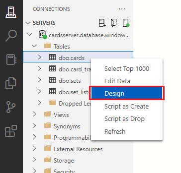

1. The first task is to dictate which columns allow null values and which don't. A card must have all the relevant information on it such as name, type, color, power, status and some art. The only column that you don't need to have text in is the card_text column. Using the checkboxes in the **Allow Nulls** column in the table designer, **uncheck all the checkboxes except for the one in the card_text row**.

    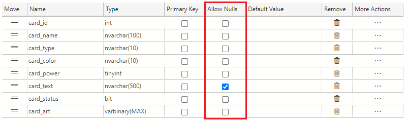

1. **card_id** is the primary key identifier of the cards table. In the **primary key column** of the table designer, select the **checkbox** to make **card_id** the **primary key** for the table.

    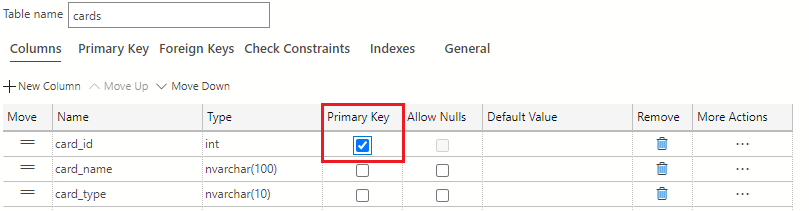

    > [!NOTE]
    > Remember, by putting a **primary key**, you have automatically added a **clustered rowstore index** to this table.

1. In addition to making the card_id column the primary key, you also want to set this column as an **identity column**. To make card_id an identity column, navigate to the **Column Properties** area and scroll down to find the  **Identity Specification** section. Here, click the checkbox for Is Identity. The values in the **Identity Seed** and **Identity Increment field** should be set to **1**.

    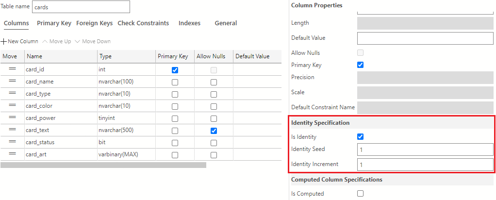

1. Next, you need to add default values to the card_type restricting this column to either **weapon**, **armor**, **spell**, or **monster**. To add default values to this column, select the **Check Constraints** tab in the table designer

    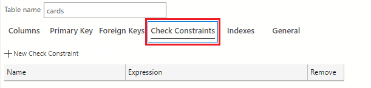

1. Next, click the **+New Constraint** button to add these constraints to the column.

    

1. Use the Check Constraints Properties area and set the following values. In the **Name** field, change the name of the constraint from the provided default to **CK_type**. Navigate to the **Expression** field and type the expression as shown in the following text:

    ```sql
    [card_type] = 'weapon' OR [card_type] = 'armor' OR [card_type] = 'spell' OR [card_type] = 'monster'
    ```

    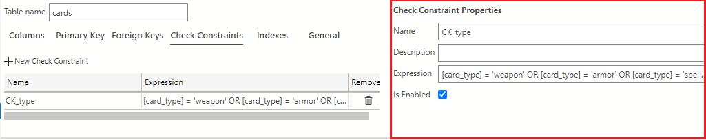

1. Just as you did with **card_type**, you need to add default values to the card_color column. A card_color can only be the following values: **orange**, **black**, **green**, **blue**, **white**, or **red**. While still on the **Check Constraints** tab in the table designer, click the **+New Constraint** to add a new constraint to the column.

    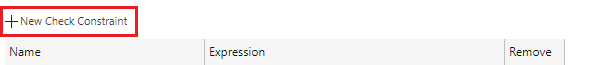

    In the **Name** field, change the name of the constraint from the provided default to **CK_color**. Navigate to the **Expression** field and type the expression as shown in the following text:
  
    ```sql
    [card_color] = 'orange' OR [card_color] = 'black' OR [card_color] = 'green' OR [card_color] = 'blue' OR [card_color] = 'white' OR [card_color] = 'red'
    ```

    The check constraints view should look like the following image after adding the card_color constraint:

    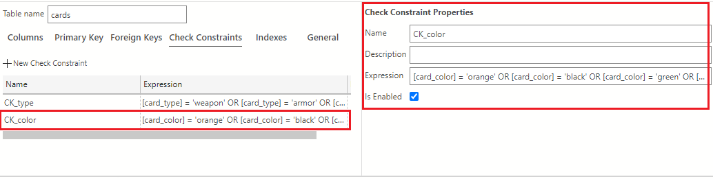

1. The **cards** table is now complete and should look like the following:

    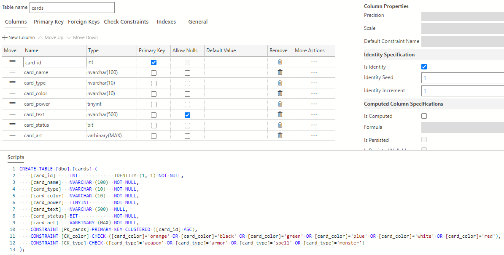

1. Click the **Publish Changes** button on the top left of the table designer window to save these table changes to the database.

    

    If prompted to review the changes, first, **click the checkbox confirming the changes** then click the **Update Database** button.

    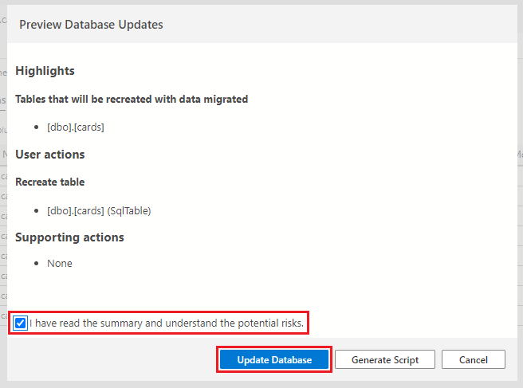

## The translations table

The translations table will be the first table to use a foreign key that will refer back to the cards table by the card_id. This relationship won't only create a reference back to the card_id column in the cards table, but will prevent rows being entered into this table without that referenced card_id existing. Again, it will also have an identity column (translation_id) that will serve as the primary key. A reoccurring situation you'll see in every table created in the card application scenario.

With the identity column and foreign key in mind, here's how you can add to your translations table:

### Card_translations

| Column name | Data type | Null? | Default values | Notes |
|---|---|---|---|---|
| translation_id | int | no |  | IDENTITY and Primary Key |
| card_id | int | no |  | Foreign key back to the Cards table |
| translation_card_language | nvarchar(50) | no |  |  |
| translation_card_name | nvarchar(500) | no |  | The translated card name |
| translation_card_text | nvarchar(2000) | yes |  | The translated card text |

#### Update the translations table in Azure Data Studio

1. Again, find the **dbo.card_translations table** in the connections navigator in the tables folder. **Right click** on the cards table and select **Design**.

    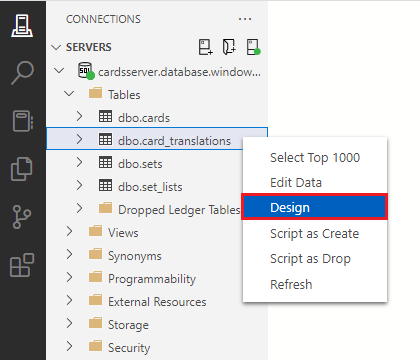

1. First, decide which columns allow null values and which don't. A row in this table must have an ID, a reference to the card_id from the cards table, a translation language and a translated card name. As with the cards table, translation_card_text can be null. Using the checkboxes in the **Allow Nulls** column in the table designer, **uncheck all the checkboxes except for the one in the translation_card_text row**.

    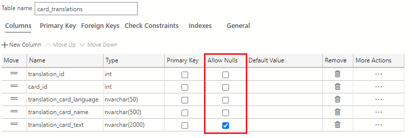

1. The **translation_id** column is the primary key identifier of this table. In the **primary key column** of the table designer, select the **checkbox** to make **translation_id** the **primary key** for the table.

    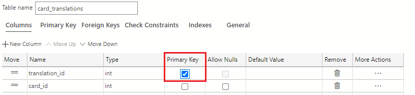

    > [!NOTE]
    > Remember, by putting a **primary key**, you have automatically added a **clustered rowstore index** to this table.

1. In addition to making the translation_id column the primary key, you also want to set this column as an **identity column**. To set translation_id as an identity column, navigate to the **Column Properties** area and scroll down to find the  **Identity Specification** section. Here, click the checkbox for Is Identity. The values in the **Identity Seed** and **Identity Increment field** should be set to **1**.

    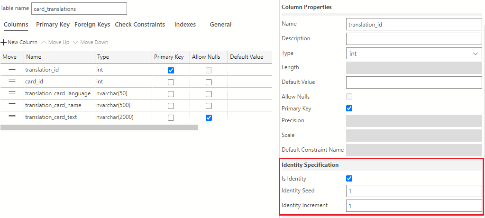

1. Once the columns are created, you need to create the foreign key. Click the **Foreign Keys tab** in the table designer then click the **+ New Foreign Key** button.

    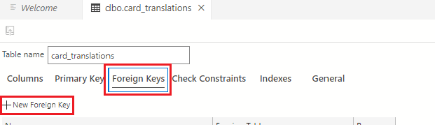

1. In the Foreign Key **name field**, enter **FK_card_id_to_translation** and use the **Foreign Table drop down** to select dbo.cards, the cards table.

    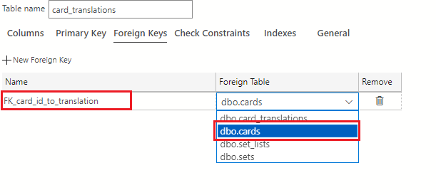

1. In the **Foreign Key properties pane** on the right of the table designer, click the **+ New Column Mapping button**.

    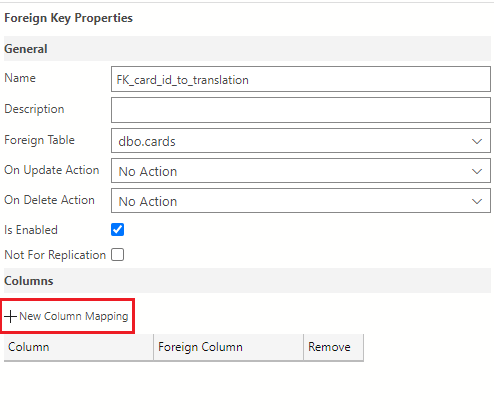

1. Select **card_id** using the **drop down** for both the **column** and **foreign column** fields.

    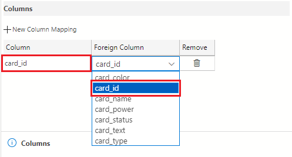

    The **card_translations** table is now complete and should look like the following:

    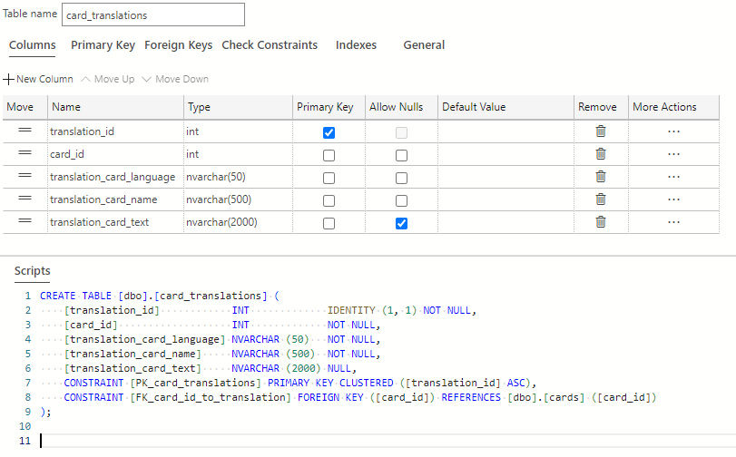

1. Click the **Publish Changes** button on the top left of the table designer window to save these table changes to the database.

    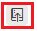

    If prompted to review the changes, first, **click the checkbox confirming the changes** then click the **Update Database** button.

    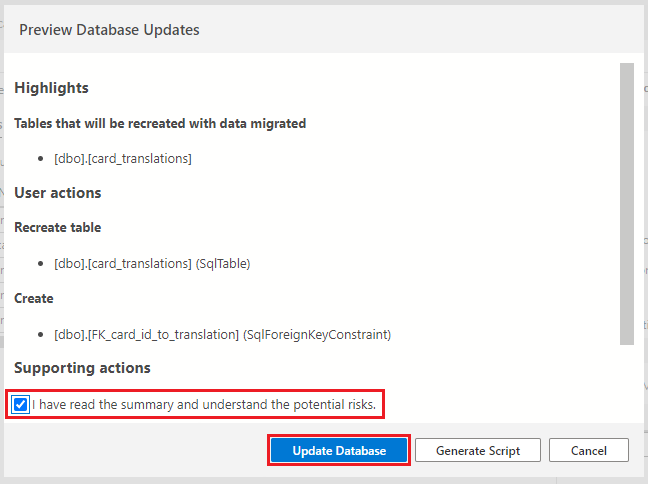

## The sets table

The update on the sets table is minor and will be the addition a primary key that also is the identity column. The column you'll use for this update is the set_id column. You'll also need to set all columns to not accept null values.

### Sets

| Column name | Data type | Null? | Default values | Notes |
|---|---|---|---|---|
| set_id | int | no |  | IDENTITY and Primary Key |
| set_name | nvarchar(50) | no |  |  |
| set_date | date | no |  | It doesn't need to store time (hours/minutes/seconds) so DATE will work here |

#### Update the sets table in Azure Data Studio

1. Find the **dbo.sets table** in the connections navigator in the tables folder. **Right click** on the cards table and select **Design**.

    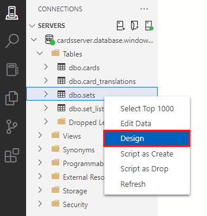

1. Using the checkboxes in the **Allow Nulls** column in the table designer, **uncheck all the checkboxes**.

    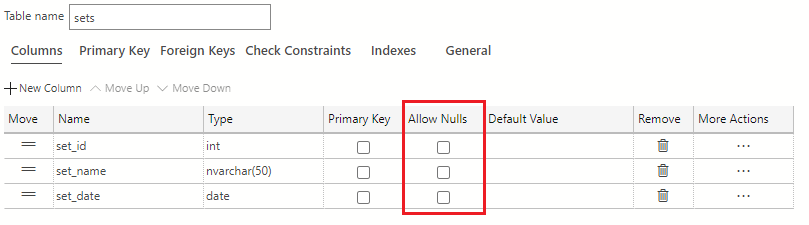

1. The **set_id** column is the primary key identifier of this table. In the **primary key column** of the table designer, select the **checkbox** to make set_id the primary key for the table.

    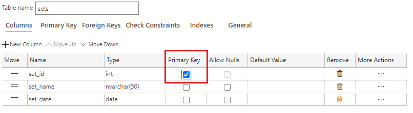

    > [!NOTE]
    > Remember, by putting a **primary key**, you have automatically added a **clustered rowstore index** to this table.

1. In addition to making the set_id column the primary key, you also want to set this column as an **identity column**. To make the set_id column an identity column, navigate to the **Column Properties** area and scroll down to find the  **Identity Specification** section. Here, click the checkbox for Is Identity. The values in the **Identity Seed** and **Identity Increment field** should be set to **1**.

    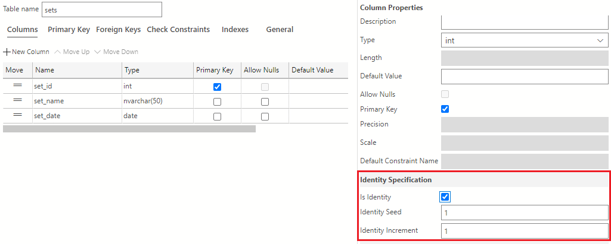

    The **sets** table is now complete and should look like the following:

    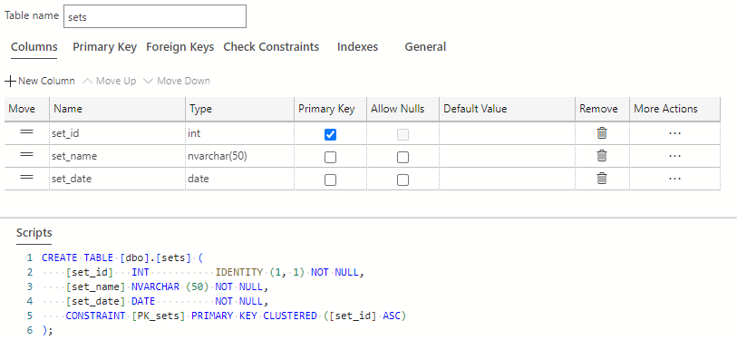

1. Click the **Publish Changes** button on the top left of the table designer window to save these table changes to the database.

    

    If prompted to review the changes, first, **click the checkbox confirming the changes** then click the **Update Database** button.

    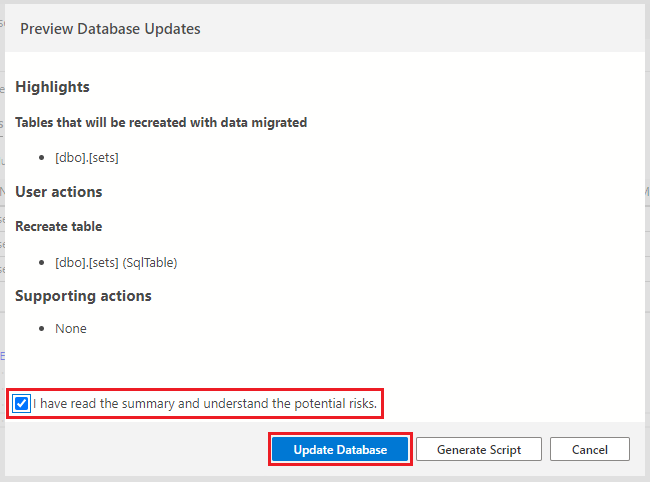

## The set_lists table

 An identity column/primary key is also needed on the set_list_id column. Next you need to create the two pointers back to the cards and sets table, which will be the foreign keys; card_id and set_id with matching data types to those tables. This set_lists table will be key when a user wants all the information about cards in a particular set. Additionally, these foreign key relationships will prevent having tables with duplicate rows or attempting to lump set_id into a single column on the cards table resulting in parsing and performance issues.

The set_lists table will look like the following with the modifications:

### Set_lists

| Column name | Data type | Null? | Default values | Notes |
|---|---|---|---|---|
| set_list_id | int | no |  | IDENTITY and Primary Key |
| card_id | int | no |  | Foreign key back to the Cards table |
| set_id | int | no |  | Foreign key back to the Sets table |

#### Update the set_lists table in Azure Data Studio

1. Find the **dbo.set_lists table** in the connections navigator in the tables folder. **Right click** on the cards table and select **Design**.

    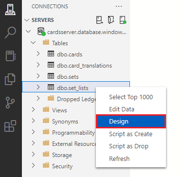

1. Using the checkboxes in the **Allow Nulls** column in the table designer, **uncheck all the checkboxes**.

    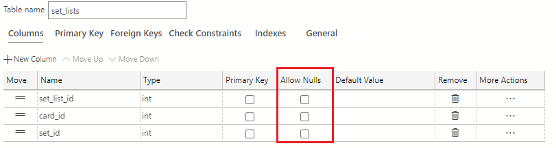

1. The **set_list_id** column is the primary key identifier of this table. In the **primary key column** of the table designer, select the **checkbox** to make the set_list_id column the primary key for the table.

    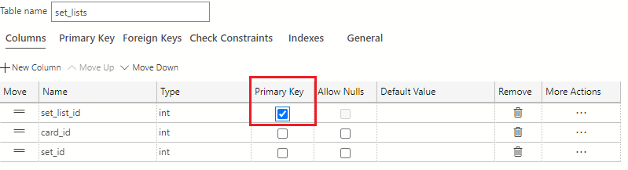

    > [!NOTE]
    > Remember, by putting a **primary key**, you have automatically added a **clustered rowstore index** to this table.

1. In addition to making the set_list_id column the primary key, you also want to set this column as an **identity column**. To make the set_list_id column into an identity column, navigate to the **Column Properties** area and scroll down to find the  **Identity Specification** section. Here, click the checkbox for Is Identity. The values in the **Identity Seed** and **Identity Increment field** should be set to **1**.

    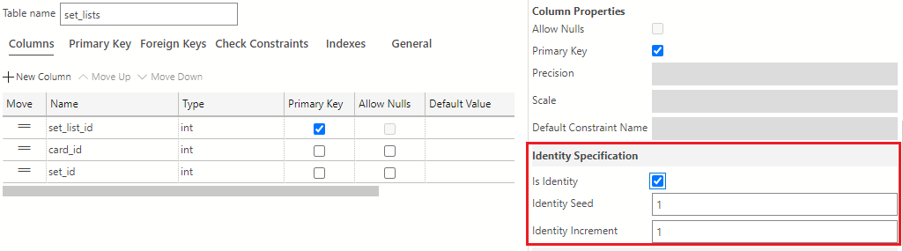

1. Next, you need to create the foreign keys. Click the **Foreign Keys tab** in the table designer then click the **+ New Foreign Key** button.

    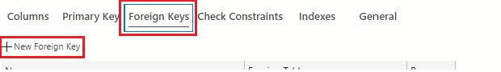

1. For the first key, in the Foreign Key **name field**, enter **FK_card_id_to_card** and use the **Foreign Table drop down** to select **dbo.cards**.

    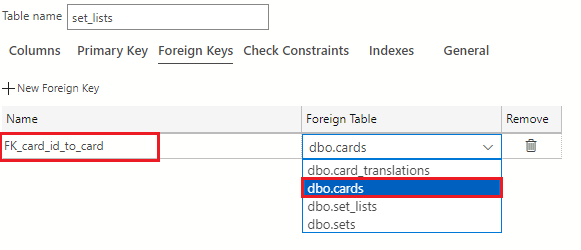

1. In the **Foreign Key properties pane** on the right of the table designer, click the **+ New Column Mapping button**.

    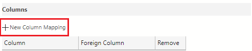

1. Select **card_id** using the **drop down** for both the **column** and **foreign column** fields.

    

1. Click the **+ New Foreign Key** button again.

    

1. and in the Foreign Key **name field**, enter **FK_set_id_to_set** and use the **Foreign Table drop down** to select **dbo.sets**.

    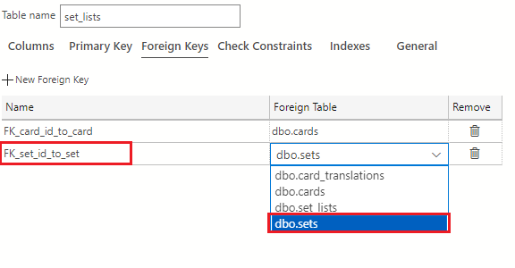

1. In the **Foreign Key properties pane** on the right of the table designer, click the **+ New Column Mapping button**.

    

1. Select **set_id** using the **drop down** for both the **column** and **foreign column** fields.

    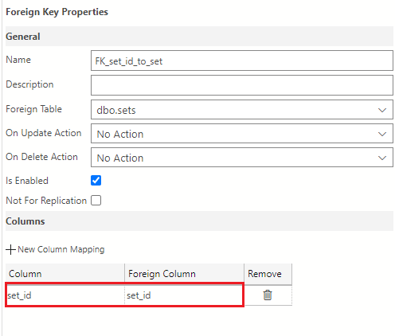

1. The **set_lists** table is now complete. It should look like the following image:

    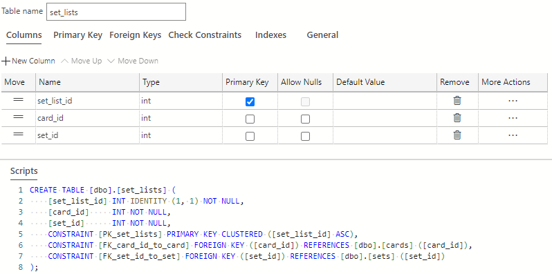

1. Click the **Publish Changes** button on the top left of the table designer window to save these table changes to the database.

    

    If prompted to review the changes, first, **click the checkbox confirming the changes** then click the **Update Database** button.

    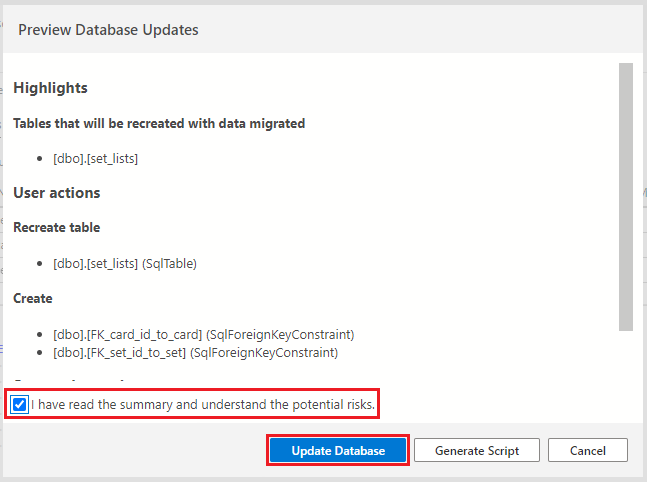
