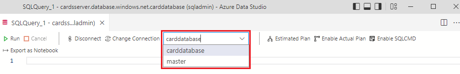
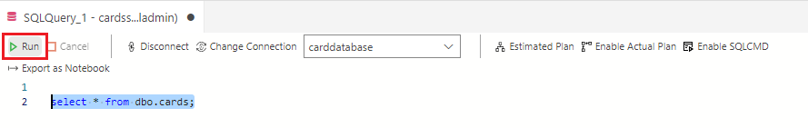
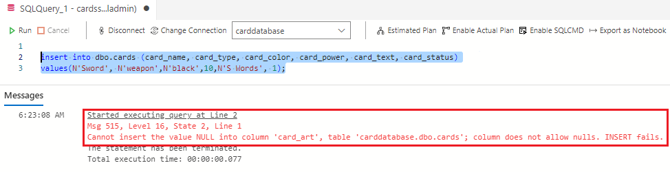
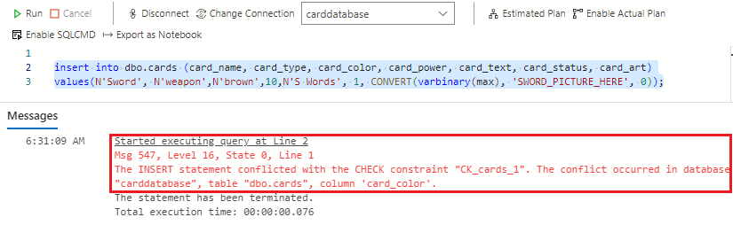
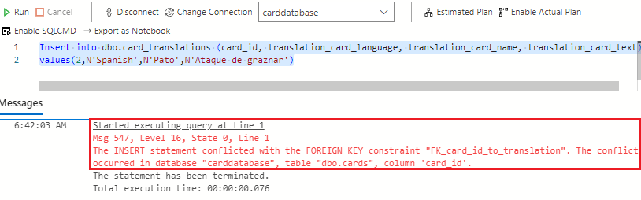
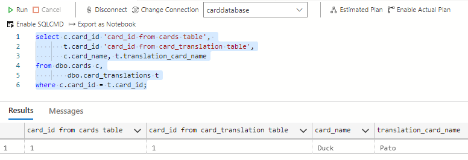
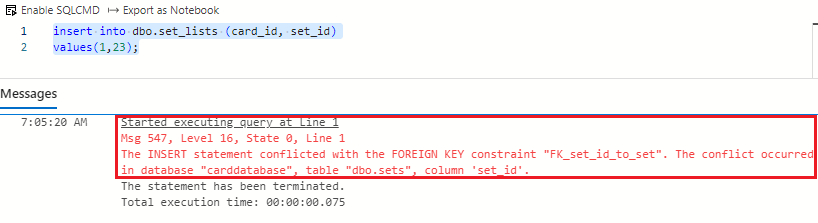
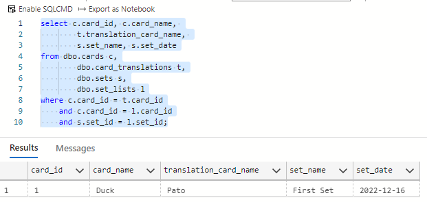
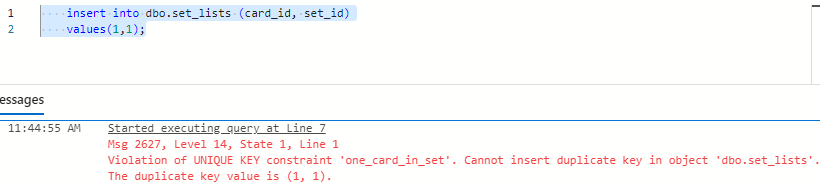
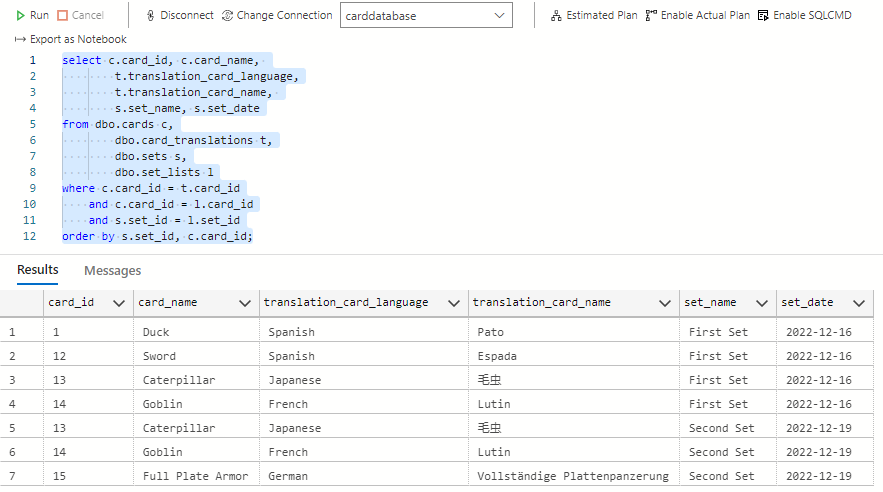

Now that your data model is complete, it's time to insert some data and see how all the elements created with the tables work.

In this exercise, you'll run sql commands to see how the tables are related in the data model and how the rules you created are enforced.

## Open a new query sheet

1. To start working with SQL in the Azure SQL Database, you need to open a new query sheet. In **Azure Data Studio**, the **connections pane** on the left of the application, right click the cards database server and **select New Query**.

    

1. Once the new query sheet is open, ensure that you're **connected** to the carddatabase Azure SQL Database using the **connection dropdown**.

    

## Working with data

The following section with be using the query sheet in Azure Data Studio. Once you've copied and pasted a command onto the sheet, you can highlight the SQL code. Once highlighted, either press F5 or click the green run arrow to run the SQL code in your Azure SQL Database.



1. To start, insert a row into the cards table with the following SQL.

    > [!NOTE]
    > To make inserting images simple, you will be just converting some text into varbinary with the convert SQL command.

    ```sql
    insert into dbo.cards (card_name, card_type, card_color, card_power, card_text, card_status, card_art)
    values(N'Duck', N'hero',N'white',10,N'Quack Attack', 1, CONVERT(varbinary(max), 'DUCK_PICTURE_HERE', 0));
    ```

1. Next, take a look at the new row in the database with a **select * command** on the cards table.

    ```sql
    select * from dbo.cards;
    ```

1. If you remember from the previous exercise, you set all columns to not accept NULL values except for the card_text column. Test the rule here by leaving out the card_art column. Run the following statement in the query sheet:

    ```sql
    insert into dbo.cards (card_name, card_type, card_color, card_power, card_text, card_status)
    values(N'Sword', N'weapon',N'black',10,N'S Words', 1);
    ```

    The database won't allow the insert and remind us of what rule that is being violated (which is NULL values in the card_art column).

    

1. The following SQL insert breaks another rule you set for the table. Here, pass in the color "brown" that you know that isn't an accepted value. You created the rule that only the colors orange, black, green, blue, white, and red will be accepted in the column.

    ```sql
    insert into dbo.cards (card_name, card_type, card_color, card_power, card_text, card_status, card_art)
    values(N'Sword', N'weapon',N'brown',10,N'S Words', 1, CONVERT(varbinary(max), 'SWORD_PICTURE_HERE', 0));
    ```

    And as you can see, this insert won't be committed to the database because it violated the rule for card_color.

    

1. Moving on to the card_translations table, you can see how a foreign key prevents inserts that don't have corresponding rows in the parent table. The following SQL statement will attempt to insert a row into the card_translations able but with a card_id of 2. There's only one row in the cards table and that has a card_id of 1. Copy and paste the following SQL statement and run it in the query sheet:

    ```sql
    Insert into dbo.card_translations(card_id, translation_card_language, translation_card_name, translation_card_text)
    values(2,N'Spanish',N'Pato',N'Ataque de graznar')
    ```

    The foreign key prevents the insert as expected

    

1. Using a correct card_id, you can create a row in the translations table by running the following SQL in the query sheet:

    ```sql
    insert into dbo.card_translations(card_id, translation_card_language, translation_card_name, translation_card_text)
    values(1,N'Spanish',N'Pato',N'Ataque de graznar')
    ```

1. With a row in the cards table and the card_translations table, **join the two tables in a query** and get all the rows that share a common card_id.

    ```sql
    select c.card_id 'card_id from cards table', 
           t.card_id 'card_id from card_translation table',
           c.card_name, t.translation_card_name
    from dbo.cards c,
            dbo.card_translations t
    where c.card_id = t.card_id;
    ```

    

1. The following SQL statement will insert a row into the sets table. You'll be using the **built in function GETDATE()** to insert today's data in the format YYYY-MM-DD. While the GETDATE function also returns hours, minutes, and seconds, the data type is DATE so it will truncate that extra time data.

    ```sql
    insert into dbo.sets (set_name, set_date)
    values(N'First Set', GETDATE());
    ```

    Now run the following SQL to see the row in the sets table:

    ```sql
    select * from dbo.sets;
    ```

1. A card is in the cards table and a set is in the sets table. With these two rows, you can enter a card and a set into the set_lists table with both the card_id and set_id. There are two foreign keys on this table, so will the following SQL work if you attempt to insert a correct card_id but an incorrect set_id into the set_lists table? Run the following SQL in the query sheet:

    ```sql
    insert into dbo.set_lists (card_id, set_id)
    values(1,23);
    ```

    As expected, the insert was blocked by a foreign key violation.

    

    Running the query with the correct IDs will result in a successful insert into the set_lists table. Run the following SQL in the query sheet:

    ```sql
    insert into dbo.set_lists (card_id, set_id)
    values(1,1);
    ```

1. With data in all 4 of the tables, use the following SQL query to get a view of the cards entered into the database, their translations and the sets they belong to. Run the following SQL in the query sheet:

    ```sql
    select c.card_id, c.card_name, 
            t.translation_card_name, 
            s.set_name, s.set_date
    from dbo.cards c,
            dbo.card_translations t,
            dbo.sets s,
            dbo.set_lists l
    where c.card_id = t.card_id
        and c.card_id = l.card_id
        and s.set_id = l.set_id;
    ```

    

1. If you remember again back to the chapter on table constraints, there was a section that talked about **Unique Constraints**. These constraints let you apply a rule across one or multiple columns to ensure that the table doesn't have duplicate values, similar to the primary key column. Looking at the set_lists table, you may have noticed that you could insert a card_id and a set_id into this table multiple times creating duplicate data. If you apply a unique constraint, this behavior can be prevented.

    You can create a unique constraint on the card_id and set_id columns. This unique constraint will tell the database "don't let anyone insert a row with a card_id and set_id combination that already exists in the table". Run the following SQL in the query sheet to create this unique constraint:

    ```sql
    ALTER TABLE dbo.set_lists   
    ADD CONSTRAINT one_card_in_set UNIQUE (card_id, set_id);   
    GO
    ```

    And now, try the following SQL again:

    ```sql
    insert into dbo.set_lists (card_id, set_id)
    values(1,1);
    ```

    You'll see an error stopping this insert and preventing duplicate data in the table.

    

    Can you think of other situations where a unique constraint could be useful in preventing duplicate data in the card reference application?

1. To get a better picture of how the data model comes together for the card reference application, you can add more data to the tables. Run the following SQL statement in the query sheet:

    ```sql
    declare @cardTable2 table (card_id int);
    declare @cardTable3 table (card_id int);
    declare @cardTable4 table (card_id int);
    declare @cardTable5 table (card_id int);
    insert into dbo.cards (card_name, card_type, card_color, card_power, card_text, card_status, card_art)
    OUTPUT Inserted.[card_id] into @cardTable2
    values(N'Sword', N'weapon',N'white',10,N'+2 Power', 1, CONVERT(varbinary(max), 'SWORD_PICTURE_HERE', 0));
    insert into dbo.cards (card_name, card_type, card_color, card_power, card_text, card_status, card_art)
    OUTPUT Inserted.[card_id] into @cardTable3
    values(N'Caterpillar', N'monster',N'green',10,NULL, 1, CONVERT(varbinary(max), 'CRAWLY_PICTURE_HERE', 0));
    insert into dbo.cards (card_name, card_type, card_color, card_power, card_text, card_status, card_art)
    OUTPUT Inserted.[card_id] into @cardTable4
    values(N'Goblin', N'monster',N'red',10,N'Can set fires', 1, CONVERT(varbinary(max), 'GOBLIN_PICTURE_HERE', 0));
    insert into dbo.cards (card_name, card_type, card_color, card_power, card_text, card_status, card_art)
    OUTPUT Inserted.[card_id] into @cardTable5
    values(N'Full Plate Armor', N'armor',N'black',10,N'+4 Protection', 1, CONVERT(varbinary(max), 'PLATE_ARMOR_PICTURE_HERE', 0));
    declare @card2i int = (select card_id from @cardTable2);
    declare @card3i int = (select card_id from @cardTable3);
    declare @card4i int = (select card_id from @cardTable4);
    declare @card5i int = (select card_id from @cardTable5);
    insert into dbo.card_translations(card_id, translation_card_language, translation_card_name, translation_card_text)
    values(@card2i,N'Spanish',N'Espada',N'+2 Poder')
    insert into dbo.card_translations(card_id, translation_card_language, translation_card_name, translation_card_text)
    values(@card3i,N'Japanese',N'毛虫',NULL)
    insert into dbo.card_translations(card_id, translation_card_language, translation_card_name, translation_card_text)
    values(@card4i,N'French',N'Lutin',N'Puede provocar incendios')
    insert into dbo.card_translations(card_id, translation_card_language, translation_card_name, translation_card_text)
    values(@card5i,N'German',N'Vollständige Plattenpanzerung',N'+4 Schutz')
    insert into dbo.sets (set_name, set_date)
    values(N'Second Set', GETDATE());
    insert into dbo.set_lists (card_id, set_id)
    values(@card2i,1);
    insert into dbo.set_lists (card_id, set_id)
    values(@card3i,1);
    insert into dbo.set_lists (card_id, set_id)
    values(@card4i,1);
    insert into dbo.set_lists (card_id, set_id)
    values(@card3i,2);
    insert into dbo.set_lists (card_id, set_id)
    values(@card4i,2);
    insert into dbo.set_lists (card_id, set_id)
    values(@card5i,2);
    ```

1. And if you run this four-table join SQL query again, you can see all the cards, their translations and the sets they belong to. Run the following SQL statement in the query sheet:

    ```sql
    select c.card_id, c.card_name, 
            t.translation_card_language,
            t.translation_card_name, 
            s.set_name, s.set_date
    from dbo.cards c,
            dbo.card_translations t,
            dbo.sets s,
            dbo.set_lists l
    where c.card_id = t.card_id
        and c.card_id = l.card_id
        and s.set_id = l.set_id
    order by s.set_id, c.card_id;
    ```

    
