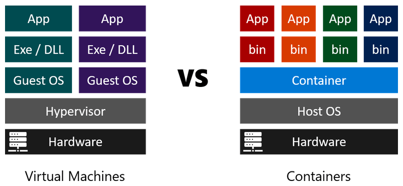
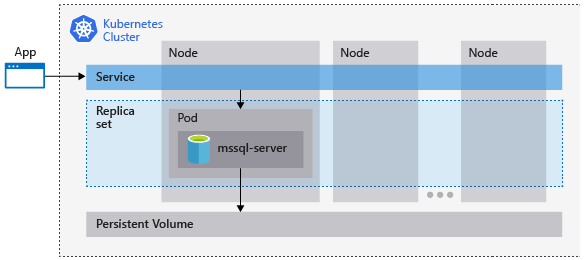

Containers help organizations to create flexible and scalable installations of SQL Server.

Wide World Importers supports some large-scale database workloads that require a flexible and scalable hosting architecture. You want to evaluate the possibility of hosting SQL Server in virtual environments such as Virtual Machines (VMs) and containers.

Here, you'll learn how to choose between containers and VMs for a database.

## Comparing VMs and containers

Virtualization is a technique that administrators use to host multiple virtual servers on a single physical server. When you use virtualization, you can easily deploy extra instances of, for example, SQL Server without buying and installing extra hardware. There are two common approaches to virtualization:

- **VMs.** When you use VMs, each instance is a complete virtual server, with its own operating system and hardware.
- **Containers.** When you use containers, each instance shares an operating system and hardware resources with the host computer.

Both VMs and containers provide an isolated environment in which applications, such as SQL Server, run as if they were on a separate physical computer.

VMs are larger and take longer to create but, because they have their own operating system, use a different configuration and hardware to the host computer. You can also mix VMs with different operating systems on the same host. For example, on a Linux host, you could install a VM running Linux and Apache to host a website. There could also be another VM running Windows and SQL Server to host a database.

Containers are smaller, so they load much more quickly than VMs. However, if your host runs Linux Ubuntu, for example, all the containers on that computer must run the same version of Ubuntu. On a Linux host, you could install a container running Linux and Apache but your database container must also run Linux. This is possible as long as you run SQL Server 2017 or later.

On the host machine, you must install software such as Hyper-V or VirtualBox to host VMs. For containers, you can use the Docker system, CRI-O, rkt, and other container hosts.

## Reasons to use Virtual Machines

There are still situations for which containers aren't the best solution. As containers run on a single operating system, and share system resources, security is a concern. If an attacker gains **superuser** privileges, some vectors could lead to gaining access to the applications. In containers, applications have to run on the same OS as the host computer. You can't run Linux-based applications in containers on Windows. With VMs, you host a Linux machine on Windows, or a Windows machine on macOS, giving greater flexibility. VMs allow you to host multiple applications, with tight integration, in a single VM. Containers traditionally only host single applications.

VMs are less efficient than containers. On a given set of hardware, you can run at least double the number of applications in containers than you can with VMs. A VM uses more resources because it needs a complete copy of the operating system, and virtualized versions of all the hardware, to support the guest operating system.

## Reasons to use containers

Containers are more lightweight in comparison and allow you to package apps into a smaller footprint. As a single operating system is hosting the containers, there's less administration. You only need to patch and update a single OS, rather than every guest OS on each VM. The containers are smaller and more straightforward, so they can be started in seconds rather than the minutes it takes to start a VM.

## Orchestration

Docker Swarm, Kubernetes, and other solutions can orchestrate containers. Orchestrators monitor and make it possible to scale apps using containers and provide a level of disaster recovery. Microsoft provides tools and examples of how to use Kubernetes, so it's a good choice for containerizing SQL Server on Linux. There's a SQL Server on Linux container image available for use with Kubernetes.

## Containerized SQL Server on Linux

One problem with databases running in containers is persistent storage. You must provide a storage location outside the container where the database can keep database files. Changes are then available to all containers in a cluster. If you use Kubernetes, you can use a persistent volume for this location.

First, create a persistent volume, and then add a persistent volume claim (PVC). Create a deployment manifest for SQL Server on Linux that uses the Microsoft created `mssql-server-linux` container image. The manifest also contains definitions for the PVC and a load balancer for the service, to guarantee a consistent IP address. Create the deployment and check that SQL Server is running inside a pod. With this setup complete, Kubernetes will bootstrap a new instance if the node fails. A simple test is to delete that pod and check a new one starts automatically.