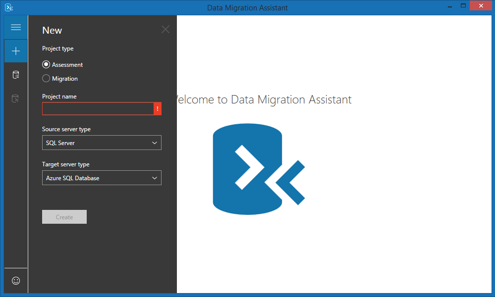

Suppose you're a database administrator for a law company and you've run a database audit. Having done this operation, you gave your results and recommendations to management for assessment. They've noted your advice to upgrade the unsupported versions of SQL Server immediately and asked how you'll go about migrating the databases. The budget isn't yet set and your manager says you might not get the funds for new licenses.

You have active database servers that run SQL Server 2000, SQL Server 2008, and SQL Server 2012.

Some databases may have to be migrated to existing instances of SQL Server 2012 or SQL Server 2016. There's an urgent need to upgrade unsupported versions. You'll explore all available options so you're ready when you're given the go-ahead.  

Here, you'll explore the main upgrade paths available for different versions of SQL Server.

## Available upgrade paths for different versions

The older the database you want to migrate, the fewer the options available. As previously discussed, if you want to upgrade SQL Server 2000 databases, you need to do an interim upgrade to SQL Server 2008 before switching to any later version.

## Backup and restore

You can use the **backup and restore** option on any version of SQL Server from 2005 through 2016. You can't back up and restore any of the systems databases, such as master, model, msdb, or temp. Take a backup of the database from the source server and restore it on the target server, then change the compatibility of the database. For example, to change the compatibility of a database named **Customer Services** to SQL Server 2016, you'd run the following command:

```sql
ALTER DATABASE [CustomerServices] SET COMPATIBILITY_LEVEL = 130
```

Ensure that all objects within the database are supported by the target environment; otherwise, you can't change the compatibility level. You'll need to remove any deprecated features, such as queries to management views that have been renamed or replaced, updated system stored procedures, or deprecated data types.

## Bulk load

Versions as far back as SQL Server 2005 can use the **bulk load** operation to copy data into a target database. By creating the new database on the target server, you can then use the **Bulk Copy Program (BCP)** to run a script to copy the data. BCP is an efficient solution for copying large volumes of data. If you aren't familiar with writing BCP scripts, factor in time to learn.

## Transactional replication

Replication allows you to upgrade SQL Server databases, but you'll need working knowledge of how transactional replication works. Replication allows you to have a mix of versions within the topology, so it's already geared to enabling upgrades. The **Distributor** must be the same version of SQL Server as the **Publisher**, or later. The **Subscriber** can be up to two versions newer or earlier than the Publisher. Replication offers two upgrade paths:

- **Side-by-side**: With side-by-side replication, you create a new parallel environment with the target version of SQL Server. Then you move the databases, logins, scheduled jobs, and any other objects, to your new environment.
- **In-place**: An in-place replication upgrade replaces the existing installation and upgrades both system and user databases.

If you already have replication in place, you should consider one of these options to complete your migration.

## Availability groups

If you've used the **Always On** availability group introduced in SQL Server 2012, you could fail over to a SQL Server 2014 or higher secondary. Your **primary** must be running SQL Server 2012 SP2 or later, and the failover might be manual or automatic. When you've failed over to a later version, and the older version of SQL Server becomes the **secondary** server, it can't receive changes from the primary.

## Database mirroring

You can use database mirroring to upgrade **principals** running SQL Server 2008 SP3, SQL Server 2008 R2 SP2 or higher, to a **mirror** that's SQL Server 2014 or later. As with availability groups, when you've failed over to the newer version of SQL Server and the older version becomes the mirror, it won't receive changes from the principal.

## Log shipping

You can use log shipping to upgrade if the **principal** is running SQL Server 2008 SP3, SQL Server 2008 R2 SP2 or higher, to a **secondary** running SQL Server 2014 or higher. After failover to the newer version of SQL Server, the older version now running as the secondary won't receive changes from the primary.

## Data Migration Assistant

The **Data Migration Assistant (DMA)** supports versions of SQL Server from 2005 upwards. Using the assistant, you connect to the instance and select the database you plan to upgrade. You tell the assistant the target version of SQL Server, and it analyzes the size and schema of the database. The assistant also makes recommendations for your upgrade. After the analysis, DMA provides a compatibility report, which highlights breaking changes, behavioral changes, and deprecated features, so these problems can be fixed.



DMA also makes recommendations for how the database uses performance, storage, and security features in the target version. You can export these results to a CSV or JSON file for future reference. This situation is ideal when you have a large number of databases to upgrade and need a concise list of tasks to prevent application failure after upgrading. You then use DMA to upgrade your database and logins to the target server.

## Choosing an upgrade method

In your law firm, for databases on SQL Server 2000, you must start by upgrading to SQL Server 2008 using the backup and restore method. Make sure you set the database compatibility level to 100 after the migration so it can be further upgraded afterwards.

When you've completed the initial upgrade from SQL Server 2000, all your databases are at SQL Server 2008 and higher, but you still have a complex situation.

The simplest consistent method for upgrading all these databases is to use the DMA, which can upgrade any database hosted on SQL Server 2005 and later. This tool provides a complete list of compatibility issues that you must fix before you upgrade a database. Your team can work through that list to resolve all problems before you use DMA to do the upgrade.

Various methods are available for upgrading your SQL Servers. The path you choose depends on the version you're upgrading from and whether there's a failover mechanism that you must use for the upgrade. DMA supports database upgrades from SQL Server 2005 onward. If you have different versions across your database landscape, this tool is ideal for upgrading from one central point.

Most usefully, DMA highlights deprecated features in older databases, so you can see the code that will break before you begin the upgrade. DMA also suggests features that will boost security and performance, and you can export the results.
