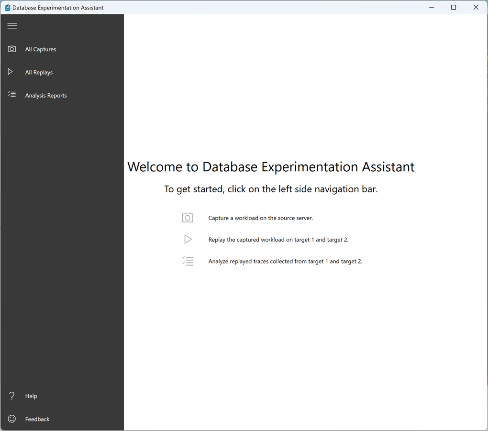

Suppose you're a database administrator for a law firm, and you've upgraded some of the databases in your company. You now need to ensure everything is working normally before you reconfigure applications to use the new databases. It's important to find and fix broken queries and replace deprecated features. You also need the database performance to be equal or better than the existing version. 

You want a tool to automate this process. It wouldn't be possible to thoroughly test multiple applications before users need to resume working.

## Post-migration tasks

Before your applications begin consuming the new target databases, you must find and fix any compatibility issues. If you're doing a large-scale upgrade operation on company-critical databases, compatibility issues are crucial because you want the least downtime possible. Also, you need to keep current performance levels or make improvements where possible.

It's natural to assume that moving your database to new hardware and the latest version of SQL Server would increase performance. This assumption can catch out DBAs, because new features might be redesigned in a way that degrades the performance of older databases. Your stored procedures might not be optimal on the new server. Testing them beforehand helps you avoid only finding out after the change has gone live with users suffering the consequences of slow queries.

## Optimize using Database Experimentation Assistant

The Database Experimentation Assistant (DEA) allows you to automate the process of testing the workload of your current database on a target server. It's designed for **A/B** testing, and allows you to test how the database will do on an upgraded version of SQL Server. You can also test performance on different hardware or with new features added. The crucial point of A/B testing is that you change ***one thing***: this approach gives you a baseline against which you test a single variant.

In practice, a server might have developers and DBAs constantly making changes. When a query slows down, it can be difficult to pinpoint the change that causes the degradation. When testing your database on an upgraded version, you can create the new database and replay a sample of the current workload on the upgraded database using DEA.

DEA compares a source and target database that are identical except for one variation: the upgraded database. You run a trace on your source production server to capture the queries that form a typical workload. Running the trace has a minimal impact on the server, so you can run tracing even during heavy demand periods. The DEA tool finds degraded queries and generates drill-through reports to highlight code that runs slower in the target environment. You can then optimize the code before you switch your production system to the target database.

## How to run realistic tests

For your law firm, you originally had a complex situation with many databases spread over servers running multiple versions of SQL Server.

Before doing any upgrades, make sure you use DEA to analyze the performance of the original system. Then you can compare the performance after you've done the upgrade. This analysis will ensure that your change hasn't had a negative impact on performance.

The DEA tool reduces administrative time and eliminates human error, by automating much of the testing process after you've upgraded your databases. By generating an analysis report that highlights query errors, query plan information, and statistics, you can quickly fix and tune queries to get applications operational again. DEA is designed for A/B testing, so you can test the impact of a single change to your database. DEA is ideal for optimizing your databases before doing an upgrade.
