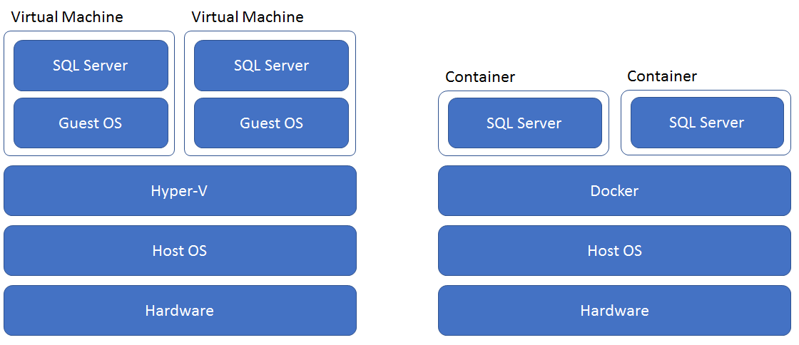

In SQL Server 2017, you can choose to run a database server on Linux or Windows. You can also choose to run a database on a physical server or in a virtual environment as a Virtual Machine (VM) or a container.

Suppose you want to make it easier to deploy database servers into the testing environment for your photo sharing application. You want to be able to deploy clean sample databases for integration and acceptance testing as quickly as possible. Because the production environment is hosted on Linux servers, you want the testing environment to run Linux as well.

In this unit, you will learn about running SQL Server 2017 in a container system such as Docker and why such an environment is advantageous for many systems.

## What are containers?

Until a few years ago, when database administrators created a new database server, they did so by installing an operating system on a new physical computer and then installing a database engine such as Microsoft SQL Server on it.

This approach changed with VMs. By using a virtualization host such as Hyper-V or Virtual Box, you could host multiple virtual computers on a single server. When you use VMs to host databases, each VM includes a complete operating system, database server, and a set of virtual hard drives where the database files can be stored.

VMs make things much more flexible. Not only can you create new database servers without necessarily investing in new hardware, you can also create them in cloud environments, such as Microsoft Azure. You can also create a Linux VM on a Windows host or a Windows VM on a Linux host because the VM includes its own operating system that is independent of the host operating system.

However, because each VM is a complete virtual computer, with a separate operating system and virtualized hardware, each VM consumes many resources on the physical host computer. This demand for resources limits the scalability of VMs.

Containers provide a solution to this problem. In a container, the operating system and the virtual hardware are shared with the host computer. Only the software is unique to the container. The software within the container is isolated, just as is it in a VM, and interacts with the operating system just as it does when installed on a physical computer. However, you do not need to run separate copies of the operating system and hardware for each container.

This architecture makes containers much smaller and more scalable than VMs. It also means that a container is easier and quicker to deploy or move. However, it means that containers are dependent on the host operating system. For example, you cannot run a Linux container on a Windows host, as you can with VMs.

## What is Docker?

Docker is an open-source software package that you can use to host containers. Docker runs on Windows, Linux, macOS, and other operating systems. Install Docker on your physical host computer in order to use containers.

There are two editions of Docker available:

- **Docker Community Edition**. This edition is ideal for developers and small teams who want to get started with Docker and experiment with container-based apps. It is free but includes no technical support.
- **Docker Enterprise Edition**. This edition is intended for enterprises that build, ship, and run business-critical applications in production and at scale in containers. Docker EE is integrated, certified, and supported to provide enterprises with the most secure container platform in the industry.

## Images and registries

After you have installed Docker, you can start to create and run containers.

The first step is to choose an image. An image is a read-only template with a set of instructions for creating a container. The image, for example could add:

- Files to the virtual hard drives, such as a database backup file or Transact-SQL scripts.
- Software applications, such as SQL Server 2017 or a web server, such as Internet Information Services (IIS) or Apache.

When you create an image, you must specify a parent image. For example, you could use a parent image that already has SQL Server 2017 installed but add a unique database backup file to it in your child image.

A Docker registry is a place where images are stored. Docker is configured to look for images in the public Docker Hub registry by default and this registry includes many useful images that you can use as parents. You can configure Docker to look for images in other registries including private registries that you set up and run yourself.

## How to choose between VMs and containers for a database server

If you have chosen to use virtualization for your database server instead of a physical server, you must ask several questions in order to choose the best system:

- Can you share an operating system? If you want complete flexibility, including the ability to run different operating systems from a host computer, you must use VMs.
- Are hardware resources restricted? If you want to maximize the number of virtual environments that run on a limited physical host computer, use containers.
- Is it important to deploy quickly? Because containers are smaller than VMs, you can deploy them faster. Rapid deployment can be helpful, for example, when you want to respond rapidly to an increase in demand.

If you choose to use containers, you should consider next whether to use Linux or Windows for the host operating system. Docker can be installed on both these systems but the operating system you choose will be shared by all containers you run on that physical host computer.

Because SQL Server 2017 can run on both Windows and Linux operating systems, your choice is no longer determined by your database system. Instead you can choose the operating system that your administrative team have more experience with.

Next, consider the images available in the Docker registries. If there is an image that includes some or all of the software you need, use it as it is or create a child image from it. This approach reduces the complexity of the image you create.

For example, if you want to run SQL Server 2017 on a Linux Docker host, consider using the Microsoft/mssql-server-linux image from the Docker Hub registry. With this parent image, you already have SQL Server 2017 installed.

## An example scenario

Recall that you want to choose a testing environment for your photo sharing application. The production environment is hosted on Linux servers and you want to reflect this setup in the testing environment. Therefore there is no need to mix operating system on one physical host server. You have no particular restriction on hardware resources but, because a clean testing environment must be deployed for each testing cycle, rapid deployment would be a distinct advantage. It would reduce the time taken to set up the test environment for each set of integration and acceptance tests.

You also have the Microsoft/mssql-server-linux base image in the Docker Hub Registry. If you base a custom image on this parent, you only need to copy a sample database into the image before booting and restoring that database.

For these reasons, containers make sense for your testing environment and should realize significant advantages over VMs.