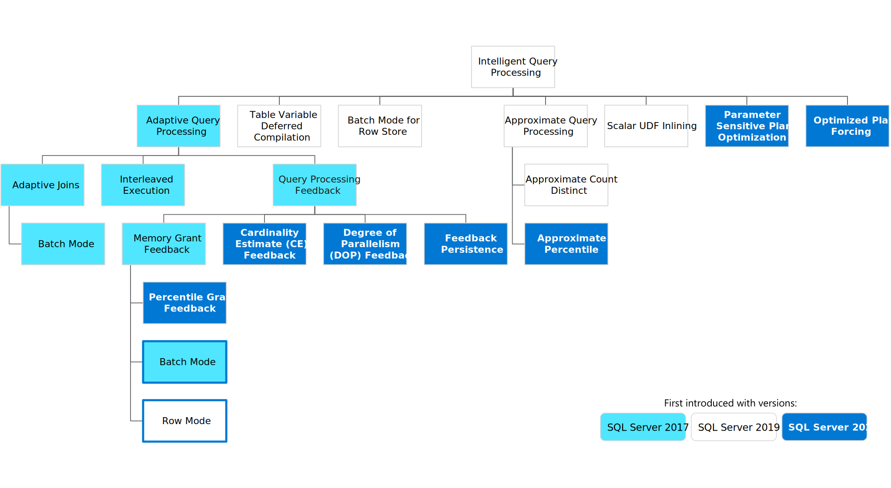

In this module, you learn about the Intelligent Query Processing (IQP) features that were enhanced in SQL Server 2022.

IQP is a family of capabilities built into the query processor in the database engine designed to accelerate performance with no code changes. The next generation of Intelligent Query Processing is built on a foundation of capabilities found in SQL Server 2017 and 2019 as seen in the following figure:

As you can see in the above diagram, there have been several IQP features that were part of SQL Server 2017 and SQL Server 2019. SQL Server 2022 adds several new capabilities for IQP. In this module, we focus on the following features:

- Memory grant feedback
- Parameter sensitive plan optimization
- Degree of parallelism

## Query Store for IQP

SQL Server 2022 provides built-in capabilities to reduce time for query tuning with the Query Store and next generation of IQP features to help you gain faster and consistent performance with no code changes.

The database engine uses two principles to make decisions for IQP:

- Avoid causing any query performance regressions by using a new method or automation.
- Provide a method at the database or query level to disable a specific IQP capability.

This allows you to pick and choose which IQP feature you want enabled at the database or query level while using other IQP feature depending on your dbcompat level.

While the Query Store collected key performance information for queries, the query processor in SQL Server 2022 will also use the Query Store to persist information to accelerate query performance, including supporting features such as Optimized Plan Forcing, Memory Grant feedback, Cardinality Estimation (CE) Model feedback, and Degree of Parallelism (DOP) feedback.

## Example scenario

Imagine that you're a database administrator at the World Wide Importers Corporation. You're overseeing the adoption of SQL Server 2022. Some databases that you manage will need to maintain their legacy compatibility mode of 140, and some can be upgraded to the current compatibility mode of 160. In each scenario, you need to make sure you're utilizing the best practices in applying the latest functionality available to optimize the performance of your systems.

To do this, you'll be utilizing the Intelligent Query Processing advancements in SQL Server 2022. Your goal is to implement these low-code to no-code changes.

## Learning objectives

At the end of this module, you'll be able to:

- Understand the key functionality behind Intelligent Query Processing and when to implement the feature
- Understand Automatic performance healing with memory grant feedback persistance
- Know how to get consistent performance with Parameter Sensitive Plan optimization
- Gain parallel efficiency with DOP Feedback
