> [!NOTE]
> This exercise will be leveraging the following githib repository:
>
> https://github.com/microsoft/sqlworkshops-sql2022workshop/tree/main/sql2022workshop/03_BuiltinQueryIntelligence/pspopt
>
> Before continuing with the exercise access lab ensure that the pre-requisites have been completed and setup has been completed.

Imagine you are the SQL Server database administrator (DBA) for Wide World Importers and part of your role is to keep up to date with new features in the product. You have learned that SQL Server 2022 is generally available and you need to evaluate the product. The Wide World Importers business unit has made note of inconsistent runtimes, which has direct impact on the customer experience. You have noted that the issue is with how SQL Server parameterizes the queries. Looking through the notes you find that SQL Server 2022 has made optimizations when it comes to how the engine parameterizes the queries with Parameter Sensitive Plan optimization.

In this exercise, we'll be evaluating the Parameter Sensitive Plan
optimization and putting together a demo for our business unit to build
a use case on why we should upgrade to SQL Server 2022 and Compatibility
Mode 160.

## Prerequisites

- SQL Server 2022 Evaluation or Developer Edition
- A virtual machine (VM) or computer with at minimum 2 CPUs and 8 GB of memory. For some of the exercises, it's best to have a machine with 8 CPUs or more.
- Install the latest version of [SQL Server Management Studio (SSMS)](/sql/ssms/download-sql-server-management-studio-ssms).
- Download ostress.exe from https://aka.ms/ostress. Install using the RMLSetup.msi file that is downloaded. Use all defaults for the installation.

## Set up the exercise

1. Create a directory called `c:\sql_sample_databases` to store backups and files.

1. Download a backup of a customized version of the `WideWorldImporters` sample database from https://aka.ms/wwi_pspopt and copy it into `c:\sql_sample_databases` directory.

   > [!NOTE]
   > If you try to restore the default sample `WideWorldImporters` database, you can use the [restorewwi.sql](https://github.com/microsoft/sqlworkshops-sql2022workshop/blob/main/sql2022workshop/03_BuiltinQueryIntelligence/pspopt/restorewwi.sql), [populatedata.sql](https://github.com/microsoft/sqlworkshops-sql2022workshop/blob/main/sql2022workshop/03_BuiltinQueryIntelligence/pspopt/populatedata.sql) and [rebuild_index.sql](https://github.com/microsoft/sqlworkshops-sql2022workshop/blob/main/sql2022workshop/03_BuiltinQueryIntelligence/pspopt/rebuild_index.sql) scripts to customize the database for the exercise.

1. [Restore](/sql/t-sql/statements/restore-statements-transact-sql) the customized version of the `WideWorldImporters` sample database to your SQL Server 2022 instance using SSMS. You may need to change the directory paths for the location of your backup and where you will restore the database files.

   ```sql
   USE master;
   GO
   DROP DATABASE IF EXISTS WideWorldImporters;
   GO
   -- Edit the locations for files to match your storage
   RESTORE DATABASE WideWorldImporters FROM DISK = 'c:\sql_sample_databases\wwi_pspopt.bak' with
   MOVE 'WWI_Primary' TO 'c:\sql_sample_databases\WideWorldImporters.mdf',
   MOVE 'WWI_UserData' TO 'c:\sql_sample_databases\WideWorldImporters_UserData.ndf',
   MOVE 'WWI_Log' TO 'c:\sql_sample_databases\WideWorldImporters.ldf',
   MOVE 'WWI_InMemory_Data_1' TO 'c:\sql_sample_databases\WideWorldImporters_InMemory_Data_1',
   stats=5;
   GO
   ```

   > [!IMPORTANT]
   > If you have permission issues to restore the backup, you can try to copy the backup into the default `data` folder for your SQL Server installation and try the restore again. You will need to edit the restore script accordingly. The default for most instances is `C:\Program Files\Microsoft SQL Server\MSSQL16.MSSQLSERVER\MSSQL\DATA.`

1. Create a new procedure to be used for the workload test using the following script.

   ```sql
   USE WideWorldImporters;
   GO
   CREATE OR ALTER PROCEDURE [Warehouse].[GetStockItemsbySupplier]  @SupplierID int
   AS
   BEGIN
   SELECT StockItemID, SupplierID, StockItemName, TaxRate, LeadTimeDays
   FROM Warehouse.StockItems s
   WHERE SupplierID = @SupplierID
   ORDER BY StockItemName;
   END;
   GO
   ```

1. Execute the following script from SSMS to ensure the `WideWorldImporters` database is at dbcompat 150 and clear the query store.

    ```sql
    USE WideWorldImporters;
    GO
    ALTER DATABASE current SET COMPATIBILITY_LEVEL = 150;
    GO
    ALTER DATABASE SCOPED CONFIGURATION CLEAR PROCEDURE_CACHE;
    GO
    ALTER DATABASE current SET QUERY_STORE CLEAR;
    GO
    ```

## Exercise - viewing PSP optimization for a single query execution

To help us understand what is happening within the Wide World Importers
database, lets look at the PSP optimization for a single query execution executing under the older database compatibility mode of 150.

1. Run the following script to execute the stored procedure created earlier, and make sure that the **Actual Execution Plan** option is enabled. Run the script **twice**.

    ```sql
    USE WideWorldImporters;
    GO
    SET STATISTICS TIME ON;
    GO
    -- The best plan for this parameter is an index seek
    EXEC Warehouse.GetStockItemsbySupplier 2;
    GO
    ```

    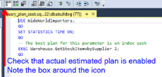

1. Select the **Messages** tab in the output pane of the query. Notice that the query runs under 1 second.

   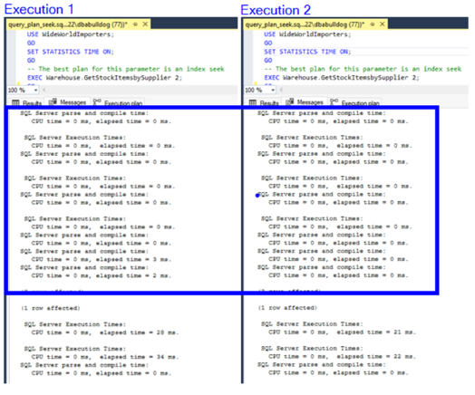

1. Check the timings for `SET STATISTICS TIME ON` from the second query
execution. The query is run twice so the second execution will not require
a compile, which is reflected in **Execution 2** in the above screenshot. This is the time we want to compare.

   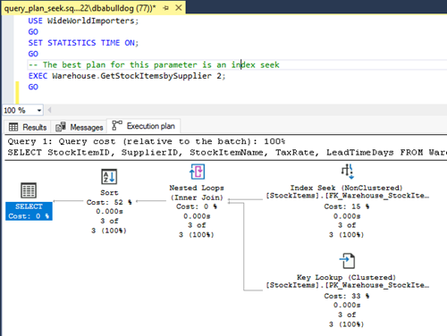

   The query plan uses an **Index Seek** reflected in the above screenshot. When this plan is within the procedure cache, the business unit reports that performance exceeds the service level agreement (SLA).

1. In a different query window, run the following script to execute the stored procedure again, but this time clearing the procedure cache and a different supplier value.

    ```sql
    USE WideWorldImporters;
    GO
    ALTER DATABASE SCOPED CONFIGURATION CLEAR PROCEDURE_CACHE;
    GO
    -- The best plan for this parameter is an index scan
    EXEC Warehouse.GetStockItemsbySupplier 4;
    GO
    ```

   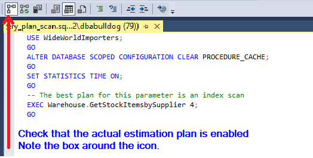

   This may take a few minutes to run. If you look at the **Execution plan**, the query is using a **Clustered Index Scan** and **Parallelism**.

   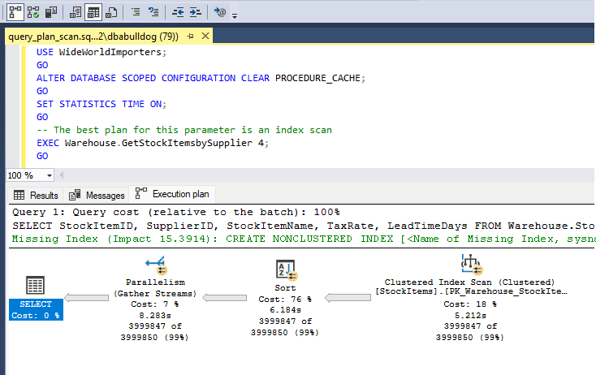

   When this query runs, the business unit reports that the query runs long but is acceptable for the information being requested and meets the SLA. However, after the `EXEC Warehouse.GetStockItemsbySupplier 4` query runs, the business unit notices the query, `EXEC Warehouse.GetStockItemsbySupplier 2` executes slower than before and no longer meets the SLA agreement.

1. To see what's going on and work on identifying the issue, go back and
run the first query in this exercise again.

    ```sql
    USE WideWorldImporters;
    GO
    SET STATISTICS TIME ON;
    GO
    -- The best plan for this parameter is an index seek
    EXEC Warehouse.GetStockItemsbySupplier 2;
    GO
    ```

   You'll see that the query executes quickly (less than one second). However, the timing from `SET STATISTICS TIME ON` is significantly longer than the previous execution. Examine the messages recorded from setting statistics time to on. We can see a significant increase in **SQL Server Execution Times**.

   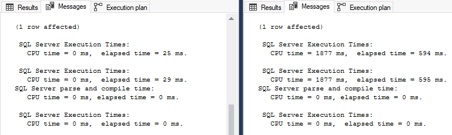

   If you look at the **Execution plan**, it now shows the query is using a clustered index scan and parallelism. The query plan that was compiled when running `EXEC Warehouse.GetStockItemsbySupplier 4`.

   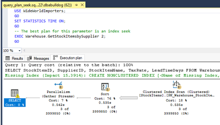

## Exercise - workload problem for PSP

**Note**: If you are using a named instance you will need to
edit **workload_index_seek.cmd** and **workload_index_scan.cmd** to use\
-S.\\\<instance name\>

1. Execute the following script to clear plan cache and query store. Remember that dbcompat is still set to 150.

    ```sql
    USE WideWorldImporters;
    GO
    ALTER DATABASE SCOPED CONFIGURATION CLEAR PROCEDURE_CACHE;
    GO
    ALTER DATABASE CURRENT SET QUERY_STORE CLEAR;
    GO
    ```

1. Setup Performance Monitor ([perfmon](https://techcommunity.microsoft.com/t5/ask-the-performance-team/windows-performance-monitor-overview/ba-p/375481)) to capture **Processor\\% Processor Time** (not Processor Information) and **SQL Server:SQL Statistics\\Batch Requests/sec** counters.

   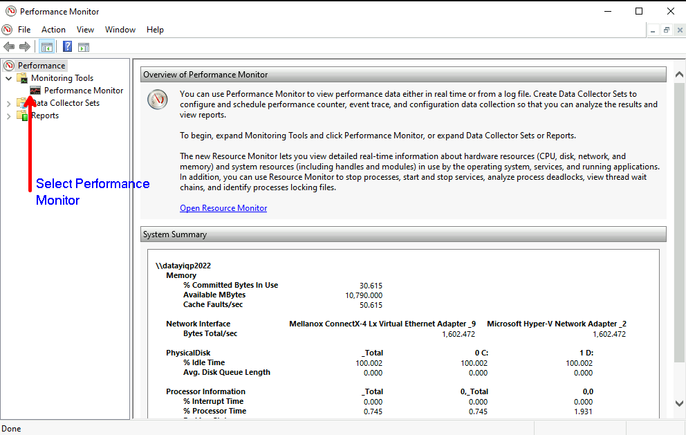

1. Select **Performance Monitor** by opening **Performance** > **Monitoring Tools**. Select the plus icon to add the counters **Processor\\% Processor Time** and **SQL Server:SQL Statistics\\Batch
Requests/sec** counters.

   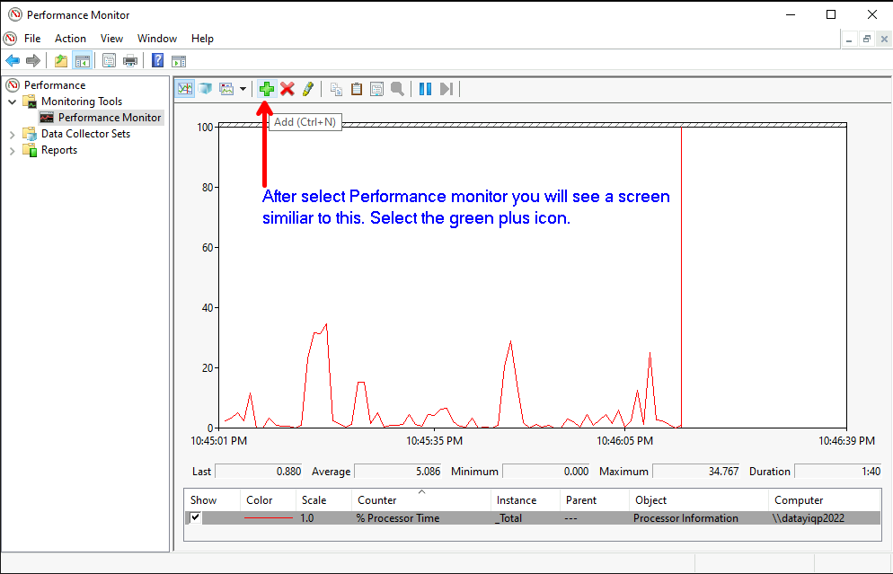

1. After selecting the plus icon, an **Add Counters** menu is displayed.
Add the **Processor\\% Processor Time** and **SQL Server:SQL Statistics\\Batch Requests/sec** counters, and then select **OK**. The counters are in alphabetical order.

   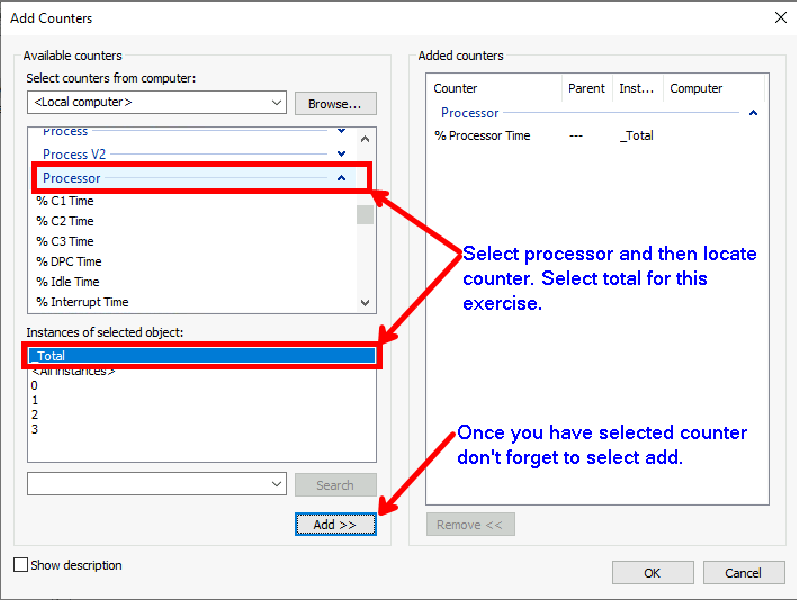

1. Use the **X** icon to remove **% Processor Time (Processor Information)** from the counters.

   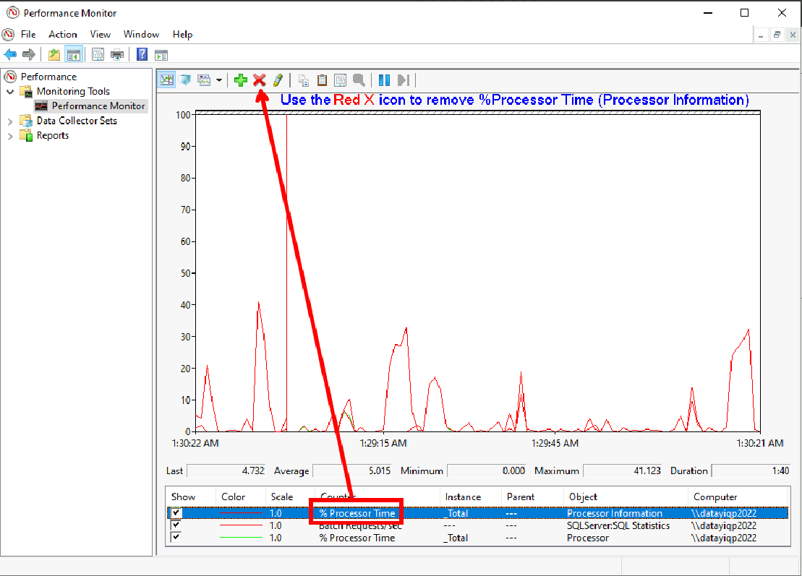

1. With the performance counters ready, let's simulate a workload against
our Wide World Importers database. Run **workload_index_seek.cmd 10** from the command prompt or within PowerShell terminal. This should finish very quickly. The parameter is the number of users. You may want to increase this for machines with 8 CPUs or more. Make sure that you are in the directory you downloaded as part of the prerequisites.


<!--Image Exercise1BExecuteWorkload_Index_Seek_Cmd for markdown-->

Observe the performance monitor counters we set up previously.


<!--Image Exercise1BPerformanceMonitorIndexsSeek1 for markdown-->

Run **workload_index_scan.cmd** from the command prompt or within
PowerShell terminal. This should take longer but now locks into cache a
plan for a scan.


<!--Image Exercise1BExecuteWorkload_Index_Scan_Cmd.png for markup-->

Run **workload_index_seek.cmd 10** again from the command prompt or
within PowerShell terminal.


<!--Image Exercise1BExecuteWorkload_Index_Seek_Cmd for markdown-->

Let's observe again the performance monitor counters we set up
previously. Notice much higher CPU and much lower batch requests/sec.
Also note the workload doesn\'t finish in a few seconds as before.


<!--Image Exercise1BPerformanceMonitorIndexsSeek2.png for markdown-->

Hit \<Ctrl\>+\<C\> in the command window or PowerShell terminal to
cancel the workload for **workload_index_seek.cmd** as it can take
minutes to complete.

Use the script **suppliercount.sql** to see the skew in supplierID
values in the table. This explains why \"one size does not fit all\" for
the stored procedure based on parameter values. The seek business
process returns data for SupplierID 2 which when initially executed the
optimizer compiles a query plan that uses a clustered index seek.
However when we execute the scan business process the optimizer compiles
a query plan that uses a clustered index scan. This new plan is stored
within the procedure cache and is the one used for future queries. When
this happens we can see by the above performance metrics the query does
not scale for those SupplierIDs with a lower supplier count due to the
skew in the data. This parameter sensitivity also know as "parameter
sniffing" would require attention of the DBA and could require coding
changes to ensure that the query scales when using parameter SupplierID.


<!--Image Exercise1Bsuppliercount for markdown-->

Note. For more information on parameter sensitivity please refer to our
documentation at
<https://learn.microsoft.com/en-us/sql/relational-databases/query-processing-architecture-guide?view=sql-server-ver16#parameter-sensitivity>.

## Exercise 3
**Solve the problem in SQL Server 2022 with no code changes**

We recently attended a Microsoft session that mentioned I can solve my
"parameter sniffing" problem with no code changes. We heard that
parameter sensitive plan optimization (PSP) will do this for us by
deploying SQL Server 2022 and updating our database to compatibility
mode 160. By doing the following we will prove out that PSP, SQL Sever
2022, and compatibility mode 160 will improve performance and
scalability of our queries.

Let\'s get this workload to run much faster and consistently using PSP
optimization. Execute the T-SQL script **dbcompat160.sql** with SSMS.


<!--Image Exercise1CCompatModeClearProcCacheClearQueryStore for markdown-->

Validate that the WideWorldImporters database is set to compatibility
level 160 by executing the following T-SQL.

```sql
    select name,compatibility_level from sys.databases
    where name =\'WideWorldImporters\'
```


<!--Image Exercise1CCheckCompatMode for markdown-->

Setup perfmon to capture **Processor\\% Processor Time** (not Processor
Information) and **SQL Server:SQL Statistics\\Batch
Requests/sec** counters.


<!--Image Exercise1BPerformanceMonitor1 for markdown-->

After selecting performance monitor you will see a screen similar to the
image below. Click on the green plus icon to add the counters indicated
above.


<!--Image Exercise1BPerformanceMonitor2 for markdown-->

After selecting the green plus icon you will be presented with a screen
where you will add the **Processor\\% Processor Time** and **SQL
Server:SQL Statistics\\Batch Requests/sec** counters. Note that the
counters are in alphabetical order.


<!--Image Exercise1BPerformanceMonitor3 for markdown-->


<!--Image Exercise1BPerformanceMonitor4 for markdown-->

With the performance counters ready let's simulate a workload against
our Wide World Importers database.

Run **workload_index_seek.cmd 10** from the command prompt or within
PowerShell terminal. This should finish very quickly. The parameter is
the number of users. You may want to increase this for machines with 8
CPUs or more. Ensure that you are in the directory you downloaded as
part of the pre-requisites.


<!--Image Exercise1BExecuteWorkload_Index_Seek_Cmd for markdown-->

Run **workload_index_scan.cmd** from the command prompt or within
PowerShell terminal. This should take longer but now locks into cache a
plan for a scan.


<!--Image Exercise1BExecuteWorkload_Index_Scan_Cmd.png for markup-->

Run **workload_index_seek.cmd 10** again from the command prompt or
within PowerShell terminal. Notice that it now finishes again in a few
seconds. Unlike in the previous exercise is where we needed to terminate the workload.


<!--Image Exercise1BExecuteWorkload_Index_Seek_Cmd for markdown-->

Observe perfmon counters and see consistent performance.


<!--Image Exercise1CPerformanceCountersConsistent for markdown-->

Run the **Top Resource Consuming Queries** report from SSMS (Use Object
Explorer and choose Query Store under your database context to find this
report) and see that there are two plans for the same stored procedure.
The one difference is that there is new OPTION applied to the query for
each procedure which is why there are two different \"queries\" in the
Query Store.


<!--Image Exercise1CQueryStoreTopResourceConsumingQueries for markdown-->


<!--Exercise Exercise1CQueryStoreTopResourceConsumingQueriesQueryVariant1
for markdown-->


<!--Exercise Exercise1CQueryStoreTopResourceConsumingQueriesQueryVariant1 for markdown -->

Execute the script **query_store_plans.sql**. Look into the details of
the results to see the query text is the same but slightly different
with the option to use variants. But notice the query_hash is the same
value.


<!--Image Exercise1CQueryStorePlansSameQueryHash for markdown-->

Execute the script **query_store_parent_query.sql** and observe this is
the text of the query from the stored procedure without variant options.
This is the text from the *parent plan*.


<!--Image Exercise1CQueryStoreParentQuery for markdown-->

Execute the script **query_store_dispatcher_plan.sql**. If you click on
the dispatcher_plan value you will see a graphical plan operator called
Multiple Plan.


<!--Image Exercise1CQueryStoreDispatcherPlan1 for markdown-->


<!--Image Exercise1CQueryStoreDispatcherPlan2 for markdown-->

To find the parent stored procedure of the statements from variants
execute the script **getsprocinqds.sql**. Scroll left and right on the
results and notice the parent_query_id, query_variant_query_id,
query_hash, and other columns of interest.


<!--Image Exercise1CQueryStoreGetSProcinqds1 for markdown-->