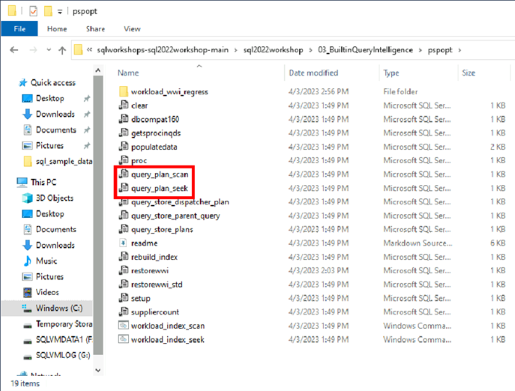
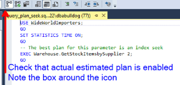
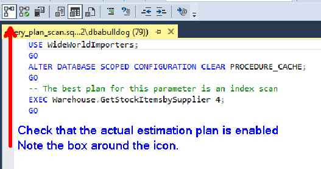
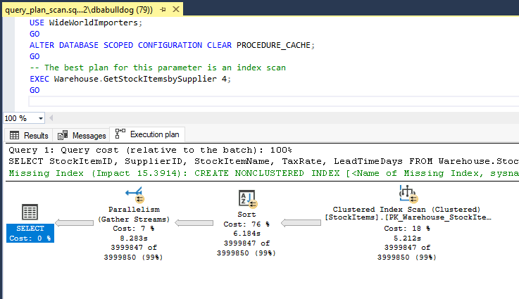
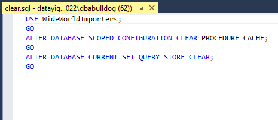
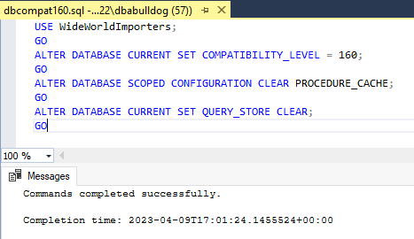
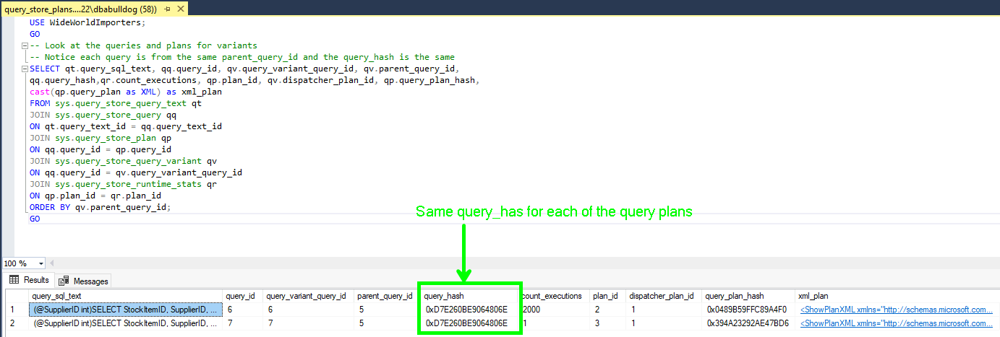
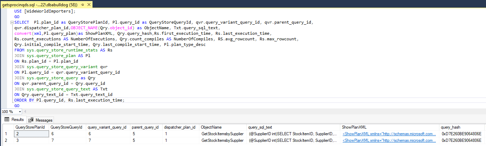

\*This will be a note for the individual taking the exercise

This exercise will be leveraging the following githib repository:

[sqlworkshops-sql2022workshop/sql2022workshop at main ·
microsoft/sqlworkshops-sql2022workshop ·
GitHub](https://github.com/microsoft/sqlworkshops-sql2022workshop/tree/main/sql2022workshop)

Before continuing with the exercise access lab

You are the SQL Server DBA for Wide World Importers and part of your
role is to keep up to date with new features in the product. You have
learned that SQL Server 2022 is GA and you need to evaluate the product.
The Wide World Importers business unit has made note of inconsistent
runtimes which has direct impact on the customer experience. You have
noted that the issue is with how SQL Server parameterizes the queries.
Looking through the notes you find the SQL Server 2022 has made
optimizations when it comes to how the engine parameterizes the queries
with Parameter Sensitive Plan optimization.

In this exercise we will be evaluating the Parameter Sensitive Plan
optimization and putting together a demo for our business unit to build
a use case on why we should upgrade to SQL Server 2022 & Compatibility
Mode 16.0.

**Viewing the parameter sniffing plan (PSP) optimization for a single
query execution.**

To help us understand what is happening within the Wide World Importers
databases lets look at the parameter sniffing plan optimization for a
single query execution executing under the older compatibility mode of
15.0.

From the pre-requisites you will have downloaded the set of T-SQL
required to examine PSP fpr a single query execution. We will be
utilizing the two queries in the box to be able to view this scenario.


<!--Image PNPWorkshopFolder for markdown-->


Load the script **query_plan_seek.sql** and set the actual execution
plan option in SSMS by using the GUI or \<Ctrl\>+\<M\>.


<!--Image Exercise1AEPSeekAEP for markdown-->

Execute **query_plan_seek.sql** **twice** in a query window in SSMS.

Select messages in the output pane of the query. Notice that the query
runs under 1 second.

> 

<!--Image Exercise1AExecution1VSExecution2 for markdown-->

Now let's check the timings from SET STATISTICS TIME ON from the second
execution. The query is run twice so the 2nd execution will not require
a compile which is reflect in execution 2 in the above screenshot. This
is the time we want to compare.


<!--> Image Exercise1AShowingIndexSeek for markdown-->

Note the query plan uses an Index Seek reflected in the above
screenshot. When this plan is within the procedure cache the business
unit reports that performance exceeds the SLA agreement.

In a different query window load the script **query_plan_scan.sql** and
set the actual execution option in SSMS by using the GUI
or \<Ctrl\>+\<M\>.


<!--Image Exercise1AScanAEP for markdown-->

Run **query_plan_scan.sql** in a query windows in SSMS. This may take a
few minutes to run. Note the query plan uses a Clustered Index Scan and
parallelism.


<!--Image Exercise1AshowingIndexScanAndParralellism for markdown-->

When this query runs our business unit reports that the query runs long
but is acceptable for the information being requested and meets the SLA.
However after the **query_plan_scan.sql**  executes the business unit
has notices the **query_plan_seek.sql**  executes more slowly and no
longer meets the SLA agreement.

To see what's going and work on identifying the issue go back and
run **query_plan_seek.sql** again ensuring that the actual execution
plan is enabled.


<!--Image Exercise1AEPSeek for markdown-->

Note that even though the query executes quickly (\< 1 sec), the timing
from SET STATISTICS TIME is significantly longer than the previous
execution. Examine the messages recorded from setting statistics time
on. We can see a significant increase in SQL Server Execution Time ms.


<!--Image Exercise1AStatisticsShowingSeekCPUTIMEIncrease for markdown-->

Also note that when we execute this query plan it uses a clustered index
scan and parallelism as noted in the image below. The query plan
compiled by our **query_plan_scan.sql** execution.


<!--Image Exercise1AShowingIndexSeekBecomesClusterScan for markdown-->

**See a workload problem for PSP**

**Note**: If you are using a named instance you will need to
edit **workload_index_seek.cmd** and **workload_index_scan.cmd** to use\
-S.\\\<instance name\>

Execute the script **clear.sql** to clear plan cache and query store.
Remember dbcompat is still set to 150 as shown in the image below.


<!--Images Exercise1BClearProcCacheAndQueryStore for markdown-->

Setup perfmon to capture **Processor\\% Processor Time** (not Processor
Information) and **SQL Server:SQL Statistics\\Batch
Requests/sec** counters.


<!--Image Exercise1BPerformanceMonitor1 for markdown-->

After selecting performance monitor you will see a screen similar to the
image below. Click on the green plus icon to add the counters indicated
above.


<!--Image Exercise1BPerformanceMonitor2 for markdown-->

After selecting the green plus icon you will be presented with a screen
where you will add the **Processor\\% Processor Time** and **SQL
Server:SQL Statistics\\Batch Requests/sec** counters. Note that the
counters are in alphabetical order.


<!--Image Exercise1BPerformanceMonitor3 for markdown-->


<!--Image Exercise1BPerformanceMonitor4 for markdown-->

With the performance counters ready let's simulate a workload against
our Wide World Importers database.

Run **workload_index_seek.cmd 10** from the command prompt or within
PowerShell terminal. This should finish very quickly. The parameter is
the number of users. You may want to increase this for machines with 8
CPUs or more. Ensure that you are in the directory you downloaded as
part of the pre-requisites.


<!--Image Exercise1BExecuteWorkload_Index_Seek_Cmd for markdown-->

Observe the performance monitor counters we set up previously.


<!--Image Exercise1BPerformanceMonitorIndexsSeek1 for markdown-->

Run **workload_index_scan.cmd** from the command prompt or within
PowerShell terminal. This should take longer but now locks into cache a
plan for a scan.


<!--Image Exercise1BExecuteWorkload_Index_Scan_Cmd.png for markup-->

Run **workload_index_seek.cmd 10** again from the command prompt or
within PowerShell terminal.


<!--Image Exercise1BExecuteWorkload_Index_Seek_Cmd for markdown-->

Let's observe again the performance monitor counters we set up
previously. Notice much higher CPU and much lower batch requests/sec.
Also note the workload doesn\'t finish in a few seconds as before.


<!--Image Exercise1BPerformanceMonitorIndexsSeek2.png for markdown-->

Hit \<Ctrl\>+\<C\> in the command window or PowerShell terminal to
cancel the workload for **workload_index_seek.cmd** as it can take
minutes to complete.

Use the script **suppliercount.sql** to see the skew in supplierID
values in the table. This explains why \"one size does not fit all\" for
the stored procedure based on parameter values. The seek business
process returns data for SupplierID 2 which when initially executed the
optimizer compiles a query plan that uses a clustered index seek.
However when we execute the scan business process the optimizer compiles
a query plan that uses a clustered index scan. This new plan is stored
within the procedure cache and is the one used for future queries. When
this happens we can see by the above performance metrics the query does
not scale for those SupplierIDs with a lower supplier count due to the
skew in the data. This parameter sensitivity also know as "parameter
sniffing" would require attention of the DBA and could require coding
changes to ensure that the query scales when using parameter SupplierID.


<!--Image Exercise1Bsuppliercount for markdown-->

Note. For more information on parameter sensitivity please refer to our
documentation at
<https://learn.microsoft.com/en-us/sql/relational-databases/query-processing-architecture-guide?view=sql-server-ver16#parameter-sensitivity>.

**Solve the problem in SQL Server 2022 with no code changes**

We recently attended a Microsoft session that mentioned I can solve my
"parameter sniffing" problem with no code changes. We heard that
parameter sensitive plan optimization (PSP) will do this for us by
deploying SQL Server 2022 and updating our database to compatibility
mode 160. By doing the following we will prove out that PSP, SQL Sever
2022, and compatibility mode 160 will improve performance and
scalability of our queries.

Let\'s get this workload to run much faster and consistently using PSP
optimization. Execute the T-SQL script **dbcompat160.sql** with SSMS.


<!--Image Exercise1CCompatModeClearProcCacheClearQueryStore for markdown-->

Validate that the WideWorldImporters database is set to compatibility
level 160 by executing the following T-SQL.

```sql
    select name,compatibility_level from sys.databases
    where name =\'WideWorldImporters\'
```


<!--Image Exercise1CCheckCompatMode for markdown-->

Setup perfmon to capture **Processor\\% Processor Time** (not Processor
Information) and **SQL Server:SQL Statistics\\Batch
Requests/sec** counters.


<!--Image Exercise1BPerformanceMonitor1 for markdown-->

After selecting performance monitor you will see a screen similar to the
image below. Click on the green plus icon to add the counters indicated
above.


<!--Image Exercise1BPerformanceMonitor2 for markdown-->

After selecting the green plus icon you will be presented with a screen
where you will add the **Processor\\% Processor Time** and **SQL
Server:SQL Statistics\\Batch Requests/sec** counters. Note that the
counters are in alphabetical order.


<!--Image Exercise1BPerformanceMonitor3 for markdown-->


<!--Image Exercise1BPerformanceMonitor4 for markdown-->

With the performance counters ready let's simulate a workload against
our Wide World Importers database.

Run **workload_index_seek.cmd 10** from the command prompt or within
PowerShell terminal. This should finish very quickly. The parameter is
the number of users. You may want to increase this for machines with 8
CPUs or more. Ensure that you are in the directory you downloaded as
part of the pre-requisites.


<!--Image Exercise1BExecuteWorkload_Index_Seek_Cmd for markdown-->

Run **workload_index_scan.cmd** from the command prompt or within
PowerShell terminal. This should take longer but now locks into cache a
plan for a scan.


<!--Image Exercise1BExecuteWorkload_Index_Scan_Cmd.png for markup-->

Run **workload_index_seek.cmd 10** again from the command prompt or
within PowerShell terminal. Notice that it now finishes again in a few
seconds. Unlike in the previous exercise is where we needed to terminate the workload.


<!--Image Exercise1BExecuteWorkload_Index_Seek_Cmd for markdown-->

Observe perfmon counters and see consistent performance.


<!--Image Exercise1CPerformanceCountersConsistent for markdown-->

Run the **Top Resource Consuming Queries** report from SSMS (Use Object
Explorer and choose Query Store under your database context to find this
report) and see that there are two plans for the same stored procedure.
The one difference is that there is new OPTION applied to the query for
each procedure which is why there are two different \"queries\" in the
Query Store.


<!--Image Exercise1CQueryStoreTopResourceConsumingQueries for markdown-->


<!--Exercise Exercise1CQueryStoreTopResourceConsumingQueriesQueryVariant1
for markdown-->


<!--Exercise Exercise1CQueryStoreTopResourceConsumingQueriesQueryVariant1 for markdown -->

Execute the script **query_store_plans.sql**. Look into the details of
the results to see the query text is the same but slightly different
with the option to use variants. But notice the query_hash is the same
value.


<!--Image Exercise1CQueryStorePlansSameQueryHash for markdown-->

Execute the script **query_store_parent_query.sql** and observe this is
the text of the query from the stored procedure without variant options.
This is the text from the *parent plan*.


<!--Image Exercise1CQueryStoreParentQuery for markdown-->

Execute the script **query_store_dispatcher_plan.sql**. If you click on
the dispatcher_plan value you will see a graphical plan operator called
Multiple Plan.


<!--Image Exercise1CQueryStoreDispatcherPlan1 for markdown-->


<!--Image Exercise1CQueryStoreDispatcherPlan2 for markdown-->

To find the parent stored procedure of the statements from variants
execute the script **getsprocinqds.sql**. Scroll left and right on the
results and notice the parent_query_id, query_variant_query_id,
query_hash, and other columns of interest.


<!--Image Exercise1CQueryStoreGetSProcinqds1 for markdown-->