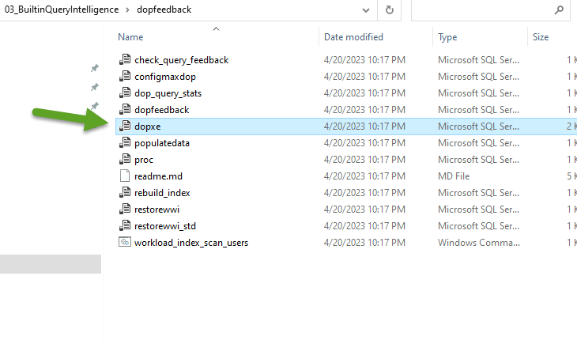
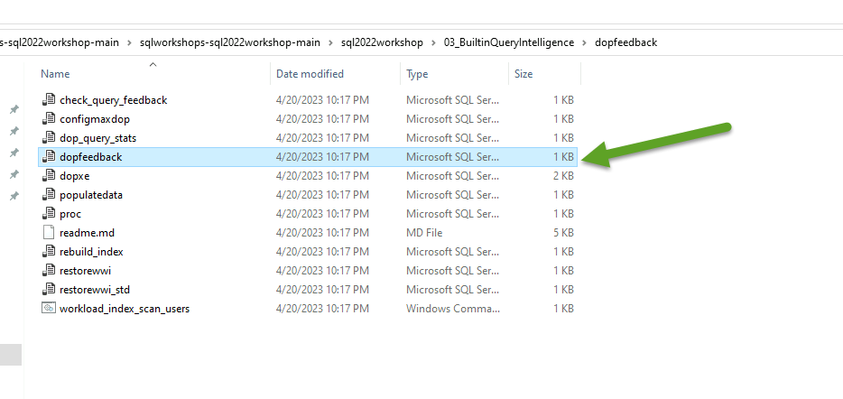
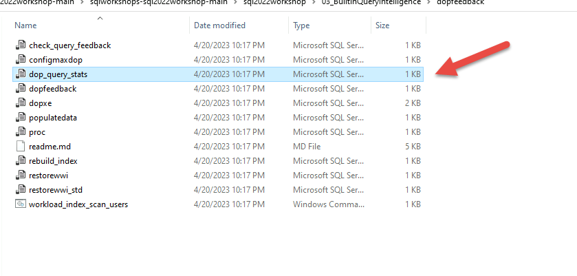
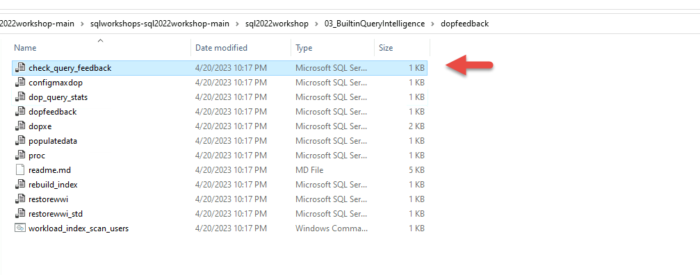

## Exercise- Degree of Parallelism feedback in SQL Server 2022

>This exercise will be leveraging the following githib repository:
>
>[sqlworkshops-sql2022workshop/sql2022workshop at main ·
>microsoft/sqlworkshops-sql2022workshop ·
>GitHub](https://github.com/microsoft/sqlworkshops-sql2022workshop/tree/main/sql2022workshop)
>
>Before continuing with the exercise access lab ensure that the pre-requisites have been completed and setup has been completed.
>
> ## Prerequisites
>SQL Server 2022 Evaluation or Developer Edition
>VM or computer with 8 CPUs and at least 24Gb RAM.
>SQL Server Management Studio (SSMS). The latest 18.x build or 19.x build will work.
>Download ostress.exe from https://aka.ms/ostress. Install using the RMLSetup.msi file that is downloaded. Use all defaults.
>
>## Setup the exercise
>Create a directory called c:\sql_sample_databases to store backups and files.
>
>Download a backup of a customized version of the WideWorldImporters sample database from <https://aka.ms/wwi_dop> from and copy it into c:\sql_sample_databases directory.
>
>Note: If you try to restore the default sample WideWorldImporters you can use the restorewwi.sql, populatedata.sql and rebuild_index.sql scripts to customize the database for >the exercise.
>
>Restore this database to your SQL Server 2022 instance. You can use the provided restorewwi.sql script. You may need to change the directory paths for the location of your >backup and where you will restore the database files.
>
>IMPORTANT: If you have permission issues to restore the backup you can try to copy the backup into the default "data" folder for your SQL Server installation and try the >restore again. You will need to edit the restorewwi.sql script accordingly. The default for most instances is C:\Program Files\Microsoft SQL Server\MSSQL16.>MSSQLSERVER\MSSQL\DATA
>

## Scenario
You are the SQL Server DBA for Wide World Importers and part of your role is to keep up to date with new features in the product. You have learned that SQL Server 2022 is GA and you need to evaluate the product. The Wide World Importers business unit has had concerns about using the right amount of parallelism for their queries. Looking through the notes you find the SQL Server 2022 has introduced a new feature called Degree Of Parallelism (DOP) feedback to find the parallel efficiency of a query.

In this exercise we will be evaluating the Degree of Parallelism feedback feature in SQL Server 2022.

You will observe how this feature validates  DOP values for an eligible query until the lowest possible DOP value is found that reduces CPU usage and achieves the “no harm” principle over time.


<!-- 2. Scenario sub-task --------------------------------------------------------------------------------

    Goal: Describe the part of the scenario covered in this exercise

    Heading: a separate heading is optional; you can combine this with the topic sentence into a single paragraph

    Example: "Recall that in the chocolate-manufacturer example, there would be a separate storage account for the private business data. There were two key requirements for this account: geographically-redundant storage because the data is business-critical and at least one location close to the main factory."

    Recommended: image that summarizes the entire scenario with a highlight of the area implemented in this exercise
-->

<!-- 3. Task performed in the exercise ---------------------------------------------------------------------

    Goal: State concisely what they'll implement here; that is, describe the end-state after completion

    Heading: a separate heading is optional; you can combine this with the sub-task into a single paragraph

    Example: "Here, you will create a storage account with settings appropriate to hold this mission-critical business data."

    Optional: a video that shows the end-state
-->

<!-- 4. Chunked steps -------------------------------------------------------------------------------------

    Goal: List the steps they'll do to complete the exercise.

    Structure: Break the steps into 'chunks' where each chunk has three things:
        1. A heading describing the goal of the chunk
        2. An introductory paragraph describing the goal of the chunk at a high level
        3. Numbered steps (target 7 steps or fewer in each chunk)

    Example:
        Heading:
            "Use a template for your Azure logic app"
        Introduction:
             "When you create an Azure logic app in the Azure portal, you have the option of selecting a starter template. Let's select a blank template so that we can build our logic app from scratch."
        Steps:
             "1. In the left navigation bar, select Resource groups.
              2. Select the existing Resource group [sandbox resource group name].
              3. Select the ShoeTracker logic app.
              4. Scroll down to the Templates section and select Blank Logic App."
-->
## Exercise   


<!-- Introduction paragraph -->

Execute the script **configmaxdop.sql** to configure MAXDOP to 0 for the instance.  


This script executes the following T-SQL statements:  

```sql
sp_configure 'show advanced', 1;
go
reconfigure;
go
```

Execute the script **proc.sql** to create a stored procedure to query data that will use a query plan with parallelism.  


This script executes the following T-SQL statements:

```sql
USE WideWorldImporters;
GO
CREATE OR ALTER PROCEDURE [Warehouse].[GetStockItemsbySupplier]  @SupplierID int
AS
BEGIN
SELECT StockItemID, SupplierID, StockItemName, TaxRate, LeadTimeDays
FROM Warehouse.StockItems s
WHERE SupplierID = @SupplierID
ORDER BY StockItemName;
END;
GO
```
   

We will create and run an XEvent session to watch live data and observe the events that get generated while the DOP feedback runs in the background.  

Execute the script **dopxe.sql** to create and start an XEvent session.

   

This script runs the following T-SQL statements:

```sql
IF EXISTS (SELECT * FROM sys.server_event_sessions WHERE name = 'DOPFeedback')
DROP EVENT SESSION [DOPFeedback] ON SERVER;
GO
CREATE EVENT SESSION [DOPFeedback] ON SERVER
ADD EVENT sqlserver.dop_feedback_eligible_query(
    ACTION(sqlserver.query_hash_signed,sqlserver.query_plan_hash_signed,sqlserver.sql_text)),
ADD EVENT sqlserver.dop_feedback_provided(
    ACTION(sqlserver.query_hash_signed,sqlserver.query_plan_hash_signed,sqlserver.sql_text)),
ADD EVENT sqlserver.dop_feedback_reverted(
    ACTION(sqlserver.query_hash_signed,sqlserver.query_plan_hash_signed,sqlserver.sql_text)),
ADD EVENT sqlserver.dop_feedback_stabilized(
    ACTION(sqlserver.query_hash_signed,sqlserver.query_plan_hash_signed,sqlserver.sql_text)),
ADD EVENT sqlserver.dop_feedback_validation(
    ACTION(sqlserver.query_hash_signed,sqlserver.query_plan_hash_signed,sqlserver.sql_text))
WITH (MAX_MEMORY=4096 KB,EVENT_RETENTION_MODE=NO_EVENT_LOSS,MAX_DISPATCH_LATENCY=1 SECONDS,MAX_EVENT_SIZE=0 KB,MEMORY_PARTITION_MODE=NONE,TRACK_CAUSALITY=OFF,STARTUP_STATE=OFF);
GO
-- Start XE
ALTER EVENT SESSION [DOPFeedback] ON SERVER
STATE = START;
GO

```
Right-click the new Extended Events session in Object Explorer in SSMS and select Watch Live Data. 

 
  
    


Execute **dopfeedback.sql** to set Query Store settings and database setting for DOP feedback. 



The script executes the following T-SQL statements:
```sql
USE WideWorldImporters;
GO
-- Make sure QS is on and set runtime collection lower than default
ALTER DATABASE WideWorldImporters SET QUERY_STORE = ON;
GO
ALTER DATABASE WideWorldImporters SET QUERY_STORE (OPERATION_MODE = READ_WRITE, DATA_FLUSH_INTERVAL_SECONDS = 60, INTERVAL_LENGTH_MINUTES = 1, QUERY_CAPTURE_MODE = ALL);
GO
ALTER DATABASE WideWorldImporters SET QUERY_STORE CLEAR ALL;
GO
-- You must change dbcompat to 160
ALTER DATABASE WideWorldImporters SET COMPATIBILITY_LEVEL = 160;
GO
-- Enable DOP feedback
ALTER DATABASE SCOPED CONFIGURATION SET DOP_FEEDBACK = ON;
GO
-- Clear proc cache to start with new plans
ALTER DATABASE SCOPED CONFIGURATION CLEAR PROCEDURE_CACHE;
GO

```
This script will enable DOP feedback, set dbcompat to 160, and clear settings for the exercise. The INTERVAL_LENGTH_MINUTES setting on the query store has been set to 1 so that we could observe query statistics at a granular level .
  


Run **workload_index_scan_users.cmd** from a command prompt.  

If you are using a named instance you will need to edit workload_index_scan_users.cmd to include a -S.<instance name>
 
The script will take around 15 minutes to run.


Once the script starts running,we can observe DOP feedback using the live data from Extended Events. Within the Live Data Viewer in SSMS, you can add columns to the default view to see the sequence of feedback.  (right-click any field in the Details pane and select Show Column in Table).   
  
You should see a series of events like below.


You should first see a dop_feedback_eligible_query event. This will take several minutes to first appear. Then you will see a series of dop_feedback_provided and dop_feedback_validation events until you see a final dop_feedback_stabilized event with a feedback_dop value of 2. Depending on your system it is possible the system can stabilize at a feedback_dop value of 4. 


The dop_feedback_stabilized event shows the reason for stabilization. In this case, the validation for DOP 2 stabilized because the query has reached the minimum dop value. 


  
When feedback is provided and feedback state is stable, the feedback is persisted to Query Store.


Run the script dop_query_stats.sql to see the changes in DOP and resulting change in the query performance through query stats.  



 Note the small decrease in avg duration and decrease in needed CPU across the various last_dop values. 


Run the script **check_query_feedback.sql** to see the persisted DOP feedback. 

 

This script runs the following T-SQL statements:

```sql
USE WideWorldImporters;
GO
SELECT * from sys.query_store_plan_feedback;
GO
```

Examine the values in the feedback_desc field to see the BaselineStats and LastGoodFeedback values.  


We can also observe the improvement in performance through the Top Resource consuming queries report.  

Open Top Resource Consuming Queries report in SSMS.  


Change Statistic to Avg and metric to  Duration. Notice the decrease in time until stabilization. 


Change the metric to CPU and observe. Notice the decrease in CPU  
 


This above report shows you the real benefit of DOP feedback: a significant reduction in CPU resources required to achieve a similar or lower duration for the query without any user action.


<!-- 5. Validation -------------------------------------------------------------------------------------------

    Goal: Enables the learner to evaluate if they completed the exercise correctly. Feedback like this is critical for learning.

    Structure:
        1. A heading of "## Check your work".
        2. An introductory paragraph describing how they'll validate their work at a high level.
        3. Numbered steps (if the learner needs to perform multiple steps to verify if they were successful).
        4. Video of an expert performing the exact steps of the exercise (optional).

    Example:
         "At this point, the app is scanning Twitter every minute for tweets containing the search text. To verify the app is running and working correctly, we'll look at the Runs history table."
             "1. Select Overview in the navigation menu.
              2. Select Refresh once a minute until you see a row in the Runs history table.
              ...
              6. Examine the data in the OUTPUTS section. For example, locate the text of the matching tweet."
-->


<!-- - - - - - - - - - - - - - - - - - - - - - - - - - - - - - - - - - - - - - - - -->

<!-- Do not add a unit summary or references/links -->
