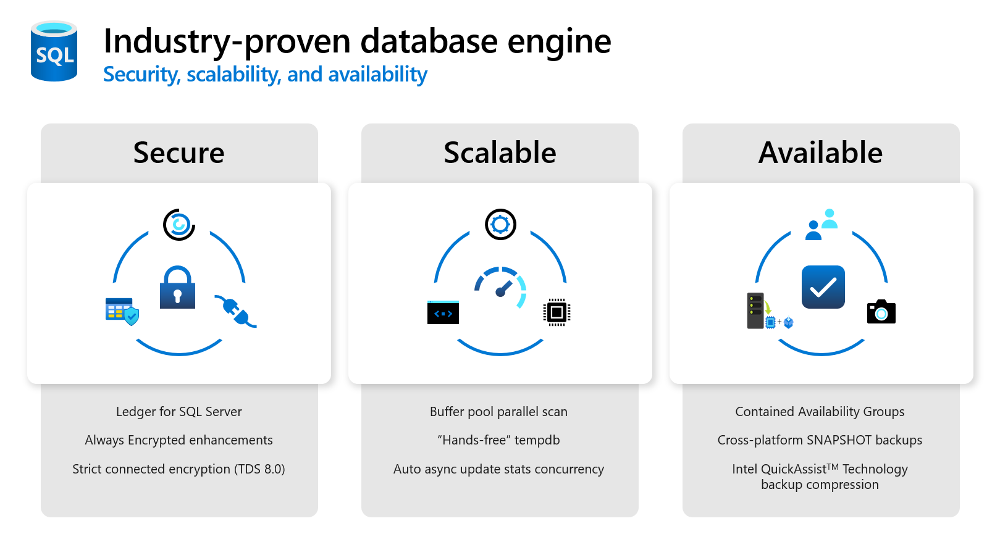
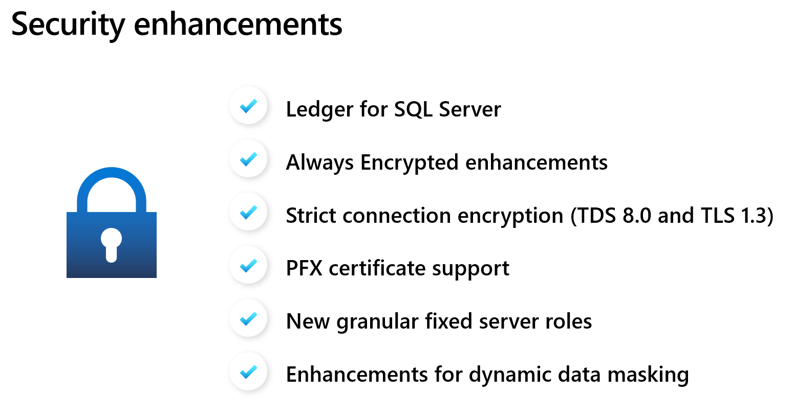

In this module, we explore the new capabilities in security, scalability, and availability of SQL Server 2022.

## Security enhancements in SQL Server 2022

SQL Server provides rich capabilities to protect your data through authentication, encryption, and authorization. SQL Server 2022 enhances security through several new capabilities. Here are some of the highlighted features:

In the following units, we'll go over:

- How you can attest that your data hasn't been tampered with and use the auditing capabilities of ledger.
- The Always Encrypted additions to SQL Server 2022 to support confidential queries.
- The added built-in server roles to provide more granular permissions for specific tasks, and how it complies with the principle of least privilege.
- How you can apply UNMASK permissions at the database, schema, table, or column level to control and limit unauthorized access to data stored in the database.

## Scalability

SQL Server has a proven track record to provide scalability without requiring application changes. SQL Server 2022 continues this tradition, and includes:

- Improvements to the performance of buffer pool scan operations on large-memory machines.
- System page latch concurrency enhancements that apply to all user databases, and especially benefits `tempdb` heavy workloads
- Asynchronous auto update statistics concurrency

This is not an exhaustive list of the scalability enhancements in SQL Server 2022, but it highlights some of the key improvements to help you scale your workloads.

## Availability

Ensuring SQL Server is highly available and your data is protected from disasters is important for any business critical application. SQL Server 2022 provides new capabilities for both availability and disaster recovery.

**Watch this video** to see some of the new security, scalability, and availability features of SQL Server 2022:

> [!VIDEO https://learn-video.azurefd.net/vod/player?show=data-exposed&ep=sql-server-2022-security-scalability-availability-ep-4-data-exposed]

## Learning objectives

At the end of this module, you will be able to:

- Describe what ledger for SQL Server is, and use ledger tables to enhance your auditing capabilities
- Be familiar with the additional security features, like the added granular fixed server roles, Always Encrypted enhancements, strict connection encryption, and granular UNMASK permissions for dynamic data masking
- Understanding of the enhancements to memory management, `tempdb`, and statistics maintenance
- Describe the new capabilities for both availability and disaster recovery

## Prerequisites

- Basic working knowledge of SQL Server, including deployment, security, query processing, and high availability
- Fundamental knowledge of the T-SQL language
- Basic knowledge of Azure concepts, including subscriptions, resource groups, Infrastructure-as-a-Service (IaaS) and Platform-as-a-Service (PaaS)
