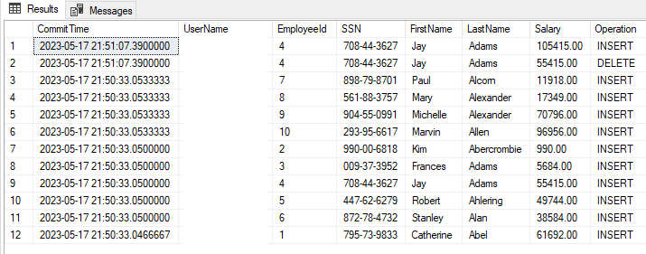

---
ms.custom:
  - build-2023
---
Imagine that you're an auditor for the Contoso company. The HR department of Contoso is using a simple web application to manage employees salaries. You were asked to audit the data in the database to make sure the data is correct and no one has tampered with it.

In this exercise, we see how you can use ledger in a real world scenario of auditing data using ledger tables. We'll perform the following tasks:

- Create a database called `ContosoHR`.
- create an updatable ledger table called `Employees`.
- Make updates to the data.
- Verify the data can be fully trusted.
- Query the history table and ledger views to see the tracking that is taking place and the relationship between the tables.

## Prerequisites

- SQL Server 2022 installed.
- The latest version of SQL Server Management Studio (SSMS).

## Create the database and ledger table

1. Sign into your SQL Server 2022 instance using SSMS with `sysadmin` permissions. Create a database called `ContosoHR` and switch to the context of using that database.

    ```sql
    USE master;
    GO
    -- Create the ContosoHR database
    DROP DATABASE IF EXISTS ContosoHR;
    GO
    CREATE DATABASE ContosoHR;
    GO
    USE ContosoHR;
    GO
    ```

1. Create an updatable ledger table for `Employees` by executing the following script:

    ```sql
    USE ContosoHR;
    GO
    -- Create the Employees table and make it an updatable ledger table
    DROP TABLE IF EXISTS [dbo].[Employees];
    GO
    CREATE TABLE [dbo].[Employees](
    	[EmployeeID] [int] IDENTITY(1,1) NOT NULL,
    	[SSN] [char](11) NOT NULL,
    	[FirstName] [nvarchar](50) NOT NULL,
    	[LastName] [nvarchar](50) NOT NULL,
    	[Salary] [money] NOT NULL
    	)
    WITH 
    (
      SYSTEM_VERSIONING = ON,
      LEDGER = ON
    ); 
    GO
    ```

    If you inspect the newly created table in SSMS **Object Explorer**, you'll notice the table has a new icon with a checkmark that indicates it's a ledger table.

    :::image type="content" source="../media/ssms-object-explorer.png" alt-text="Screenshot of the newly created ledger table in SSMS Object Explorer.":::

1. Populate the `Employees` table with some sample data by executing the following script:

    ```sql
    USE ContosoHR;
    GO
    -- Clear Employees table
    DELETE FROM [dbo].[Employees];
    GO
    -- Insert 10 employees. The names and SSN are completely fictional and not associated with any person
    DECLARE @SSN1 char(11) = '795-73-9833'; DECLARE @Salary1 Money = 61692.00; INSERT INTO [dbo].[Employees] ([SSN], [FirstName], [LastName], [Salary]) VALUES (@SSN1, 'Catherine', 'Abel', @Salary1);
    DECLARE @SSN2 char(11) = '990-00-6818'; DECLARE @Salary2 Money = 990.00; INSERT INTO [dbo].[Employees] ([SSN], [FirstName], [LastName], [Salary]) VALUES (@SSN2, 'Kim', 'Abercrombie', @Salary2);
    DECLARE @SSN3 char(11) = '009-37-3952'; DECLARE @Salary3 Money = 5684.00; INSERT INTO [dbo].[Employees] ([SSN], [FirstName], [LastName], [Salary]) VALUES (@SSN3, 'Frances', 'Adams', @Salary3);
    DECLARE @SSN4 char(11) = '708-44-3627'; DECLARE @Salary4 Money = 55415.00; INSERT INTO [dbo].[Employees] ([SSN], [FirstName], [LastName], [Salary]) VALUES (@SSN4, 'Jay', 'Adams', @Salary4);
    DECLARE @SSN5 char(11) = '447-62-6279'; DECLARE @Salary5 Money = 49744.00; INSERT INTO [dbo].[Employees] ([SSN], [FirstName], [LastName], [Salary]) VALUES (@SSN5, 'Robert', 'Ahlering', @Salary5);
    DECLARE @SSN6 char(11) = '872-78-4732'; DECLARE @Salary6 Money = 38584.00; INSERT INTO [dbo].[Employees] ([SSN], [FirstName], [LastName], [Salary]) VALUES (@SSN6, 'Stanley', 'Alan', @Salary6);
    DECLARE @SSN7 char(11) = '898-79-8701'; DECLARE @Salary7 Money = 11918.00; INSERT INTO [dbo].[Employees] ([SSN], [FirstName], [LastName], [Salary]) VALUES (@SSN7, 'Paul', 'Alcorn', @Salary7);
    DECLARE @SSN8 char(11) = '561-88-3757'; DECLARE @Salary8 Money = 17349.00; INSERT INTO [dbo].[Employees] ([SSN], [FirstName], [LastName], [Salary]) VALUES (@SSN8, 'Mary', 'Alexander', @Salary8);
    DECLARE @SSN9 char(11) = '904-55-0991'; DECLARE @Salary9 Money = 70796.00; INSERT INTO [dbo].[Employees] ([SSN], [FirstName], [LastName], [Salary]) VALUES (@SSN9, 'Michelle', 'Alexander', @Salary9);
    DECLARE @SSN10 char(11) = '293-95-6617'; DECLARE @Salary10 Money = 96956.00; INSERT INTO [dbo].[Employees] ([SSN], [FirstName], [LastName], [Salary]) VALUES (@SSN10, 'Marvin', 'Allen', @Salary10);
    GO
    ```

## Explore the data using ledger views

1. Examine the columns using a `SELECT` query. The following script has two examples of how to query the data. The first example uses the `*` wildcard to return all columns. The second example lists out all the columns. Notice how the table has other columns that aren't part of the original table definition. These columns are used by the ledger feature to track the changes to the data.

    ```sql
    USE ContosoHR;
    GO
    -- Use * for all columns
    SELECT * FROM dbo.Employees;
    GO
    -- List out all the columns
    SELECT EmployeeID, SSN, FirstName, LastName, Salary, 
    ledger_start_transaction_id, ledger_end_transaction_id, ledger_start_sequence_number, 
    ledger_end_sequence_number
    FROM dbo.Employees;
    GO
    ```

1. Look at the `Employees_Ledger` view by executing the following `SELECT` query. This is a view from the `Employees` table and a ledger history table. The ledger has the transaction information from hidden columns in the table, plus an indication of what type of operation was performed on the ledger for a specific row.

    ```sql
    USE ContosoHR;
    GO
    SELECT * FROM dbo.Employees_Ledger;
    GO
    ```

   :::image type="content" source="../media/ssms-get-employees-ledger.png" alt-text="Screenshot of the ledger view for the Employees table in SSMS.":::

1. To get a better understanding of the definition of the ledger view, you can execute the following query:

    ```sql
    USE [ContosoHR];
    GO
    sp_helptext 'Employees_ledger';
    GO
    ```

    ```output
    CREATE VIEW [dbo].[Employees_Ledger] AS   SELECT [EmployeeID], [SSN], [FirstName], [LastName], [Salary], [ledger_start_transaction_id] AS [ledger_transaction_id], [ledger_start_sequence_number] AS [ledger_sequence_number], 1 AS [ledger_operation_type], N'INSERT' AS [ledger_operation_type_desc] FROM [dbo].[Employees]   UNION ALL   SELECT [EmployeeID], [SSN], [FirstName], [LastName], [Salary], [ledger_start_transaction_id] AS [ledger_transaction_id], [ledger_start_sequence_number] AS [ledger_sequence_number], 1 AS [ledger_operation_type], N'INSERT' AS [ledger_operation_type_desc] FROM [dbo].[MSSQL_LedgerHistoryFor_901578250]   UNION ALL   SELECT [EmployeeID], [SSN], [FirstName], [LastName], [Salary], [ledger_end_transaction_id] AS [ledger_transaction_id], [ledger_end_sequence_number] AS [ledger_sequence_number], 2 AS [ledger_operation_type], N'DELETE' AS [ledger_operation_type_desc] FROM [dbo].[MSSQL_LedgerHistoryFor_901578250]
    ```

   You can see that the view is a union of the original table (for new inserts), and updates from the history table (for inserts and deletes).

1. You can combine the ledger view with a system table to get more auditing information, such as who performed the transaction on the database, and at what date and time. Execute the following query to see an example.

    ```sql
    USE ContosoHR;
    GO
    SELECT e.EmployeeID, e.FirstName, e.LastName, e.Salary, 
    dlt.transaction_id, dlt.commit_time, dlt.principal_name, e.ledger_operation_type_desc, dlt.table_hashes
    FROM sys.database_ledger_transactions dlt
    JOIN dbo.Employees_Ledger e
    ON e.ledger_transaction_id = dlt.transaction_id
    ORDER BY dlt.commit_time DESC;
    GO
    ```

1. To verify the integrity of the ledger, let's generate a digest by executing the stored procedure `sp_generate_database_ledger_digest`. Save the output value (including the brackets) to be used for verifying the ledger.

    ```sql
    USE ContosoHR;
    GO
    EXEC sp_generate_database_ledger_digest;
    GO
    ```

1. You can now see blocks generated for the ledger table by looking at `sys.database_ledger_blocks`.

    ```sql
    USE ContosoHR;
    GO
    SELECT * FROM sys.database_ledger_blocks;
    GO
    ```

## Make changes to the data

Now that we've looked at some of the functionality of ledger in SQL Server 2022, let's make some changes to the data and see how the ledger tracks the changes. This helps you in your task of auditing the data in the `ContosoHR` database, and specifically, the `Employees` table.

1. Pretend that Jay, an employee at the company has logged into the database, and executes the following query to add 50,000 to their salary. Unfortunately for Jay, the `Employees` table is an updatable ledger table. That means their change, along with their identity and the timestamp have been persisted in a tamper-evident ledger data structure.

    ```sql
    UPDATE [dbo].[Employees] SET [Salary] = [Salary] + 50000
    WHERE [FirstName] = N'Jay' AND [LastName] = N'Adams'
    ```

1. If you use a `SELECT` query on the `Employees` table, you can see that Jay's salary has been updated from earlier.

    ```sql
    SELECT * FROM [dbo].[Employees]
    ```

   :::image type="content" source="../media/ssms-updated-salary.png" alt-text="Screenshot of the updated Employees table in SSMS.":::

## Auditing the data

Let's assume that a few weeks later, you're doing a routine audit of changes in the `ContosoHR` database. As a first step, you run the ledger verification to make sure that you can trust the data that you're going to examine.

1. Execute the query below to run the ledger verification. The results contain the latest database digest and represent the hash of the database at the current point in time. Copy the contents of the results to be used in the next step.

    ```sql
    USE ContosoHR;
    GO
    EXEC sp_generate_database_ledger_digest;
    GO
    ```

   :::image type="content" source="../media/ssms-copy-digest.png" alt-text="Screenshot of the results of the ledger digest in SSMS.":::

1. Use the `sp_verify_database_ledger` stored procedure to verify that the historical data in your database wasn't tampered with. Replace `<YOUR DATABASE DIGEST>` with the digest you copied in the previous step.

    ```sql
    EXECUTE sp_verify_database_ledger N'
    <YOUR DATABASE DIGEST>
    ';
    ```

   If the verification is successful and your data hasn't been tampered with, you'll see the following **Message**:

   :::image type="content" source="../media/ssms-ledger-verification-success.png" alt-text="Screenshot of the results of the ledger verification in SSMS.":::

   By using this digest, we know that:

   - The data is valid based on the time the digest was captured.
   - The internal blocks match the current data changes for the update to Jay's salary. If someone had to fake the data for the `Employees` table without doing a T-SQL `UPDATE` command to make the system *think* Jay's current salary was 50,000 more than it really is, the system would have raised an error that hashes of the changes don't match the current data. You would see a `Ledger verification failed` message.

1. Now that you've verified the data hasn't been tampered with, you browse the content of the ledger view for the `Employees` table. You notice a suspicious update operation performed by Jay, who won't be able to effectively deny they have updated their salary. The data in the ledger table has been cryptographically verified as genuine and it clearly shows Jay's **UserName** as the account who updated the salary. To verify this, run the following query.

    ```sql
        SET NOCOUNT ON
    	SELECT
    	t.[commit_time] AS [CommitTime]
    	, t.[principal_name] AS [UserName]
    	, l.EmployeeId
    	, l.[SSN]
    	, l.[FirstName]
    	, l.[LastName]
    	, l.[Salary]
    	, l.[ledger_operation_type_desc] AS Operation
    	FROM [dbo].[Employees_Ledger] l
    	JOIN sys.database_ledger_transactions t
    	ON t.transaction_id = l.ledger_transaction_id
    	WHERE t.[commit_time] > DATEADD(MONTH, -1, SYSDATETIMEOFFSET())
    	ORDER BY t.commit_time DESC;
    ```

   
