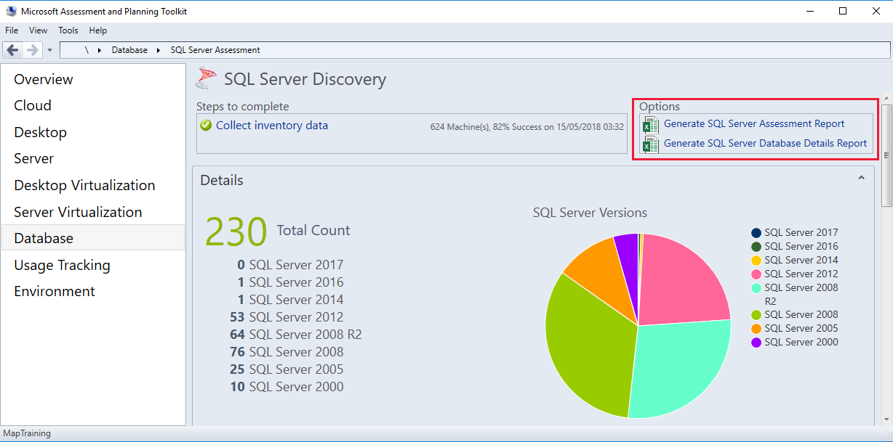

Suppose you are a newly-hired database administrator and, as well as taking an inventory of all the SQL Server instances within your corporate environment, you want to identify databases requiring an upgrade. You are concerned about a number of SQL Server 2005 databases used by critical business applications, as they are no longer supported by Microsoft. Furthermore, there are SQL Server 2008 instances that you want to upgrade before support expires.

Performing a corporate-wide inventory of SQL Server instances and the supporting hardware can be a tedious, repetitive, and time-consuming task. It is helpful to automate a task such as this, to reduce the time and the potential for mistake through human error.

Being able to perform automated audits is especially important in larger operations, as more instances means more time required for the audit process. A regular audit helps highlight potential security and stability issues in unsupported SQL Server versions on old hardware, and enables a clear plan for performing system upgrades.

## How to collect inventory data

You can use the **Microsoft Assessment and Planning (MAP)** toolkit to scan your network for servers, or supply credentials for a specific computer. Depending on the purpose of your audit, you can select the information you want the toolkit to gather in the inventory. You can search for Windows, Linux, or VMware computers, Exchange, Lync/Skype for Business, or SQL Servers, as well as Active Directory (AD) users.

To perform an assessment of your SQL Servers for potential upgrade, you should focus on the **SQL Server** option.

## Assess the inventory data

After running the inventory operation, the toolkit returns a high level view of your landscape.

Under the **Database** view, the **SQL Server Discovery** report provides a count of SQL Servers by version, the number of services by type, the total number of licenses by edition, and a count of developer and free editions.

**SQL Server Versions** shows the breakdown of the total count by version number, such as 10 SQL Server 2000 servers, 76 SQL Server 2008 servers, and 1 SQL Server 2016 server. The **SQL Server Component** count displays the number of services installed across the landscape. Service types are categorized by Database Engine, Integration Services, Analysis Services, Reporting Services, Master Data Services, Data Quality Services, and SQL Server R Services.

**Licensed Editions** is split into paid-for licenses, and free licenses. Paid-for licenses is slightly less easy to compare due to the differences across versions. For example, the Business Intelligence edition was introduced in SQL Server 2012, but removed in a later version, whereas the Standard and Enterprise editions have existed from SQL Server 2000 through SQL Server 2017.

The free editions are useful to include in your inventory. These comprise Evaluation, Express, Desktop, and Developer. Periodically it is good practice to check that no production databases are running on free versions of SQL Server.

Along with the numeric counts of versions, installed service components, and licenses, the SQL Server Discovery tab also displays these values in pie charts, delivering a visual and immediate breakdown of your landscape. To dig deeper into the inventory data, you can export the assessment data to Excel.

## Export Assessment Report to Excel

The SQL Server Discovery tab provides two export options: **Generate SQL Server Assessment Report**, and **Generate SQL Server Database Details Report**. The SQL Server Assessment Report provides an in-depth breakdown of your instances, which would be incredibly time-consuming to generate manually in an organization running anything more than a handful of SQL Servers. The data is written into a pre-formatted matrix including filters, so you can assess your environment without any delay.

The **Summary** tab includes a list of installed services and a count of each. The **Database Instances** tab delivers an extensive table of instance data, including the computer name, SQL Server instance name, version, edition, Service Pack, clustering information, service state (Running or Stopped), operating system, logical disk space, and the machine type (Physical or Virtual).

The **SQL Server Database Details** report digs deeper into the configuration of each database on your landscape. The **Overview** tab aggregates the number of database engine instances found by SQL Server version, and includes the count of databases on those servers. The **SQL Server Summary** tab displays a count of instances on each server, and the number of user databases; by including instance names, you can see where a hardware resource is being shared by SQL Server instances, or by other servers such as SharePoint and Office.

You can view a complete list of databases in the **SQL Server Database Summary** tab. As well as information on the server, instance, and database name, this tab also shows the size of the database, data, and log files, and also the space and percentage used within the log file. You can also filter on the compatibility level, or last backup time, and see counts of tables, views, stored procedures, and functions. If you are performing any consolidation work as part of your upgrades, then information on file growth and usage can help you focus your attention on the servers and instances that may be good candidates for such consolidation.

The **SQL Server Database Engine Instances Summary** tab includes the version number of each instance, the collation sequence, number of users, and license type. For active settings, you can use the **SQL Server Database Engine Instance Properties** tab, which highlights which features are enabled, such as **backup compression**, **CLR**, **contained database authentication**, and **xp_cmdshell**. The extensive list of options are presented alphabetically to help you quickly locate the information you need.  

Finally, the **Database User Details** tab lists all the users against roles, logins, and their default database and schema. This is a quick and easy way to perform a fast security audit of your databases, as well as showing which users have access to any database you may want to upgrade or migrate to a new server, as you’ll want to ensure that the user is migrated along with the database.

## Summary

The Microsoft Assessment and Planning Toolkit provides database administrators with vital information that is useful to keep close at hand, especially in a production environment. Questions from the business regarding the landscape can be provided with both speed and accuracy.

Furthermore, having a count of instances and databases by version, helps to gauge the time required to perform upgrades. In practice, organizations will block out time, usually out of hours, over weekends, or during the lowest period of usage, to perform system upgrades. By having a precise list of databases to upgrade, you can make a best guess at the time needed to perform an upgrade operation and schedule the change. In turn, this helps you inform the business or users of proposed upgrades, enabling work to be managed around this.
