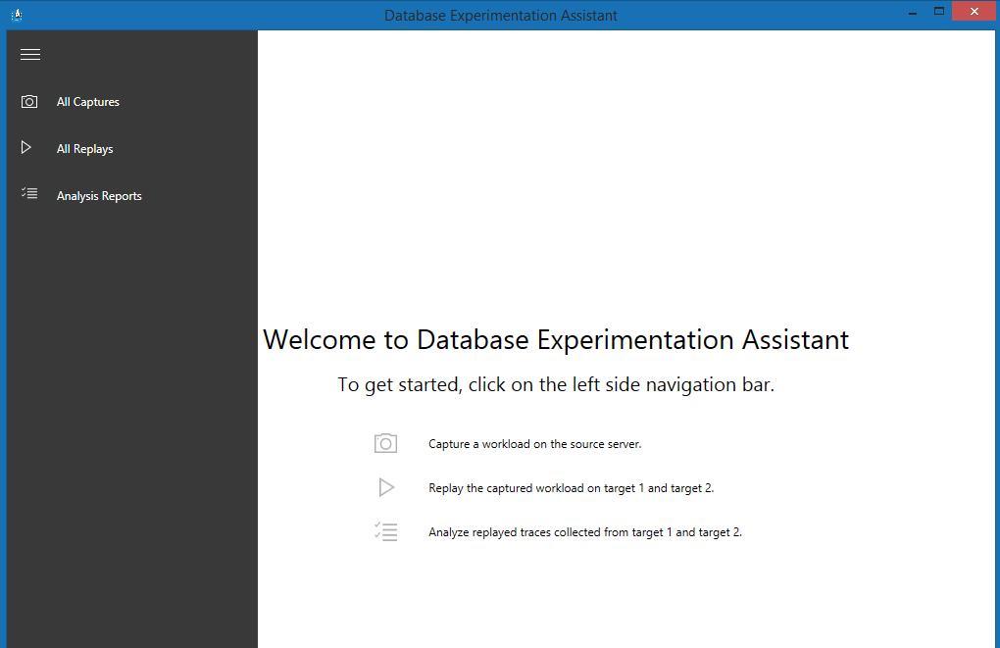

Using the **Microsoft Database Experimentation Assistant (DEA)** to test a database creates an analysis report that a company can use to review the impact of changes.

Suppose you're responsible for providing database support to the customer call center at a telecommunications company. Having installed SQL Server 2017 on a non-production server, you now want to test the current workload of the call center database on the new version. It's imperative that when the live database is upgraded, performance isn't severely reduced. You want to reassure the management team that when the upgraded database goes into production, customers won't be kept delayed on the phone while the operative is waiting for the call center software to respond.

Using the DEA you hope to provide solid evidence that the database upgrade will maintain the current level of performance.

In this unit, you'll see how the DEA can produce the evidence you need.

## What is the Microsoft Database Experimentation Assistant?

In practice, many developers will be working continuously to make additions, improvements, and fixes to databases in a company. Along with natural data growth, this makes it difficult to pinpoint precisely what causes a reduction in performance. It could be one or more queries, a table that has grown so large that it's slow to join to, or the addition of a bad index. If multiple changes are applied simultaneously to a database, and the database slows down, how do you know what caused the degradation? When you've control to change a single thing, it makes it easy to test the impact of that change: this is known as **A/B testing**.

The DEA is an A/B testing solution that is able to monitor the impact of a change within your SQL Server environment. DEA captures a workload and reruns it against a target database that incorporates the change. For example, it might be the addition of a new table or index that you can't test in production. You can't know what the impact of the new table will be until you run a typical workload on it.

For testing the impact of upgrading a database, the DEA is an ideal solution. It captures a workload and runs it against the upgraded database and reports back on the performance impact. You can analyze the results of running queries against two databases, one of which incorporates the single change you've made. This ensures the output reflects only the single change. The source and target databases supported by the DEA are SQL Server 2005 or above, and you can replay the capture on Azure SQL Database, Azure SQL Managed Instance, and SQL Server on Linux.

## Summary

When there are multiple developers continually applying changes to databases within an organization, there may be no structured change log to interrogate what change caused the database performance to slow down. In systems such as a call center, where results must be instantaneous for customers waiting on the telephone, an adverse change can have a detrimental impact on the business. When you've a change that may have an impact, the DEA helps you by testing the change, and comparing it to the unchanged database. Applying the A/B testing method to analyze one change at a time, enables you to clearly know the impact of the change, be it an improvement to performance, degradation, or maybe no performance difference, which is equally acceptable.

The rest of this module focuses on installing and using the Database Experimentation Assistant.
