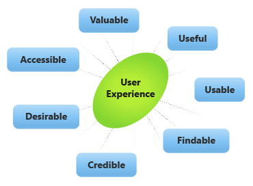

At its core, UX (User Experience) is how a product feels to your user while they interact with your product. This refers to the full experience of the user’s first exposure of the product until their last. Whether it’s a positive or negative experience for your user, UX is about understanding the various needs of your users and how to meet them. A well thought and strategized UX creates a friendly environment for users to fulfill their needs simply and without any hassle. UX design demonstrates a complete understanding of the user.

Here’s a look at some of the factors that influence User Experience:

You want to use a balance of the aforementioned factors to generate a quality User Experience. Let’s dig in:

Valuable - Above all, the product must provide value. When keeping value in mind, you’re confirming there’s a need and market for what you are building and that there’ll likely be success for the product in said market.

Useful - From the users’ perspective, the question in mind would be “What is the purpose of this product?”. While it’s subjective whether your product is useful to the user, you still want to deliver a product that ranks high in importance in comparison to your competitors.

Usable - Usability supports how efficient and effective a product is to the user. From a founder’s perspective, you want to create a solution with your users accomplishing their end goal in mind.

Findable - In the age of digital media and information being abundantly available, it's beyond imperative that your product must be easy to find. The content must be readily available to find as well. In other words, if users can’t find the product, it’s going to be significantly more difficult to purchase and use the product.

Credible - Be it word of mouth, affiliation, or reviews, users want to be able to confirm that your product won’t only work for them, but work effectively. You gain your users' trust when you can deliver a meaningful product built on honesty and the best intentions for the user.

Desirable - With there being a plethora of solutions and products on the market, it’s imperative that you set yourself apart from the rest. When it comes to design and UX, it’s important to put time and effort into the more ancillary parts of your product, such as the branding, the assets, and overall aesthetic. To put it quite simply – the more desirable the product is, the more inclined a user will be to champion your product.

Accessible - In a perfect design world, every product would have an experience capable of being inclusive to people from all walks of life. You don’t want to neglect accessibility in the user experience. Accessibility in UX terms means that the user experience is extended to users with a range of abilities – including, but not limited to, those with disabilities.

## UX considerations for KrashAIO

A beta version of the product was released originally to test how users could automate the e-commerce checkout experience in a matter of a few clicks. One of the most important pieces of feedback we received from our beta users was that, unless you had the application open in front of you, there was no way for you to be alerted whether your checkout was successful or not.

When the final version of the product was released, we decided to implement a “notifications” section inside of the Settings tab that allows you to select or toggle whether you would like to receive desktop and sound alerts.

To create the best user experience, and give your users a comfortable feel with your product, these seven factors of influence must be included into their initial product journey. Remember, UX is about fulfilling the users’ needs with little to no room for hassle or difficulties. As a founder, you always want to maintain and keep the UX as fluid as possible.