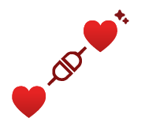
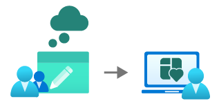
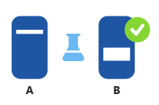
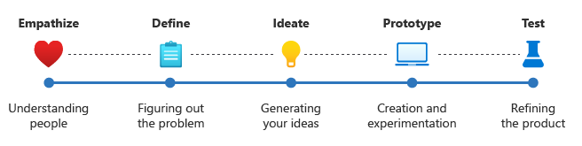

Now that we have gone over the fundamentals of what UX consists of, let’s consider design thinking and why it is necessary on your journey as a founder.

Whether you are a product manager, designer, or do any work around the topic of innovation, you are most likely going to have referred to design thinking.

User experience and design thinking are closely related. Design thinking is a creative problem-solving process that involves understanding user needs, exploring solutions, and testing ideas to create innovative products and services. UX is the practice of designing products and services that are easy to use and provide a positive experience for users. Design thinking is an important part of UX, as it helps to ensure that products and services are designed with the user in mind.

## Key factors of design thinking

Design thinking is often used as a framework for UX design, as it helps designers to understand the user's needs and develop solutions that meet those needs. The two approaches complement each other and are often used together in the design process to create products and services that are both functional and user-friendly. Before we break down each step of the design thinking process, let’s take a look at some of the key factors:

1. Understanding your user; (expound 1-2 sentences)

    

    **Empathize** - Understanding your user is an impetus to achieving empathy when looking to understand your user at their core.

2. Challenging assumptions; (expound 1-2 sentences)

    

    **Challenge assumptions** - The first step to challenging assumptions is to establish a hypothesis in which your research will look to prove or disprove your assumption(s).

3. Creating solutions that allow you to prototype and test the assumptions out; (expound 1-2 sentences)

    

    **A/B Testing** - One of the most effective ways to test a hypothesis is to build and allow your user(s) to test assumptions out in order to refine the most optimal solution.

Now that you understand what design thinking is from a high level, let’s take a deep dive into each of its steps and how they can be applied to your product journey.

When it comes to the five steps of design thinking, it’s important to note that it is not a linear process. This means that the steps don’t necessarily need to be done in a sequential order. In fact, one of the biggest reasons why design thinking is effective, is because it’s a highly iterative process. Once you’ve managed to take an idea from inception to product, your work doesn’t stop there, because there will still be a need for continuous improvement as you gain more insights from users.

## Five stages of design thinking

**Empathize** - To be able to deliver the best product or experiences, you first need to understand who your users are and what they need. What are the biggest challenges and pain points? To avoid operating under assumptions, it’s best to spend as much time observing, engaging, and talking to potential users to gain better insight as to what an optimal solution looks like for them.

**Define** - Now you’ve gathered all your findings and insights from empathizing with the user(s). At this point, you want to start to formulate a clear problem statement that will guide you throughout the design process.

**Ideate** - After you’ve identified your target users and what they want, this phase can be broken down into two steps, generating and deciding the ideas – “bad ideas are welcomed”.

**Prototype** - Prototype - “This is where the magic happens” – the goal of this stage is to take the ideas from the ideation phase and start turning into something tangible where you can put in front of actual users.

**Test** - Now that you’ve built the first iteration of your prototype, this phase is dedicated to testing your product to obtain real insights, from real users, in real time.

Let’s look at how this process looks like in a real-world scenario using our example, KrashAIO:

| Key Factor | Design Thinking Phase(s) | Example |
| ---------- | ------------------------ | ------- |
| Understanding the user | **Empathize** | To gain perspective and insights on the problem space, a survey was sent out to multiple sneaker communities, to understand their pain points as it relates to their unique online purchasing experience. |
| Challenging assumptions | **Define & Ideate** | As a sneaker enthusiast, you understood that operating under your own assumptions would limit the possibilities as to what an optimal solution looks like. To avoid this, once you collected the feedback from the surveys, you then created two user personas that were used to refer to for the remainder of the initial product development process.   From there you were able to brainstorm possible solutions based on the user’s needs, thus helping them draft their user stories, which would later become their first set of features. |
| Creating solutions | **Prototype & Test** | At this stage, the founders looked to put these ideas into action by creating a high-fidelity prototype based on the user stories. Their goal was to demonstrate its core functionality, information architecture (IA) and the user flow between screens.  At this stage, you can create some basic screen designs that allow the user to complete their primary goals and help satisfy the basic requirement for each feature.  To get the best insights about the user flow, the founders decided it was best to test by allowing a select group of users to simulate going through and:  1. Creating a Task. 2. Creating a Profile. 3. Adding billing & shipping information.  From there, it was back to the drawing board to decide on building a Minimum Viable Product, where they took the next 8 weeks to develop the desktop application, so that they could begin testing with their community for feedback. |

In conclusion, design thinking is a key framework to assist in the creation of a great user experience. It’s important to note that this is NOT a linear process and should be executed with an iterative approach. Feedback is key to any product or company’s success, so it’s beyond imperative to be able to capture insights and apply changes as needed.