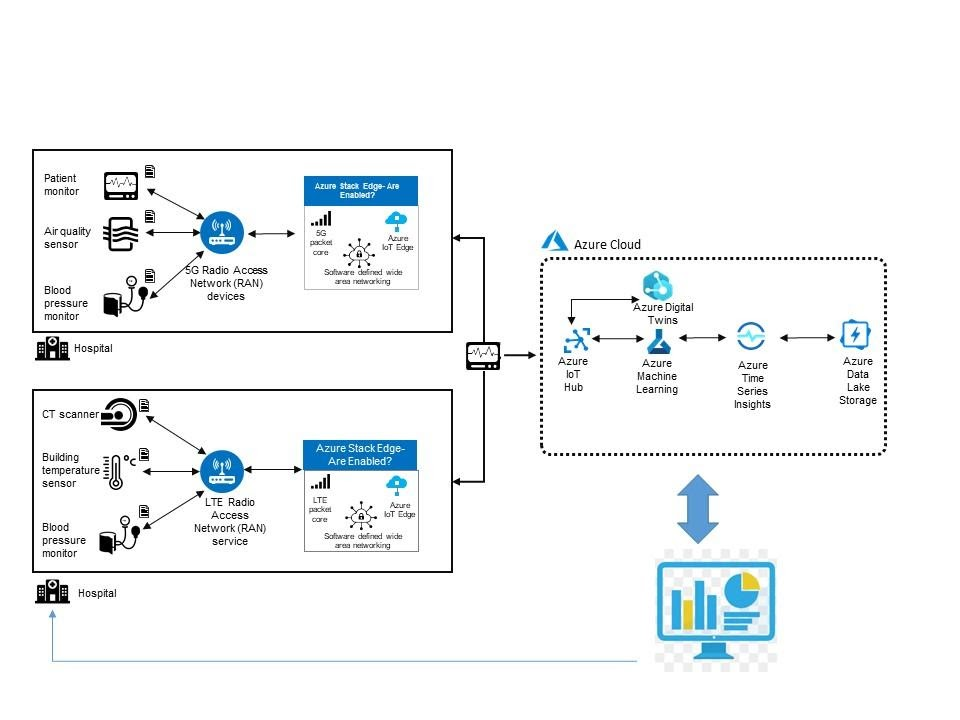

To implement a safe and compliant environment using the capabilities of 5G and Azure private MEC, you need to ensure the following:

- Maintain social distance in the workplace
- Ensure presence of items such as Hand Sanitizers
- Ensure that masks are worn
- Ensure Proper Ventilation in the workplace
- Identify illness as early as possible
- Escalate conditions from healthcare monitors

In all cases, rapid responses are essential. We describe below how these challenges can be mitigated using 5G and Azure private MEC. 

Sensors from three types of sensors can capture data:

- Medical sensors ex: heart rate monitors
- Proximity sensors for maintaining social distancing
- Environmental sensors ex: air quality etc.

Data from these sensors is sent to either LTE or 5G Radio Access Network (RAN) devices. From the 5G or LTE radios located in the hospitals, the data is sent to the 5G or LTE packet cores running on the edge servers. You can implement edge servers using either Azure Stack Edge or Azure Arc-enabled servers. You can also pre-process data on the edge servers before sending it to the Azure cloud for further analysis.

Once the data reaches the cloud, it's ingested by Azure IoT Hub and sent further to Azure Machine Learning and Azure Time Series to gain insights. You could simulate the interaction between the entities in the facility using Azure Digital Twins. Finally, data is stored using Azure Data Lake Storage. Using a dashboard, you can get visual insights for rapid action. This interaction is shown below.

