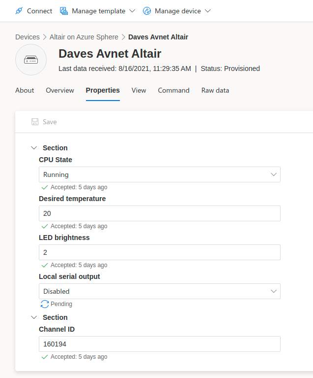
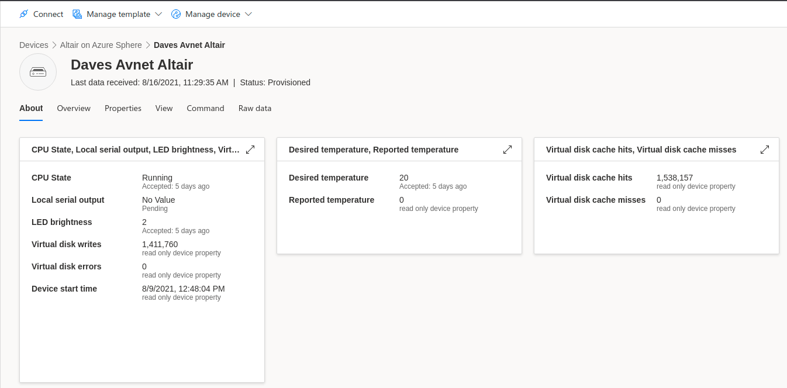
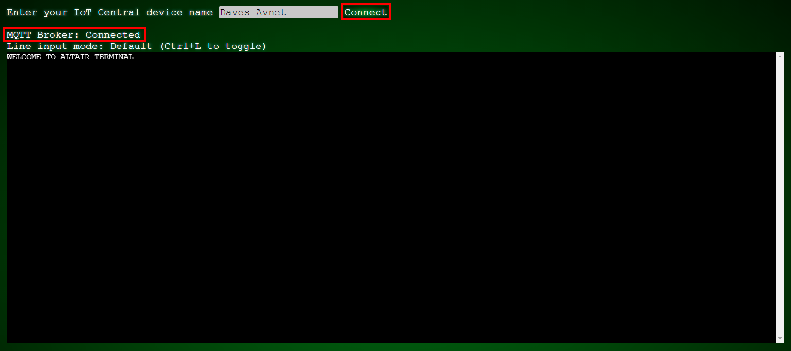
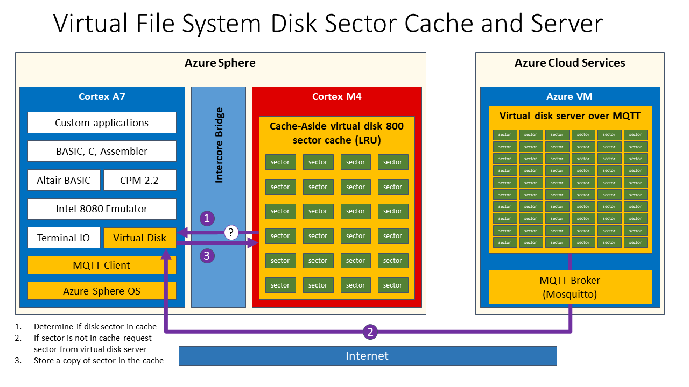

In this module, you will learn how to configure IoT Central, create the Altair Web Terminal, and run the Altair virtual disk server.

## Configure IoT Central

Your Altair IoT Central application requires customization to support the Altair project. IoT Central is used to set parameters and chart data for the Altair emulator. In this module, you will create IoT Central views that you will later use to control and chart data from the Altair emulator.

When your Altair emulator connects to IoT Central, you can set several properties, including startup CPU State and LED brightness. You also can report memory usage and environment data.

> [!div class="mx-imgBorder"]
> 

From IoT Central, you will also be able to monitor the current state of the Altair emulator including how the virtual disk cache is performing.

> [!div class="mx-imgBorder"]
> 

## Create the Altair Web Terminal

The Altair emulator redirects keyboard and terminal messages over MQTT, via an MQTT broker, the MQTT enables web terminal. The main way you will interact with the Altair emulator running on the Azure Sphere is via the Altair Web Terminal. The Altair Web Terminal is an Azure Static Web application. In this module, you will create the Static Web application.

When you have created the Web Terminal, you will be able to securely connect with your web browser to your Altair emulator from anywhere.

The following image shows connecting to the Altair emulator from a web browser.

> [!div class="mx-imgBorder"]
> 

## Run the Altair virtual disk server

The Azure Sphere does not have enough onboard read/write storage for you to save any applications you write. To provide read/write permanent storage for your applications, you will run a virtual disk server. You have access to the read/write storage when running CP/M where the storage is accessed as drive B: on the Altair emulator. The virtual disk server can run on your desktop or in a cloud-based Azure Virtual Machine.

Disk sector reads and writes for drive B are redirected over MQTT via the Mosquitto MQTT Broker to a Python-based virtual disk server. Disk sectors are also cached on one of the real-time cores to significantly improve read/write performance on the Altair emulator.

Disk reads work as follows:

1. The Altair emulator disk driver first checks if the requested disk sector is available from the disk sector cache server.
1. If the disk sector is found in the cache, then it is immediately returned to the Altair emulator. This round trip is fast. The round trip for a successful disk sector request from the cache is approximately 200 microseconds.
1. If the requested disk sector is not found in the local cache, then a request for the sector is sent over MQTT to the cloud-based virtual disk server running in an Azure Virtual Machine.
1. When the disk sector is returned from the cloud-based virtual disk server, it is sent to the disk sector cache manager and then returned to the Altair emulator for processing.

Disk writes work as follows:

1. The Altair emulator disk driver sends the disk sector to the cache manager.
1. The disk sector is then sent to the cloud-based virtual disk manager.

In this module, you'll learn how to:

## Prerequisites

Add a list or write None.