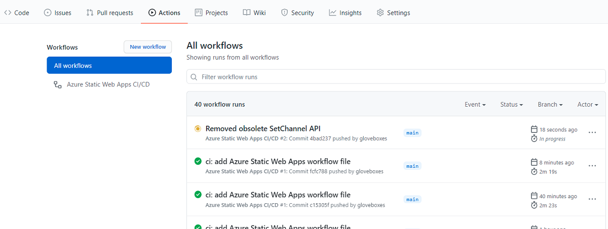
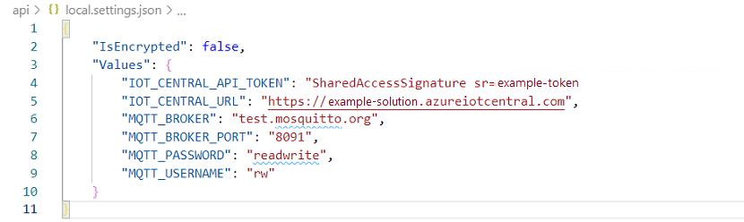
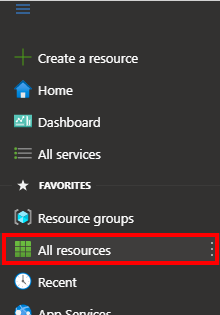
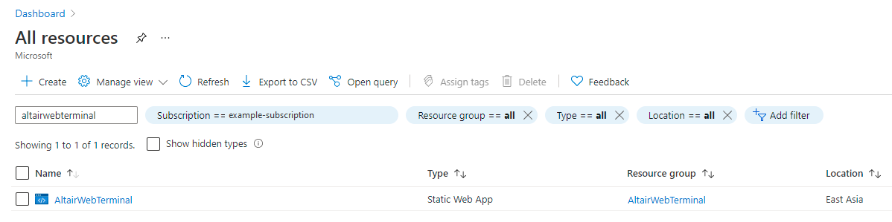
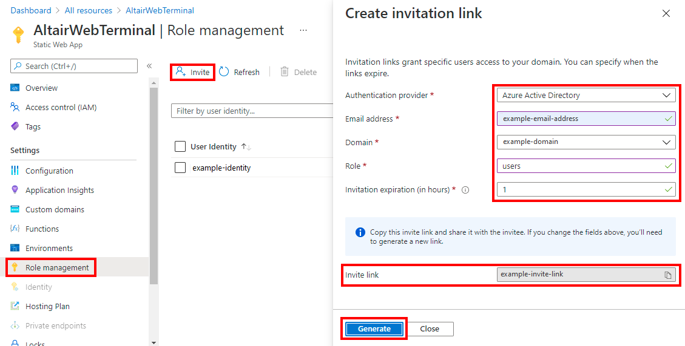

In this exercise, we'll deploy the Altair Web Terminal Azure Static Web App.

## Install the Visual Studio Static Web Apps Extension

Install the Static Web Apps Extension from the [Extension Marketplace](https://code.visualstudio.com/docs/editor/extension-marketplace?azure-portal=true), or in Visual Studio Code, search for Static Web Apps in the Extension Marketplace and install it.

## Open the Altair Web Terminal project

1. Start Visual Studio Code.
1. From the Visual Studio Code main menu, click **File**, then **Open folder**.
1. Open the **Cloud-Enabled-Altair-on-Azure-Sphere** folder you cloned or downloaded.
1. Open the **Altair_Web_Terminal** folder.
1. Click **Select Folder** or the **OK** button to open the project.

## Deploy the Altair Web Terminal

1. Still in Visual Studio Code, press <kbd>F1</kbd>
1. Type **create static web app**, and select **Azure Static Web Apps: Create Static Web App...(Advanced)**.
1. Select your subscription.
1. You may be prompted to sign in with your GitHub account.
1. Enter the name of the static web app: Enter **AltairWebTerminal**.
1. Select **Create a new resource group**.
1. Name the resource group **AltairWebTerminal**.
1. Select the **Free** sku.
1. Choose **Custom** build preset.
1. Enter the location of your application code. Enter **/Altair_Web_Terminal**.
1. Enter the location of your Azure Function code. Enter **/Altair_Web_Terminal/api**.
1. Enter the build output location. Ensure left **blank**.
1. Select a location for the new resource. Select the desired location for the Static Web App.

## Browser the Github Action

> [!div class="mx-imgBorder"]
> 

The action will take 2 or 3 minutes to run.

## Create the Altair Web Terminal settings

1. From Visual Studio Code, navigate to the Altair Web Terminal **api** folder.
1. Right mouse click on the **local.settings.sample.json** file and rename the file to **local.settings.json**.
1. Open the **local.settings.json** file.

The MQTT Broker configuration is prepopulated for the **test.mosquitto.org** public MQTT Broker.

You need to configure the IoT Central settings using the IoT Central API Token and URL that you saved to notepad.

* Update the **IOT_CENTRAL_API_TOKEN** and **IOT_CENTRAL_URL** property values.

When completed, your **local.settings.json** file will look similar to the following.

> [!div class="mx-imgBorder"]
> 

## Upload the Altair Web Terminal local settings

1. Still in Visual Studio Code, press <kbd>F1</kbd>
1. Type **static local**, and select **Azure Static Web Apps: Upload Local Settings...**.
1. Select your subscription.
1. Select the **Static Web App**. Enter the name you created **AltairWebTerminal**.
1. Select environment. Enter **Production**.

The setting will then be uploaded.

## Invite users to the Altair Web Terminal

The Altair Web Terminal is secure and requires authenticated users so you need to invite users, including yourself to the Altair Web Terminal Static Web App.

1. From the [Azure Portal](https://portal.azure.com).
1. Select **All resources**.

> [!div class="mx-imgBorder"]
> 

1. Filter resources by name. Type **AltairWebTerminal** in the filter dialog box.
1. Click on the **AltairWebTerminal** Static Web App.

> [!div class="mx-imgBorder"]
> 

1. Click **Role management**, followed by **Invite**.
1. Select your **Authentication provider**.
1. Enter your **Email address** or **User handle**.
1. For Role, type **users**.
1. Then click **Generate**.
1. Finally, copy the Invite link to the clipboard.

## Activate the Invite link

1. If the invite link is for you, then paste the **Invite link** into your browser address bar.
1. You will be asked to authenticate using the email address or user handle.
1. You will need to grant consent.

1. If the invite link is for someone else then send it to them and they will need to authenticate and grant consent.

> [!div class="mx-imgBorder"]
> 

## Connect the Altair Web Terminal to your Azure Sphere

Now you have authenticated the Altair Web Terminal your need to connect to your Azure Sphere over MQTT.

1. Enter your **IoT Central device name**, and click **Connect**.

The MQTT Broker status message changes to **Connecting...**, when it has successfully connected, the status will change to **Connected**.

> [!div class="mx-imgBorder"]
> 

In the next unit, you will install and run the Altair emulator virtual disk server.
