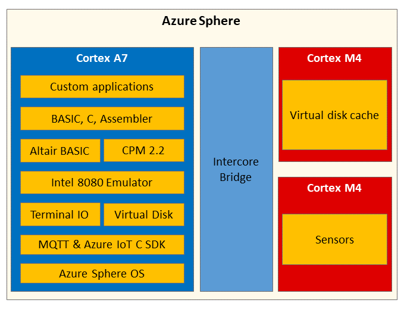

In this module, you'll learn about the architecture of the Azure Sphere and the Altair emulator. You'll also learn how to deploy the emulator to your Azure Sphere.

## Azure Sphere Architecture

The Azure Sphere microcontroller unit (MCU) has three developer-accessible cores. There is a Cortex-A7 high-level core that runs a Linux kernel and two Cortex-M4 real-time cores. The Cortex-A7 is responsible for running system services and your custom high-level application. The Cortex-M4 cores can run your custom bare-metal apps, or real-time operating systems such as Azure RTOS or FreeRTOS.


## The Altair emulator application architecture

The Altair emulator consists of three applications, one high-level application, and two real-time applications.



1. The **AltairHL_emulator** high-level application is responsible for running the Altair emulator and managing communications.

    * The Altair project is a dual communications stack project. The built-in Azure IoT C SDK is used for communications with IoT Central. The Altair emulator's stdin, stdout, and disk requests are passed over MQTT and a back-end MQTT Broker.

1. The **AltairRT_disk_cache_server** real-time application.

    * The disk cache server application provides Cache-Aside services using a Least Recently Used eviction policy for the Altair emulator virtual file system. The Altair emulator uses the cache to improve remote disk performance. The cache-aside pattern is useful in a wide range of scenarios. For example, you could cache Price Look-Up codes for retail solutions.

1. The **AltairRT_enviromon** real-time application.

    * The environment monitor application is a bare metal real-time application responsible for sensing temperature, pressure, and humidity. If you're using the Avnet Azure Sphere, then the onboard temperature and pressure sensor are used. If you're using the Seeed Studio Azure Sphere dev kit, then sensible random environment data is generated. This data is available to BASIC apps running on the Altair emulator.

<!-- ## IoT Central IoT Plug and Play model

The IoT Plug and Play model for this learning module can be found in the **IoTPlugAndPlay** folder. This model has been uploaded to the public repository of IoT Plug and Play models. To learn more about IoT Plug and Play visit "[What is IoT Plug and Play](https://docs.microsoft.com/azure/iot-pnp/overview-iot-plug-and-play?azure-portal=true)".

The IoT Plug and Play model used by this learning module is declared in main.c.

```c
#define IOT_PLUG_AND_PLAY_MODEL_ID		"dtmi:com:example:azuresphere:altair;2"
```

IoT Central is an IoT Plug and Play enabled application. When your device first connects to IoT Central, the IoT Plug and Play Model ID is passed to IoT Central. IoT Central then retrieves the IoT Plug and Play model from the public repository of IoT Plug and Play models and creates a device template and default views. -->

In this module, you will:

* Learn about the architecture of Azure Sphere. 
* Learn about the application architecture of the Altair emulator. 
* Start the app build and deployment process. 
* Understand the virtual disk cache-aside server. 

## Prerequisites

TBD
