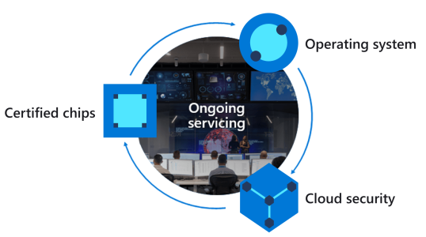
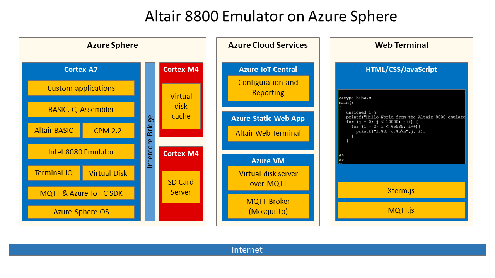

Welcome to the *Learn computing fundamentals with Altair 8800 emulator & Azure Sphere* learning path.

## Introduction to the Altair 8880

The Altair 8800 is considered to be the computer that kick-started the Personal Computer revolution. You can learn more about the Altair at https://en.wikipedia.org/wiki/Altair_8800.

[Altair 8800 image attribution - Smithsonian Museum](https://commons.wikimedia.org/wiki/File:Altair_8800,_Smithsonian_Museum.jpg)

The Altair 8800 was built on the [Intel 8080](https://en.wikipedia.org/wiki/Intel_8080) CPU, the second 8 bit microprocessor manufactured by Intel in 1974. By todays standards, it is a very simple CPU design, perfect for learning, due to its limited instruction set. This makes it easier to understand and learn computer fundamentals.

This learning path brings the Altair 8800 to the Azure Sphere. You will learn about secure IoT, secure cloud services, computer fundamentals, using caches to improve performance, and how to program the Altair with Intel 8080 Op Codes, Assembly, C, and BASIC.

## Introduction to Azure Sphere

The traditional approach to IoT microcontroller (MCU) development is that you are responsible for integrating and maintaining all the bits of a solution. This includes the communications stack, security, authentication, certificates, identity, encryption libraries, update processes, your solution, and more. Not only are you a solution domain expert, but you are now responsible for tracking new and emerging security threats, mitigating, and updating to protect IoT devices.

Azure Sphere is a unique highly secure IoT platform. You focus on your solution, Azure Sphere deals with security, identity, certificates, reporting, tracking emerging attack vectors, mitigating, updating the platform, and application distribution to protect your solutions, customers, and reputations.

Azure Sphere consists of the following components:
- **Azure Sphere–certified chips** from hardware partners include built-in Microsoft security technology to provide connectivity and a dependable hardware root of trust.
- **Azure Sphere OS** adds layers of protection and ongoing security updates to create a trustworthy platform for new IoT experiences.
- **Azure Sphere Security Service** brokers trust for device-to-cloud communication, detects threats and renews device security.

Together these components implement [The Seven Properties of Highly Secure Devices](https://www.microsoft.com/research/publication/seven-properties-highly-secure-devices).

# Introduction to the cloud enabled Altair 8800 on Azure Sphere

The Azure Sphere is running an Open Source Intel 8080 emulator, and on top of the emulator, we are layering Altair BASIC and CP/M. On CPM there is support for 3 languages - assembler, BASIC, and C - C and Assembler apps can be edited with WordMaster.

It integrates with Azure Services - IoT Central, Static Web Apps, and Azure VM for virtual disks and MQTT communications services. The Altair emulator running on the Azure Sphere is accessible via a web browser-based terminal, so you can access the Altair emulator securely from anywhere given the right credentials.

Three apps are running on the Azure Sphere - one on each Cortex core. Running on the Cortex A7 is the Altair emulator, plus communications stack (MQTT and Azure IoT C SDK). One of the Cortex M4 runs a Least Recently Used virtual disk cache, and on the second M4 core an environment sensor app is running.

