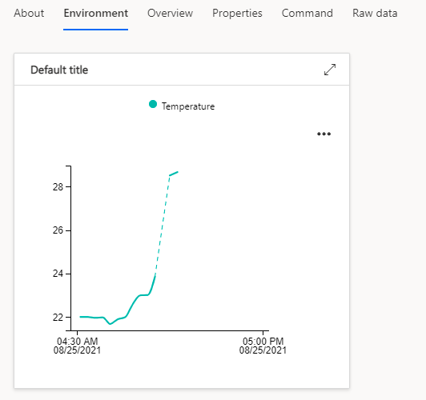

In this exercise, you'll learn how to start programming the Altair emulator.

## Connect to the web terminal

1. Switch back to the web terminal in your web browser.
1. If required, authenticate the web terminal.
1. The Altair emulator might have started running before you connected to the web terminal. If so, press the **RESET** button on Azure Sphere to restart the Altair emulator. When Azure Sphere restarts, the CP/M `>` prompt will appear in the web terminal.

## Get started with CP/M

For more information about CP/M, see the [CP/M reference manual](http://www.cpm.z80.de/manuals/cpm22-m.pdf?azure-portal=true).

Here are some CP/M commands to get you started:

- Get a directory listing:

    ```cpm
    dir
    ```

- Erase a file:

    ```cpm
    era *.txt
    ```

- Copy Microsoft BASIC `mbasic.com` from drive A to drive B:

    ```cpm
    pip b:=a:mbasic.com
    ```

- List the contents of a file:

    ```cpm
    type hw.c
    ```

- Rename a file:

    ```cpm
    ren hello.c=hw.c
    ```

## Get started with Microsoft BASIC-80

For more information on Microsoft BASIC, see the [Microsoft BASIC-80 reference manual](https://github.com/AzureSphereCloudEnabledAltair8800/Altair8800.manuals/blob/master/BASIC-80_MBASIC_Reference_Manual_text.pdf).

Microsoft BASIC-80 is included on drive A.

1. To start Microsoft BASIC, from the CP/M command prompt, enter:

    ```bash
    mbasic B:TEST.BAS
    ```

    After Microsoft BASIC starts, it opens or creates a file called *TEST.BAS* on drive B.

1. Enter your first program:

    ```basic
    10 for i = 1 to 1000
    20 print i
    30 next i
    ```

1. Save your program to disk:

    ```basic
    save "B:TEST.BAS"
    ```

1. Load your program from disk:

    ```basic
    load "B:TEST.BAS"
    ```

1. Stop the program from running by selecting **Ctrl+C**.

1. Quit BASIC:

    ```basic
    system
    ```

You can learn more about BASIC from the following BASIC applications included with the Altair emulator:

* *DISKRW.BAS*
* *STARTREK.BAS*
* *TICTACTOE.BAS*
* *SIMPLE.BAS*
* *LOOPY.BAS*
* *WEATHER.BAS*
* *IOT.BAS*

## Use ports to read temperature and air pressure

The BASIC language has an extensibility mechanism called ports. The Altair emulator includes support for ports that the *IOT.BAS* application uses. The *IOT.BAS* application calls *in* port 43 to read the temperature and port 44 to read the air pressure. These calls are routed to the C `sphere_port_in` value in *main.c* of the Altair emulator.

If you have an Avnet Azure Sphere Starter Kit, the temperature and pressure data is read from the onboard sensors. If you have an Azure Sphere device from Seeed Studio, random temperature and pressure data is used.

The following BASIC program is a listing of *IOT.BAS*:

```basic
10 PRINT
20 PRINT "Avnet onboard temperature and pressure sensor App"
30 PRINT
70 A$=""
80 C=INP(43)
90 IF C = 0 THEN GOTO 120
100 A$=A$+CHR$(C)
110 GOTO 80
120 PRINT "Temperature is ";A$;" degrees Celsius."
130 A$=""
140 C=INP(44)
150 IF C = 0 THEN GOTO 180
160 A$=A$+CHR$(C)
170 GOTO 140
180 PRINT "Air pressure is ";A$;" hPa."
210 PRINT
```

This is the `sphere_port_in` C function found in *main.c* of the Altair emulator application:

```c
/// <summary>
/// Support for BASIC Port In for IOT.BAS temperature and pressure example
/// Example shows environment temperature and pressure example
/// </summary>
/// <param name="port"></param>
/// <returns></returns>
static uint8_t sphere_port_in(uint8_t port) {
  static bool reading_data = false;
  static char data[10];
  static int readPtr = 0;
  uint8_t retVal = 0;
  if (port == 43) {
    if (!reading_data) {
      readPtr = 0;
      snprintf(data, 10, "%d", onboard_telemetry.latest.temperature);
      publish_telemetry(onboard_telemetry.latest.temperature, onboard_telemetry.latest.pressure);
      reading_data = true;
    }
    retVal = data[readPtr++];
    if (retVal == 0x00) {
      reading_data = false;
    }
  }
  if (port == 44) {
    if (!reading_data) {
      readPtr = 0;
      snprintf(data, 10, "%d", onboard_telemetry.latest.pressure);
      reading_data = true;
    }
    retVal = data[readPtr++];
    if (retVal == 0x00) {
      reading_data = false;
    }
  }
  return retVal;
}
```

### Run the IOT.BAS application

1. To start Microsoft BASIC, from the CP/M command prompt, enter:

    ```cpm
    mbasic A:IOT.BAS
    ```

    After Microsoft BASIC starts, it opens the *IOT.BAS* application.

1. Run the application:

    ```basic
    run
    ```

When you run this application, temperature and pressure data is published to Azure IoT Central. You can view the data in the Azure IoT Central web portal, under the **Environment** tab for your device.

> [!div class="mx-imgBorder"]
> 

### Extend the IOT.BAS app

Make the *IOT.BAS* application read the temperature and pressure every five seconds. When the temperature and pressure are read, the data is sent to Azure IoT Central and plotted on the **Environment** chart.

1. To pause the app for approximately 5 seconds, add a loop:

   ```basic
   250 FOR J = 0 TO 30000: NEXT J
   ```

1. Save your changes by using the BASIC `save` command:

   ```basic
   save "B:IOT.BAS"
   ```

## Get started with the Word-Master text editor

The CP/M disk image includes the Word-Master text editor. To use Word-Master, you must switch the web terminal to character input mode. In character input mode, the web terminal sends each character that you type as an MQTT message to the Altair emulator.

To switch between line input mode and character input mode, select **Ctrl+L**. When you're finished with Word-Master, switch back to line input mode. Web terminal communications over MQTT in line input mode are more efficient.


For more information, view the [Word-Master user's guide](https://github.com/AzureSphereCloudEnabledAltair8800/Altair8800.manuals/blob/master/Word-Master_Manual.pdf?azure-portal=true).

The following table lists the Ctrl characters that Word-Master uses. This list is sourced from the [Experiencing the Altair 8800](https://glasstty.com/?p=1235) blog.

```text
VIDEO MODE SUMMARY

^O   INSERTION ON/OFF           RUB  DELETE CHR LEFT
^S   CURSOR LEFT CHAR           ^G   DELETE CHR RIGHT
^D   CURSOR RIGHT CHAR          ^\   DELETE WORD LEFT
^A   CURSOR LEFT WORD           ^T   DELETE WORD RIGHT
^F   CURSOR RIGHT WORD          ^U   DELETE LINE LEFT
^Q   CURSOR RIGHT TAB           ^K   DELETE LINE RIGHT
^E   CURSOR UP LINE             ^Y   DELETE WHOLE LINE
^X   CURSOR DOWN LINE           ^I   PUT TAB IN FILE
^^   CURSOR TOP/BOT SCREEN      ^N   PUT CRLF IN FILE
^B   CURSOR RIGHT/LEFT LINE     ^@   DO NEXT CHR 4X
^W   FILE DOWN 1 LINE           ^P   NEXT CHR IN FILE
^Z   FILE UP 1 LINE             ^V   NEXT CHR(S) TO VIDEO
^R   FILE DOWN SCREEN           ESC  EXIT VIDEO MODE
^C   FILE UP SCREEN             ^J   DISPLAY THIS

```

In character input mode, the following keyboard mappings will improve your editing experience:

```text
Keyboard key            Word-Master Ctrl Sequence
----------------------------------------------
Insert                  ^O   INSERTION ON/OFF
Delete                  ^G   DELETE CHR RIGHT
Cursor Left             ^S   CURSOR LEFT CHAR
Cursor Right            ^D   CURSOR RIGHT CHAR
Cursor Up               ^E   CURSOR UP LINE
Cursor Down             ^X   CURSOR DOWN LINE
```

## Compile assembler applications

The CP/M disk image includes a demo assembler application. Follow these steps to edit, assemble, and load the demo file:

1. Copy the demo app (*demo.asm*) to drive B by using the `pip` command:

    ```bash
    pip b:=a:demo.asm
    ```

1. Edit the *demo.asm* file with Word-Master. From the CP/M command prompt, enter:

    ```bash
    a:wm b:demo.asm
    ```

1. Switch the web terminal to character input mode by selecting **Ctrl+L**.

1. Make your changes to the *demo.asm* file.

1. Save your updates to the *demo.asm* file:

    1. Select the **Esc** key.
    1. Select **E** to exit. Your file changes are saved to disk.

1. Switch the web terminal to line input mode by selecting **Ctrl+L**.

1. Assemble the *demo.asm* file:

    ```bash
    a:asm b:demo
    ```

1. Load and link the assembled code:

    ```bash
    a:load b:demo
    ```

1. Run the demo application:

    ```bash
    b:demo
    ```

## Compile C applications

The CP/M disk image includes a simple C application. Follow these steps to edit, compile, and link the *hw.c* (helloworld) file:

1. Copy the *hw.c* source code to read/write drive B by using the `pip` command:

    ```bash
    pip b:=a:hw.c
    ```

1. Edit the *hw.c* file with Word-Master:

    ```bash
    a:wm b:hw.c
    ```

1. Switch the web terminal to character input mode by selecting **Ctrl+L**.

1. Make your changes to the *hw.c* file.

1. Save your updates to the *hw.c* file:

    1. Select the **Esc** key.
    1. Select **E** to exit. Your file changes are saved to disk. 

1. Switch the web terminal to line input mode by selecting **Ctrl+L**.

1. Compile the *hw.c* file:

    ```bash
    a:cc hw
    ```

1. Link the *hw* application:

    ```bash
    a:clink hw
    ```

1. Run the *hw* application:

    ```bash
    b:hw
    ```

1. Stop the *hw* application from running by selecting **Ctrl+C**.
