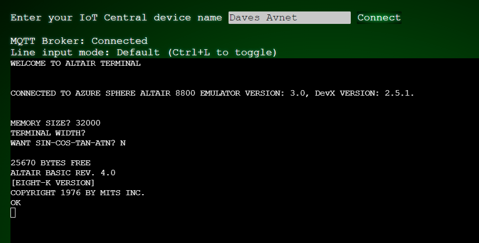
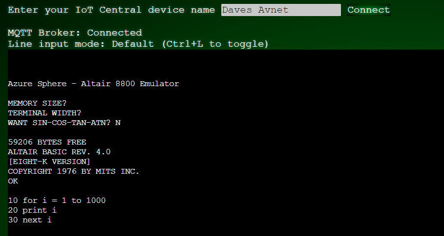

Altair BASIC was the first high-level programing language for the Altair 8800. For this exercise, imagine you're a game developer in the 1970s who wants to build a game on the Altair 8800. This exercise is an introduction to Altair BASIC. The rest is up to your imagination.

## Change the boot order

By default, the Altair emulator runs CP/M. To change the boot order and run Altair BASIC, follow these instructions:

1. From Visual studio code, open the Altair emulator *CMakeList.txt* file. Update `BOOT CONFIG` as follows:

    ```cmake
    # BOOT CONFIG #####################################################################################################
    #
    # Comment out the "add_compile_definitions(BOOT_CPM) line below to boot Altair BASIC 4.0
    #
    add_compile_definitions(BOOT_CPM)
    #
    ###################################################################################################################
    ```

1. Redeploy the Altair emulator to Azure Sphere. Select **Ctrl+F5**.

## Connect to the web terminal

To program the Altair, you first need to connect the web terminal to the Altair 8800 emulator running on Azure Sphere. After you make the connection, you can load or write and then run Altair BASIC apps.

1. Switch back to the web terminal in your web browser.
1. If necessary, authenticate the web terminal.
1. The Altair emulator might have started running before you connected to the web terminal. If so, press the **RESET** button on Azure Sphere to restart the Altair emulator. When Azure Sphere restarts, Altair BASIC prompts you for the following information:

    * **MEMORY SIZE?**: Select the Enter key to accept the default.
    * **TERMINAL  WIDTH?**: Select the Enter key to accept the default.
    * **WANT SIN-COS-TAN-ATN?**: Enter `Y` or `N`.

Altair BASIC responds with the amount of memory and version information.

> [!div class="mx-imgBorder"]
> 

## Write and run an application

1. From the web terminal, enter the following code to create an Altair BASIC application:

   ```basic
   10 for i = 1 to 1000
   20 print i
   30 next i
   ```

   Your web terminal should look similar to the following image.

   > [!div class="mx-imgBorder"]
   > 

1. Run the program by entering the following command: 

   ```basic
   run
   ```

   Your program counts to 1,000.

## Learn useful commands

As you work with Altair BASIC, you'll likely use these commands often:

* `list`
* `new`
* `load`

Also remember that you can use the **Ctrl+C** keyboard shortcut to stop a program.

For more information, see the [Altair 8800 BASIC reference manual](https://altairclone.com/downloads/manuals/BASIC%20Manual%2075.pdf?azure-portal=true).

## Load and run an application

There are six preloaded Altair BASIC applications:

* *STARTREK.BAS*
* *TICTACTOE.BAS*
* *SIMPLE.BAS*
* *LOOPY.BAS*
* *WEATHER.BAS*
* *IOT.BAS*

To load and run one of them:

1. Enter `load` followed by the application name in quotation marks. For example, for the Tic-Tac-Toe application, enter the following command:

   ```basic
   load "TICTACTOE.BAS"
   ```

1. Run the application by using the following command:

   ```text
   run
   ```

1. The application starts, and you're prompted to go first:

   ```basic
   *** WELCOME TO TIC-TAC-TOE ***
   > YOU ARE X's <
   DO YOU WANT TO GO FIRST? 
   ```

In the following units, you'll learn other ways to program the Altair emulator.
