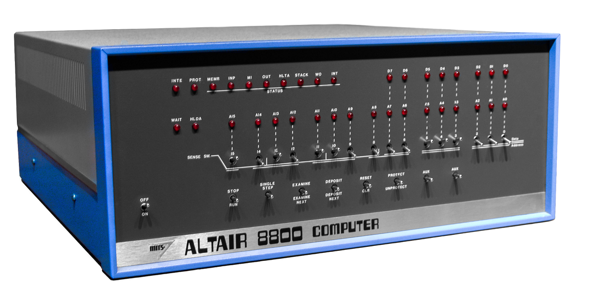

In this unit, you'll learn how to program the Altair emulator using the front panel.

You have the following options to program with the front panel:
1. The virtual front panel.
1. The MikroE 4x4 Button Click.
1. The Altair front panel board.

The original Altair 8800 was programmed directly using the front panel. It was a painstaking, error-prone process to load and execute a program. Programming the Altair emulator using the front panel and Intel OpCodes is a great way for you to understand how computers work.

The Altair 8800 had a series of LEDs and switches that you used to load apps and determine the state of the Altair.

[Altair 8800 image attribution - Smithsonian Museum](https://commons.wikimedia.org/wiki/File:Altair_8800,_Smithsonian_Museum.jpg)

## Overview

The Altair emulator supports several front panel configurations.

1. The virtual front panel, the advantage is that no extra hardware is required. The virtual front panel works with both the Avnet and Seeed Studio Azure Sphere developer kits.
2. If you have an Avnet Azure Sphere, then the Click front panel is an option. The MikroE clicks can be used to simulate the front panel. The advantage is a more authentic experience programming the Altair. The LED panel also indicates the current state of the Altair and your application.
3. The Altair front panel is the most authentic experience, you'll need to build the panel, but it operates just like the original Altair. You can find the hardware design in the [MT3620 Azure Sphere Based Altair 8800 Hardware](https://github.com/AzureSphereCloudEnabledAltair8800/AzureSphereAltair8800.Hardware?azure-portal=true)) repo.

## Hardware configurations

### Avnet Azure Sphere plus MikroE 4x4 key and 8x8 LED Clicks

An Avnet Azure Sphere Starter Kit Rev 1 with the MikroE 4x4 key Click and 8x8 R Click LED matrix display.

> IMPORTANT: This Click board configuration is only compatible with the Avnet Azure Sphere V1 board. The Click board solution for Avnet Azure Sphere Starter Kits Rev 1 and Rev 2 will be available shortly.

### Avnet Azure Sphere plus MikroE Altair 8800 Retro Click

An Avnet Azure Sphere Starter Kit Rev 1 and Rev 2 with the MikroE Altair 8800 Retro Click (**Available soon**).

### Altair front panel

The Seeed Studio or Avnet with the Altair Front Panel. See the Front Panel wiring section in the appendix.

#### Front panel wiring

If you do build an Altair front panel, then you will need to know how to connect it to the Azure Sphere.

The following describes how to wire the front panel to the Avnet and Seeed Studio Azure Sphere developer kits.

##### Seeed Studio Azure Sphere development Kit

Pin No. | Function | MT3620 Pin | MT3620 Pin Function | Description |
--------|----------|------------|---------------------|------------ |
1 | Switches Load | H4/P14 | GPIO40 | Active low load switch data into shift registers |
2 | Switches Chip Select | H4/P12 | GPIO37 | Switch 'chip select' - active low enable for shift registers that read switch states |
4 | MISO | H4/P5 | MISO1 | SPI MISO |
5 | MOSI | H4/P11 | MOSI1 | SPI MOSI |
6 | MR | H4/P10 | GPIO39 | Active low master rest of shift registers that control the LEDs |
7 | CLK | H4/P7 | SCLK1 | Clock input |
8 | LED Store | H4/P8 | GPIO36 | Clocks data from the shift registers into the storage registers that control the LEDs |
9 | LED Output Enable | H4/P6 | GPIO38 | Active low output enable for the shift registers that control the LEDs |
10 | VCC | H3/P3 | 3.3 V | +3.3 V |
11 | GND | H3/P2 | GND | Ground  |

##### Avnet Azure Sphere Starter Kit Rev 1 & 2

Pin No. | Function | Click Pin | MT3620 Pin Function | Description  |
--------|----------|------------|---------------------|------------ |
1 | Switches load | CLICK 1: AN | GPIO42 | Active low load switch data into shift registers |
2 | Switches Chip Select | CLICK 1: RST | GPIO16 | Switch 'chip select' - active low enable for shift registers that read switch states |
4 | MISO | CLICK 1: MISO | MISO1 | SPI MISO |
5 | MOSI | CLICK 1: MOSI | MOSI1 | SPI MOSI |
6 | MR | CLICK 1: PWM | GPIO0 | Active low master rest of shift registers that control the LEDs |
7 | CLK | CLICK 1: SCK | SCLK1 | Clock input |
8 | LED Store | CLICK 1: INT | GPIO2 | Clocks data from the shift registers into the storage registers that control the LEDs |
9 | LED Output Enable | CLICK 1: RX | GPIO28 | Active low output enable for the shift registers that control the LEDs |
10 | VCC | CLICK 1: 3.3 | 3.3 V | +3.3 V |
11 | GND | CLICK 1: GND | GND | Ground |

In the following exercise, you'll learn how to program the Altair emulator using the Altair front panel.
