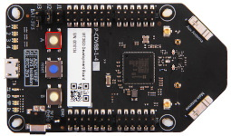
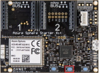
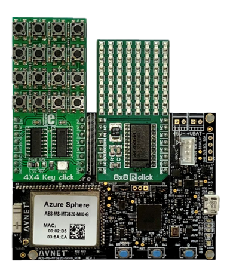
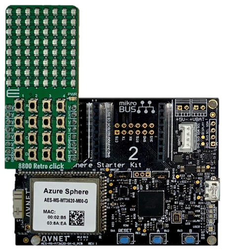
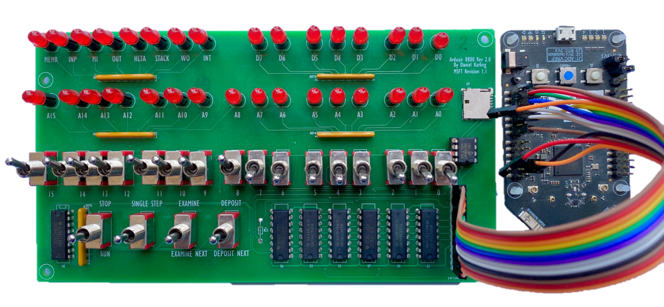

In this module you are going to learn about the supported Altair 8800 emulator hardware configurations and how to set up the Azure Sphere
development environment.

If you are new to Azure Sphere development and IoT Central then it’s strongly recommended you complete the [Develop secure IoT solutions for Azure Sphere, Azure RTOS and Azure IoT Central](https://docs.microsoft.com/learn/modules/develop-secure-iot-solutions-azure-sphere-iot-central/) Microsoft Learn module before attempting to set up the Altair on Azure Sphere solution.

## Hardware requirements

There are three supported configurations for the Altair project on the Azure Sphere.

## Standalone Azure Sphere

Either an Avnet or Seeed Studio Azure Sphere.

| Seeed Studio Azure Sphere Developer Kit     | Avnet Azure Sphere Starter Kit Rev 1     |
|----------------|---------------|
|  |  |

### Avnet Azure Sphere plus MikroE 4x4 key and 8x8 LED Clicks

An Avnet Azure Sphere Starter Kit Rev 1 with the MikroE 4x4 key click and 8x8 R Click LED matrix display.

> IMPORTANT: This Click board configuration is only compatible with the Avnet Azure Sphere V1 board. The Click board solution for Avnet Azure Sphere Starter Kits Rev 1 and Rev 2 will be available shortly.

### Avnet Azure Sphere plus MikroE Altair 8800 Retro Click

An Avnet Azure Sphere Starter Kit Rev 1 and Rev 2 with the MikroE Altair 8800 Retro Click (**Available soon**).

### Altair front panel

The Seeed Studio or Avnet with the Altair Front Panel. See the Front Panel wiring section in the appendix.

#### Front panel wiring

##### Seeed Studio Azure Sphere development Kit

Pin No. | Function | MT3620 Pin | MT3620 Pin Function | Description
--------|----------|------------|---------------------|------------
1 | Switches Load | H4/P14 | GPIO40 | Active low load switch data into shift registers
2 | Switches Chip Select | H4/P12 | GPIO37 | Switch 'chip select' - active low enable for shift registers that read switch states
4 | MISO | H4/P5 | MISO1 | SPI MISO
5 | MOSI | H4/P11 | MOSI1 | SPI MOSI
6 | MR | H4/P10 | GPIO39 | Active low master rest of shift registers that control the LEDs
7 | CLK | H4/P7 | SCLK1 | Clock input
8 | LED Store | H4/P8 | GPIO36 | Clocks data from the shift registers into the storage registers that control the LEDs
9 | LED Output Enable | H4/P6 | GPIO38 | Active low output enable for the shift registers that control the LEDs
10 | VCC | H3/P3 | 3.3v | +3.3V
11 | GND | H3/P2 | GND | Ground

##### Avnet Azure Sphere Starter Kit Rev 1 & 2

Pin No. | Function | Click Pin | MT3620 Pin Function | Description
--------|----------|------------|---------------------|------------
1 | Switches load | CLICK 1: AN | GPIO42 | Active low load switch data into shift registers
2 | Switches Chip Select | CLICK 1: RST | GPIO16 | Switch 'chip select' - active low enable for shift registers that read switch states
4 | MISO | CLICK 1: MISO | MISO1 | SPI MISO
5 | MOSI | CLICK 1: MOSI | MOSI1 | SPI MOSI
6 | MR | CLICK 1: PWM | GPIO0 | Active low master rest of shift registers that control the LEDs
7 | CLK | CLICK 1: SCK | SCLK1 | Clock input
8 | LED Store | CLICK 1: INT | GPIO2 | Clocks data from the shift registers into the storage registers that control the LEDs
9 | LED Output Enable | CLICK 1: RX | GPIO28 | Active low output enable for the shift registers that control the LEDs
10 | VCC | CLICK 1: 3.3 | 3.3v | +3.3V
11 | GND | CLICK 1: GND | GND | Ground

## Software requirements

There are five components to the cloud-enabled Altair on Azure Sphere solution. These are:

1. The Altair emulator running on the Azure Sphere.
2. An IoT Central application for configuration and reporting.
3. The Web Terminal Azure Static Website.
4. The Virtual disk server.
5. And optionally, a private MQTT Broker.

In this module, you'll learn how to:

## Prerequisites

Add a list or write None.

In the next unit you will learn about the software you need to install on your computer to build and deploy the Altair 8800 emulator to you Azure Sphere.
