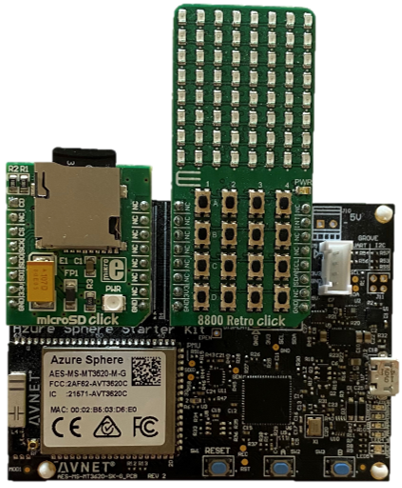

## Hardware requirements

There are three supported configurations for the Altair emulator on the Azure Sphere.

## Standalone Azure Sphere

Either an Avnet or Seeed Studio Azure Sphere.

| Seeed Studio Azure Sphere Developer Kit     | Avnet Azure Sphere Starter Kit Rev 1 or Rev 2    |
|----------------|---------------|
| :::image type="content" source="../media/seeed-studio-azure-sphere-rdb.png" alt-text="Photo of Seeed Studio Azure Sphere." border = "false"::: | :::image type="content" source="../media/avnet-azure-sphere.png" alt-text="Photo of Avnet Azure Sphere." border = "false"::: |

### Avnet Azure Sphere plus MikroE 8800 Retro Click and microSD Card

An Avnet Azure Sphere Starter Kit with the [MikroE 8800 Retro Click](https://www.mikroe.com/8800-retro-click?azure-portal=true) and [MikroE microSD Card Click](https://www.mikroe.com/microsd-click?azure-portal=true).

### Altair front panel

The Seeed Studio or Avnet with the Altair Front Panel. Full details for building and wiring the Altair front panel can be found on the [Altair 8800 Hardware repo](https://github.com/AzureSphereCloudEnabledAltair8800/AzureSphereAltair8800.Hardware?azure-portal=true).

:::image type="content" source="../media/avnet-front-panel.png" alt-text="Image that shows Avnet Azure Sphere with the Altair front panel." border = "false":::

:::image type="content" source="../media/altair-front-panel.png" alt-text="Image that shows Seeed Studio Azure Sphere with the Altair front panel." border = "false":::
