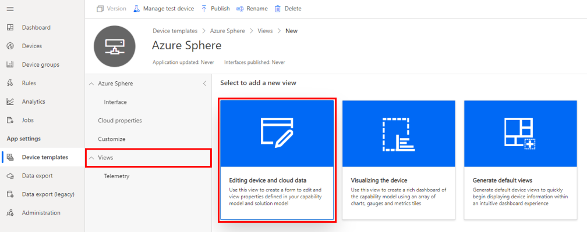
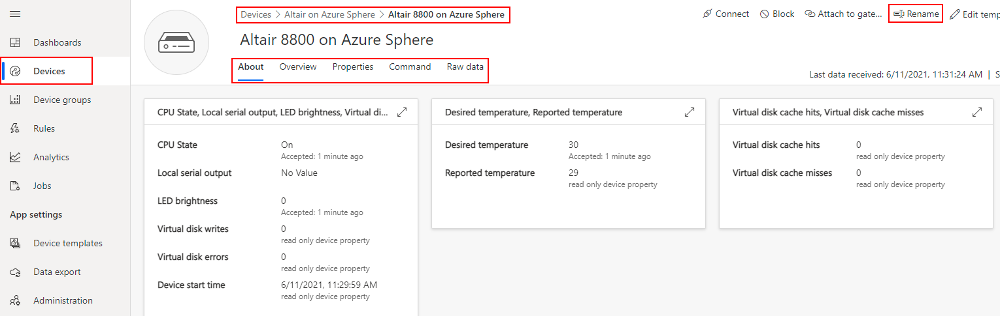

In this exercise, you will configure your Altair IoT Central application.

1. Switch back to the **IoT Central** web portal.

1. From the sidebar menu, select **Devices**, then the **Altair on Azure Sphere** template, then your **device**.

    The device name is your Azure Sphere Device ID. You can display your Device ID by running the following command from the Windows **PowerShell command line** or Linux **Terminal**.

   ```
   azsphere device show-attached
   ```

    Note, it may take a minute for your device is displayed in the devices section.

## Rename your device

Rename your device in IoT Central ensuring that the name is unique. The Web Terminal uses this name to retrieve the Channel ID property from IoT Central. The Channel ID is used to create unique MQTT topic names used by the Altair emulator and the Web Terminal.

From the Device menu bar, select **Manage device**, then **Rename**.

> [!div class="mx-imgBorder"]
> 

## Customize the Altair on Azure Sphere template

### Customize properties

From the Device menu bar, select **Edit template**.

1. Select **Customize**, and expand the **Desired temperature** property. Update the property using the information from the table below and click **Save**.

    > [!div class="mx-imgBorder"]
    > 

    <!-- :::image type="content" source="../media/iot-central-template-customise.png" alt-text="The illustration shows how to customize a device template."::: -->

    | Display name     | Initial value      | Min value | Max value | True name | False name |
    |----------------|---------------|----------------|---------------|----------------|---------------|
    | Desired Temperature | 20 | -20 | 80 | n/a | n/a |
    | LED brightness | 2 | 0 | 15 | n/a | n/a |
    | CPU State | On | n/a | n/a | Running | Stopped |
    | Local Serial Port | Enabled | n/a | n/a | Enabled | Disabled |

1. Repeat for the **LED brightness**, **CPU State**, and **Local Serial Port** properties, be sure to **Save** your updates.

### Add Properties view

1. Click **Views** and select **Editing device and cloud data**.

    > [!div class="mx-imgBorder"]
    > 

    <!-- :::image type="content" source="../media/iot-central-view-properties-create.png" alt-text="The illustration shows how to customize a device template."::: -->

1. Name the properties form **Properties**.
1. Expand **Properties**

    > [!div class="mx-imgBorder"]
    > 

    <!-- :::image type="content" source="../media/iot-central-template-properties-properties.png" alt-text="The illustration shows how to customize a device template."::: -->

1. Select the following properties.
    * Channel ID
    * CPU State
    * Desired temperature
    * LED Brightness
    * Local serial output
1. Click **Add section**
1. Click **Save**

    > [!div class="mx-imgBorder"]
    > 

    <!-- :::image type="content" source="../media/iot-central-template-properties.png" alt-text="The illustration shows how to customize a device template."::: -->

### Add an Environment data visualization view

1. Click **Views** and select **Visualizing the device**.

    > [!div class="mx-imgBorder"]
    > 

1. Name the view **Environment**.
1. From the **Start with a visual** list, select **Line chart**, scroll to the end of the list, and select **Add tile**.
1. Click the **Configure** icon on the tile.
1. Click **+ Capability**.
1. From the capability list, select **Temperature**.

    > [!div class="mx-imgBorder"]
    > 

1. Click **Update**.
1. Click **Save**.

### Publish template

1. Finally, click **Publish** to publish the template into the IoT Central application.

    > [!div class="mx-imgBorder"]
    > 

    <!-- :::image type="content" source="../media/iot-central-template-publish.png" alt-text="The illustration shows how to customize a device template."::: -->

## View your Altair on Azure Sphere device

1. From the sidebar menu, select **Devices**, then the **Altair on Azure Sphere** template, and finally your device.

1. Navigate the tabs to explore the device views.

    > [!div class="mx-imgBorder"]
    > 

    <!-- :::image type="content" source="../media/iot-central-device-tabs.png" alt-text="The illustration shows how to display measurements."::: -->

## Update the Device properties tab

Set the initial state for the Altair emulator.

Set as following:

1. CPU state: Running
1. Desired Temperature (Celsius): 30
1. LED Brightness (Avnet with LED Click): 2
1. Local serial output: Disabled
1. The Channel ID is for information only. It is required for the Virtual Disk Server.

## Create an IoT Central API Token

You need to create an IoT Central API Token for the Altair Web Terminal.

The Web Terminal Static Web App includes an Azure Function that needs the API Token to connect to your IoT Central application. The Azure Function locates your device by its display name to retrieve the Channel Id used to form unique MQTT topic names used for communications between the Altair emulator running on the Azure Sphere and the console running in the Web Terminal.

1. From the IoT Central sidebar menu, navigate to **Administration**, then **API Token**.
1. Click **Generate token**.
1. Name your token **Altair-Web-Terminal**.
1. Click **Generate**
1. **Copy** the generated token to notepad as you will need for the next step.

> [!div class="mx-imgBorder"]
> 

## Generate the IoT Central URL

You need the IoT Central URL for the Altair Web Terminal.

1. From your browser address bar, **copy** the base address of your IoT Central application to notepad as you will need for the next step.
1. Ensure you **remove** the trailing '**/**' from the URL.

> [!div class="mx-imgBorder"]
> 

In the next unit, you will create the Altair Web Terminal.
