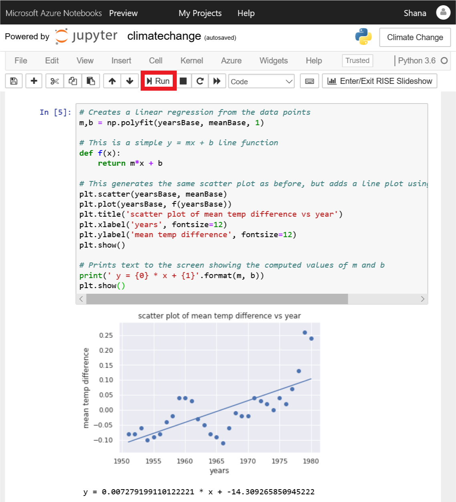

Scatter plots offer a handy means for visualizing data, but suppose you wanted to overlay the scatter plot with a trend line showing how the data is trending over time. One way to compute such trend lines is [linear regression](https://en.wikipedia.org/wiki/Linear_regression). In this exercise, you will use NumPy to perform a linear regression and Matplotlib to draw a trend line from the data.

1. Place the cursor in the empty cell at the bottom of the notebook. Change the cell type to **Markdown** and enter "Perform linear regression" as the text.

1. Add a **Code** cell and paste in the following code. Take a moment to read the comments (the lines that begin with # signs) to understand what the code is doing.

    ```python
    # Creates a linear regression from the data points
    m,b = np.polyfit(yearsBase, meanBase, 1)

    # This is a simple y = mx + b line function
    def f(x):
        return m*x + b

    # This generates the same scatter plot as before, but adds a line plot using the function above
    plt.scatter(yearsBase, meanBase)
    plt.plot(yearsBase, f(yearsBase))
    plt.title('scatter plot of mean temp difference vs year')
    plt.xlabel('years', fontsize=12)
    plt.ylabel('mean temp difference', fontsize=12)
    plt.show()

    # Prints text to the screen showing the computed values of m and b
    print(' y = {0} * x + {1}'.format(m, b))
    plt.show()
    ```

1. Now run the cell to display a scatter plot with a regression line.

    

    _Scatter plot with regression line_

From the regression line, you can see that the difference between 30-year mean temperatures and 5-year mean temperatures is increasing over time.  Most of the computational work required to generate the regression line was done by NumPy's `polyfit` function, which computed the values of `m` and `b` in the equation y = mx + b.