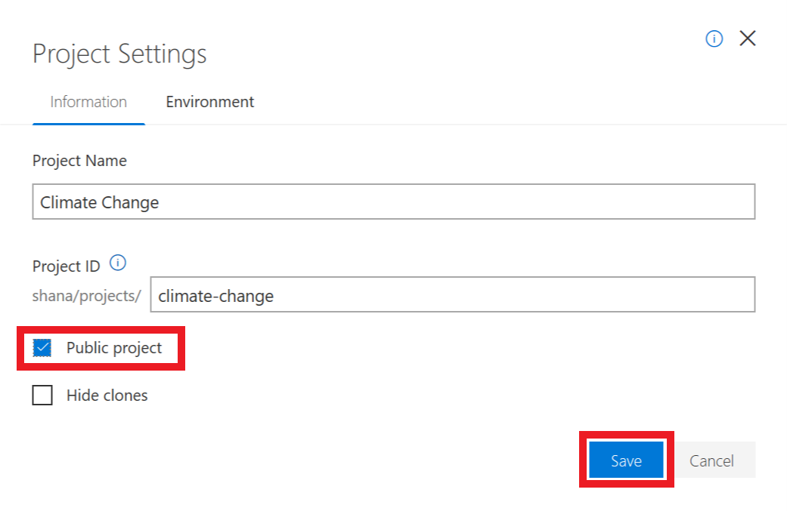
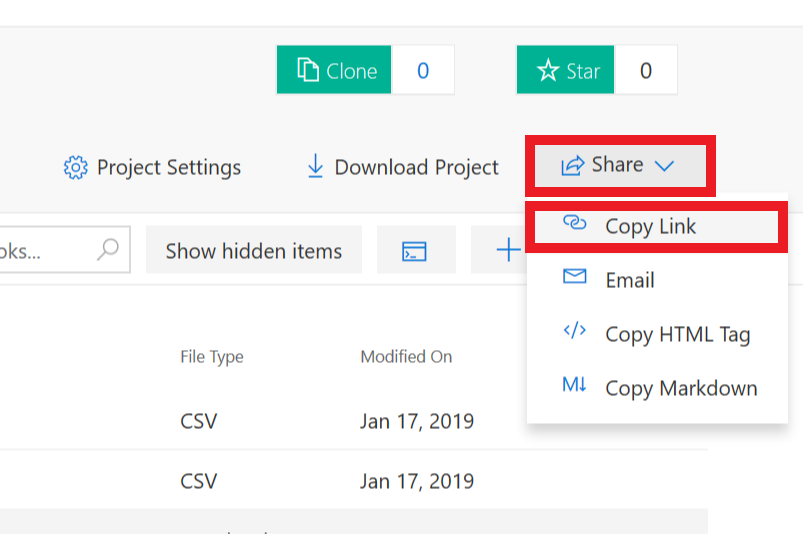

One of the value-added features of Azure Notebooks is that it provides a cloud-based hub for sharing notebooks. In this unit, you'll share the notebook you created in previous exercises.

1. Select **File** -> **Close and Halt** to close the notebook.

    

    _Closing the notebook_

1. Click **Project Settings** to edit the project's settings. Check the **Public project** box to make the project public, and then click **Save**.

    

    _Making the project public_

1. Click **Share**. Notebooks can be shared by links, on social media, and through email. To demonstrate, click **Copy Link** to copy a link to the notebook to the clipboard. Then paste the link into a separate browser window and confirm that the notebook appears there.

    

    _Sharing by link_

Another way to share a notebook is to download it as a **.ipynb** file and send the **.ipynb** file to whomever you wish to share it with. You can download a notebook and make a local copy by clicking the **Download Project** button. You can even run them in other Jupyter environments if you would like because there's nothing proprietary about Azure Notebooks.