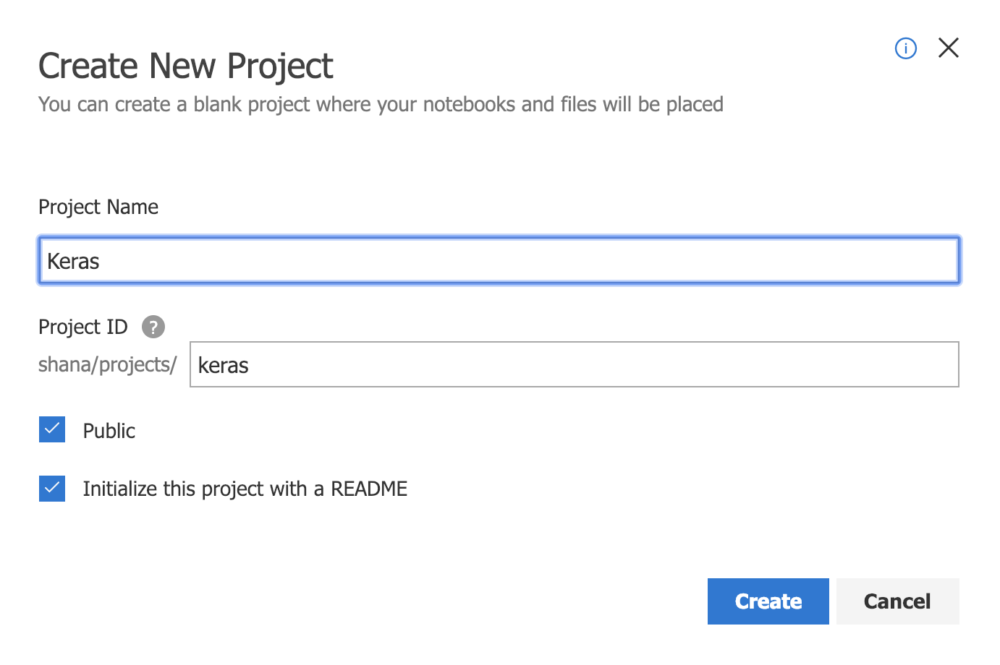
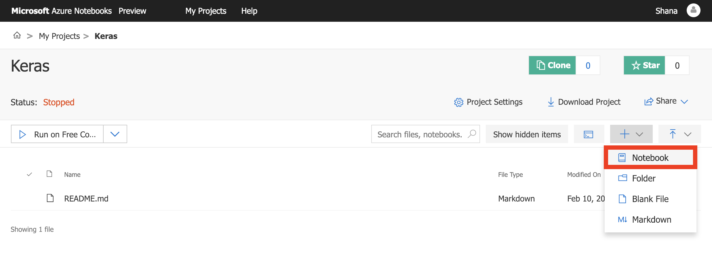
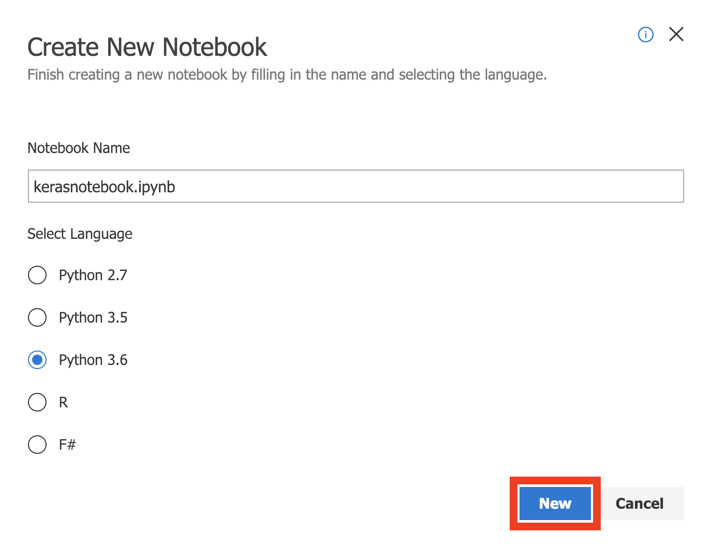
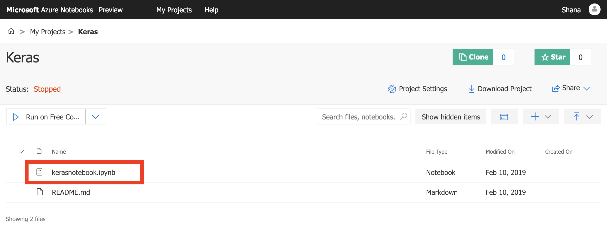

The first order of business is to create a new Azure notebook. Azure notebooks are contained in *projects* whose primary purpose is to group related notebooks. In this unit, you'll create a new project and then create a notebook inside it.

1. Navigate to [https://notebooks.azure.com](https://notebooks.azure.com/?azure-portal=true) in your browser.

1. Sign in using your Microsoft account. 

1. Click **My Projects**.

    

    _Navigating to the Projects page_

1. Click **+ New Project**. Then create a new project named "Keras". You may uncheck the "Public project" box if you'd like, but making the library public allows the notebooks in it to be shared with others through links, social media, or e-mail. If you're unsure which to choose, you can easily change a notebook to public or private later on.

    

    _Creating a project_

1. Click the **+** sign to add a notebook to the project.

    

    _Adding a notebook to the project_

1. Name the notebook "kerasnotebook.ipynb" and select **Python 3.6 Notebook** as the item type. This will create a notebook with a Python 3.6 kernel. One of the strengths of Jupyter notebooks is that you can use different languages by choosing different kernels.

    

    _Creating a notebook_

    If you're curious, the **.ipynb** file-name extension stands for "IPython notebook." Jupyter notebooks were originally known as IPython (Interactive Python) notebooks, and they only supported Python as a programming language. The name Jupyter is a combination of Julia, Python, and R — the core programming languages that Jupyter supports.

1. Click the new notebook. This will launch the notebook and allow you to start editing it.

    

    _Opening the notebook_

You can create additional projects and notebooks as you work with Azure Notebooks. You can create notebooks from scratch, or you can upload existing notebooks. In the next exercise, you will use the notebook you created to build a neural network from scratch.