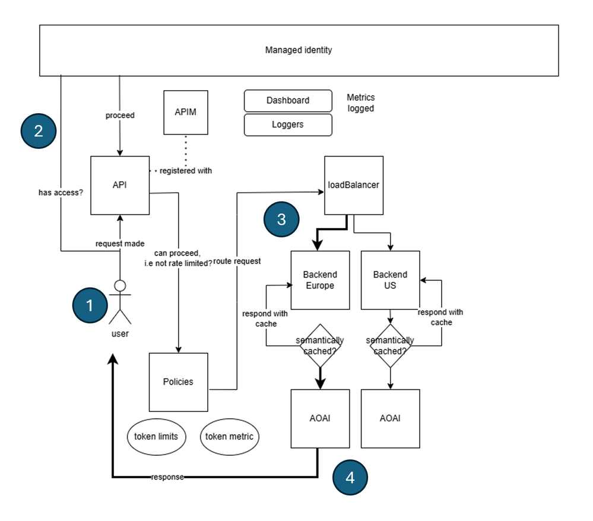

So what's the problem I'm having that makes me want to seek out an API management solution? You most likely have the following challenges:

- **Scaling**, your API or APIs is used by many clients in different regions of the world and you need to ensure that it's available and responsive.
- **Security**, you need to ensure that your API is secure and that only authorized clients can access it.
- **Error management**, you need to ensure that your API can handle errors gracefully.
- **Monitoring**, you need to monitor your APIs to ensure that it's performing as expected.
- Resilience, you need to ensure that your API is resilient and can handle failures gracefully.

For each of these challenges you could opt for a point solution, but that could be challenging to manage. Consider also that your APIs could be built in different tech stacks, which means the solutions to above challenges could mean you need different solutions for each API. If you're having all these challenges, then you should consider a centralized API management solution like Azure API Management.  

Let's dive deeper into some challenges and see how a centralized API management solution like Azure API Management can help you address them.

## Infrastructure as code, IaC

It's perfectly fine by creating your Azure resources using the Azure portal, but as your infrastructure grows, it becomes harder to manage. One of the problems you face is that you can't easily replicate your infrastructure in another environment.

It's also hard to trace all the changes that are made to your infrastructure. This situation is where Infrastructure as Code (IaC) comes in. IaC is the practice of managing your infrastructure using code. To apply IaC on Azure, you have several options, one of which is Bicep. Bicep is a Domain Specific Language (DSL) for deploying Azure resources declaratively. It's a great way to manage your cloud resources. Here's a simple example of what Bicep looks like:

```bicep
param location string = 'eastus'

resource storageAccount 'Microsoft.Storage/storageAccounts@2021-06-01' = {
  name: 'mystorageaccount'
  location: location
  kind: 'StorageV2'
  sku: {
    name: 'Standard_LRS'
  }
}
```

In the preceding example, we defined a storage account using Bicep. We defined the location of the storage account, the kind of storage account, and the SKU (stock-keeping unit). Location is a parameter that we can pass in when we deploy the Bicep file. To deploy the file presented, we would use the Azure CLI like so:

```bash
az deployment group create --resource-group myResourceGroup --template-file main.bicep
```

The preceding command deploys the storage account to the resource group `myResourceGroup` and use the Bicep file `main.bicep` to create the resources in the file.

## Handling load via a load balancer

Adding a load balancing construct is the answer when the problem is that your API is overwhelmed by requests. A load balancer can help you distribute the load across multiple instances of your API.

In Azure API Management service, load balancing is implemented by you defining a concept called backends. The idea is that you set up many backends that correspond to your API endpoints and then you create a load balancer that distributes the load across these backends. Here's how the architecture looks like:



What's happening in the preceding architecture is:

1. The client sends a request to the API Management instance.
1. The request is authenticated and authorized.
1. The request is then sent to the load balancer.
1. The load balancer distributes the request to one of the backends (selected Azure OpenAI API is indicated in bold).

The backend processes the request and sends a response back to the client.

## Defining the load balancer

To set up a load balancer in Azure API Management, you need to do the following parts:

- **Backends**, as many backends as you want to distribute the load on.
- **Load balancer**, a load balancer that contains the backends you want to distribute the load across.
- **A policy** that directs the incoming calls to the load balancer.

### Creating the backends

To create a backend in Azure API Management, you need to define a backend entity. Here's how you can define a backend in Bicep:

```yml
resource backend2 'Microsoft.ApiManagement/service/backends@2023-09-01-preview' = {
  parent: apimService
  name: 'backend2'
  properties: {
    url: '${openai2Endpoint}openai'
    protocol: 'http'
    circuitBreaker: {
      rules: [
        {
          failureCondition: {
            count: 3
            errorReasons: [
              'Server errors'
            ]
            interval: 'P1D'
            statusCodeRanges: [
              {
                min: 500
                max: 599
              }
            ]
          }
          name: 'myBreakerRule'
          tripDuration: 'PT1H'
        }
      ]
    }
}
```

In the preceding Bicep code, a backend is defined to correspond to an API endpoint URL, notice also the name `backend2` this name is something we can use later. For each backend you have, you should encode it like the preceding bicep code.

> [!NOTE]
> Remember that you can have multiple backends, so you can define as many backends as you want.

### Create backend pool 

Next, we want to create a backend pool that sets up which backends we want to distribute the load between. We can encode this backend pool as a backend entity like so:

```yml
resource loadBalancing 'Microsoft.ApiManagement/service/backends@2023-09-01-preview' = {
  parent: apimService
  name: 'LoadBalancer'
  properties: {
    description: 'Load balancer for multiple backends'
    type: 'Pool'
    pool: {
      services: [
        {
          id: '/subscriptions/${subscriptionId}/resourceGroups/${resourceGroupName}/providers/Microsoft.ApiManagement/service/${apimService.name}/backends/${backend1.id}'
        }
        {
          id: '/subscriptions/${subscriptionId}/resourceGroups/${resourceGroupName}/providers/Microsoft.ApiManagement/service/${apimService.name}/backends/${backend2.id}'
        }
      ]
    }
  }
}
```

The backend we created before, `backend2`, is referenced along with another backend `backend1`, the latter we omitted for brevity. 

We can also include a `priority` and `weight` property, for each item in the `services` list to determine how the load balancer distributes the load. Here's how you can set the priority and weight for each backend:

```bicep
services: [
    {
      id: '/subscriptions/<subscriptionID>/resourceGroups/<resourceGroupName>/providers/Microsoft.ApiManagement/service/<APIManagementName>/backends/backend-1'
      priority: 1
      weight: 3
    }
    {
      id: '/subscriptions/<subscriptionID>/resourceGroups/<resourceGroupName>/providers/Microsoft.ApiManagement/service/<APIManagementName>/backends/backend-2'
      priority: 1
      weight: 1
    }
  ]
```

In the preceding example, the load balancer distributes the load to `backend-1` three times more than `backend-2`.

### Direct incoming calls

Lastly, we need to direct any incoming calls to this load balancing backend. The direction instruction is created the following API entity:

```bicep
resource api1 'Microsoft.ApiManagement/service/apis@2020-06-01-preview' = {
  parent: apimService
  name: apiName
  properties: {
    displayName: apiName
    apiType: 'http'
    path: apiSuffix
    format: 'openapi+json-link'
    value: 'https://raw.githubusercontent.com/Azure/azure-rest-api-specs/main/specification/cognitiveservices/data-plane/AzureOpenAI/inference/preview/2024-03-01-preview/inference.json'
    subscriptionKeyParameterNames: {
      header: 'api-key'
    }
    
}
```

### Configure the policy

Now, finally we can set the policy on earlier described API and direct the incoming calls to the load balancer:

```bicep
// policy.xml
<policies>
  <inbound>
    <base />
    <set-backend-service id="apim-generated-policy" backend-id="{0}" />
  </inbound>
  <backend>
    <base />
  </backend>
  <outbound>
    <base />
  </outbound>
  <on-error>
    <base />
  </on-error>
</policies>

var headerPolicyXml = format(loadTextContent('./policy.xml'), loadBalancing.name, 5000)

// Create a policy for the API, using the headerPolicyXml variable
resource apiPolicy 'Microsoft.ApiManagement/service/apis/policies@2020-06-01-preview' = {
  parent: api1
  name: 'policy'
  properties: {
    format: 'rawxml'
    value: headerPolicyXml
  }
}
```

What we did was to create a policy that directs the incoming calls to the load balancer. The `set-backend-service` policy is used to direct the incoming calls to the load balancer. The `backend-id` property is set to the name of the load balancer we created before.

With all these moving parts in place, your API Management instance is now load balanced. You can now scale your API by adding more backends to the load balancer.
  
## Circuit breaker

A circuit breaker is something you use when you want to protect your API from being overwhelmed by requests. How it works is that you define a set of rules that when met, the circuit breaker triggers and stops sending requests to the backend. In Azure API Management, you can define a circuit breaker by setting up a backend and defining a circuit breaker rule. Here's how you can do it:

```bicep
resource backend2 'Microsoft.ApiManagement/service/backends@2023-09-01-preview' = {
      parent: apimService
      name: 'backend2'
      properties: {
        url: '${openai2Endpoint}openai'
        protocol: 'http'
        circuitBreaker: {
          rules: [
            {
              failureCondition: {
                count: 3
                errorReasons: [
                  'Server errors'
                ]
                interval: 'P1D'
                statusCodeRanges: [
                  {
                    min: 500
                    max: 599
                  }
                ]
              }
              name: 'myBreakerRule'
              tripDuration: 'PT1H'
            }
          ]
        }
       }
     }
```

In the preceding backend definition, there's a property `failureCondition` that defines when the circuit breaker should trip. In this case, the circuit breaker trips if there are three server errors in a day. The `tripDuration` property defines how long the circuit breaker should stay open before it closes again. It's good practice to define a circuit breaker for each backend you have in your API Management instance.

## Managed identity

Another problem we're looking to tackle is security. You want to ensure that your API is secure and that only authorized clients can access it. A way to secure your API is by using managed identity. Managed identity is a way to authenticate your API to other Azure services. In Azure API Management, you need to apply managed identity in several places namely:

- **APIM instance level**, you can enable managed identity in the APIM instance by setting the `identity` property to `SystemAssigned` like so:

    ```bicep
    resource apimService 'Microsoft.ApiManagement/service@2023-09-01-preview' = {
        name: name
        location: location
        tags: union(tags, { 'azd-service-name': name })
        sku: {
        name: sku
        capacity: (sku == 'Consumption') ? 0 : ((sku == 'Developer') ? 1 : skuCount)
        }
        properties: {
            publisherEmail: publisherEmail
            publisherName: publisherName
        // Custom properties are not supported for Consumption SKU
        }
        identity: {
            type: 'SystemAssigned'
        }
    }
    ```

    This action generates a managed identity for the APIM instance that we can use later our APIM instance to, for example,  an Azure OpenAI instance.

- **API level**, for your API instance, you can associate it with a policy. In said policy you can add the needed instructions for managed identity to work:

    ```bicep
    <policies>
      <inbound>
        <base />
        <authentication-managed-identity resource="https://cognitiveservices.azure.com" output-token-variable-name="managed-id-access-token" ignore-error="false" /> 

        <set-header name="Authorization" exists-action="override"> 
          <value>@("Bearer " + (string)context.Variables["managed-id-access-token"])</value> 
      </set-header> 
      </inbound>
      <backend>
        <base />
      </backend>
      <outbound>
        <base />
      </outbound>
      <on-error>
        <base />
      </on-error>
    </policies>
    ```

    See the preceding calls to `authentication-managed-identity` and `set-header` these instructions  make sure that managed identity is applied to the API.

- **Backend level**, finally, providing your backends are pointing to Azure OpenAI instances. We need to connect our APIM instance with the Azure OpenAI instance/s. To make this connection, here's the Bicep instruction:

    ```bicep
    resource role 'Microsoft.Authorization/roleAssignments@2022-04-01' = {
      name: guid(subscription().id, resourceGroup().id, principalId, roleDefinitionId)
      properties: {
        principalId: principalId
        principalType: "ServicePrincipal"
        roleDefinitionId: resourceId('Microsoft.Authorization/roleDefinitions', roleDefinitionId)
      }
    }
    ```

    The idea with above Bicep instruction is to create a role assignment between the APIM instance and the Azure OpenAI instance. In this case:
    - `principalId` is the identity ID from the APIM instance, 
    - `roleDefinitionId` is the specific user, in this case it's a user called "Cognitive Services User," a user that has access to the Azure OpenAI instance.
    - `name`, this property ensures that the role assignment is applied to the correct scope, which in this case is a specific subscription and resource group. (needs to be the same resource group as the Azure OpenAI instance)
