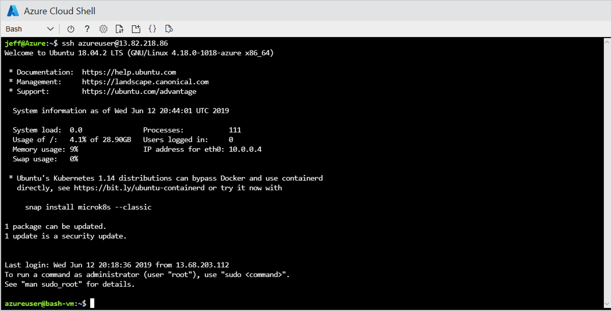

On your own Linux computer, you can run Bash commands locally. If you have access to Linux servers, you can remote in to them and execute Bash commands there. But nobody wants to experiment on a live production system — particularly on their first day at Northwind!

In this unit, you will use Azure Cloud Shell to create a Linux virtual machine (VM) running Ubuntu in Azure. Cloud Shell is a command-line interface to Azure that you access through the Azure porta] or at <https://shell.azure.com>. You don't have to install anything on your PC or laptop to use it. 

We will use Cloud Shell within Learn. You can see it on the right half of the page. 

After creating the VM, you will remote into it so you can use it to practice Bash commands.

## Create a virtual machine

Creating a virtual machine from Cloud Shell requires just a few steps:

1. Execute the following command in Cloud Shell to list the Azure subscriptions associated with your Microsoft account:

	```
	az account list
	``` 

	The default subscription — the one used to create resources created with the CLI—is marked `isDefault=true`. If that's the subscription you wish to use, or if it's the only subscription in the list, proceed to the next step. Otherwise, use the following command to designate one of the other subscriptions as the default, replacing SUBSCRIPTION_ID with the ID of that subscription: 

	```
	az account set -s SUBSCRIPTION_ID
	```

1. Use the following command to create a resource group named "bash-vm-rg" to hold your VM. Note that you can paste commands into Cloud Shell by pressing Shift+Insert if you are running Windows, or Cmd+V on a Mac:

	```bash
	az group create --name bash-vm-rg --location eastus
	```

	Resource groups are an incredibly important feature of Azure. They act as containers for other Azure resources and serve to group those resources together so you can view billing information for them as a group, apply security rules as a group, and even delete them as a group. *Every* Azure resource that you create must be part of a resource group.

1. Now use the following command to create a VM running the latest version of Ubuntu:

	```bash
	az vm create --resource-group bash-vm-rg --name bash-vm --image UbuntuLTS --admin-username azureuser --generate-ssh-keys
	```

	This command creates a relatively inexpensive virtual machine featuring one virtual CPU, 3.5 GB of RAM, and a 7 GB solid-state drive (SSD). It also creates an admin user named "azureuser." No password is required because `--generate-ssh-keys` generates a pair of cryptographic keys used for logging in securely.

	> [!NOTE]
	> For a complete list of options you can specify with the [az vm create](https://docs.microsoft.com/cli/azure/vm?view=azure-cli-latest#az-vm-create) command, type `az vm create --help`. One of the options available is `--size`, which lets you specify a VM with more CPUs and more RAM. The downside to larger VMs is that they are more expensive.

## Connect to the VM

To connect to the VM, you will use the [Secure Shell](https://wikipedia.org/wiki/Secure_Shell) (SSH) protocol, which enables you to securely connect to remote servers over unsecured networks.

1. Wait for the VM to be created. (It might take a couple of minutes.) Then copy the public IP address from the output and use the command below to SSH into the VM, replacing IP_ADDRESS with the VM's public IP address. Note that you can copy selected text from Cloud Shell to the clipboard using **Ctrl+C** on Windows or **Cmd+C** on a Mac:

	```bash
	ssh azureuser@IP_ADDRESS
	```

	Answer "yes" if you are warned that the authenticity of the host can't be established and asked if you want to log in anyway.

1. Confirm that the command prompt changes to `azureuser@bash-vm:~$` indicating that you are logged into the VM.

	[  ](../media/bash-vm.png#lightbox)

	_Connect to the VM_

	You can't execute `az` commands in the VM, but you can execute Bash commands. You can log out of the VM with an `exit` command, and connect again with the an `ssh` command. If you are ever confused as to whether you are executing commands in Cloud Shell or the VM, look to the command prompt. Cloud Shell prompt reads `USER_NAME@Azure:~$`, whereas the VM prompt reads `adminuser@VM_NAME:~$`.

Now that the VM has been created and you are connected to it remotely, it's time to start learning Bash.