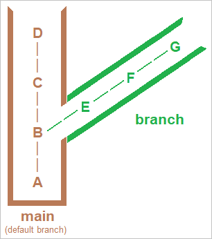

You're a web developer trying to learn more about Git for work. You've created a simple HTML and CSS website about cats to practice your skills and have been working on it with your friends, Alice and Bob. As your project progresses, you realize you'd like for everyone to be able to work on more than one task at a time without getting in one another's way. You need a way to keep everyone's work separate so new development doesn't get in the way of existing bugfixes.

_Branches_ make this easy. The work done "on a branch" doesn't have to be shared, and it doesn't interfere with other branches. Branches let you keep the commits related to each topic together and in isolation, making changes easy to review and track. Modern software development is done almost entirely in branches. The goal is to keep "master" (the main branch) clean until the work is ready to check in. Then you push your changes to "master," or better yet, submit a pull request for the merge.

One of Git's advantages over older version-control systems is that creating a branch is extremely fast; it amounts to writing a 40-character hash into a file under ".git/heads." Switching branches is also fast, because Git stores whole files and just unzips them rather than trying to reconstruct them from lists of changes. Merging in Git isn't _quite_ that simple, but it's straightforward and often completely automatic. Let's learn what branches are, how they're used, and how they work.

## Understand branches

A _branch_ is simply a chain of commits "branching off" from the main line of development, like a branch on a tree.

If you are switching to Git from another version-control system, you may be accustomed to slightly different terminology. Subversion, for example, calls its main branch "trunk". Git calls it "master." You can rename "master," just as you can rename any other branch, and some teams do this when switching to Git from other version-control systems.

A branch usually starts with a commit on "master." It grows a separate history chain as commits are added. Eventually its changes can be merged back into "master." You will learn to do that shortly.

Suppose you branch off of the "master" branch. Here's how to visualize what happens:



Each capital letter in the diagram represents a commit. Branches are given names such as "add-authentication" and "fix-css-bug," and branches can have branches of their own. The ultimate goal is to let developers do what they need to do without stepping on one another, and to wind up with a "master" branch representing the best efforts of everyone involved.

## Create and switch branches with `git branch` and `git checkout`

A common reason to create a new branch is to make changes to an existing feature. A branch for this purpose would commonly be called a _topic branch_ or _feature branch_.

You can create a new branch with the `git branch` command, and switch between branches with the `git checkout` command.

You have already encountered `checkout` as a way of replacing files in the working tree by getting them from the index. With no paths in the argument list, `checkout` updates *everything* in the working tree and the index to match the specified commit — in this case, the head of the branch.

## Merge branches with `git merge`

Once you've finalized some work, like a feature or bug fix, in a branch, you'll want to _merge_ that branch back into the "master" branch. You can use the `git merge` command to merge a given branch into your current branch.

For example, if you were working in a branch called **my-feature**, the workflow would look like:

```bash
# switch back to master branch
git checkout master
# merge my-feature branch into master
git merge my-feature
```

After using these commands (and resolving any _merge conflicts_, which we will discuss later), all the changes from your **my-feature** branch would be in **master**.
