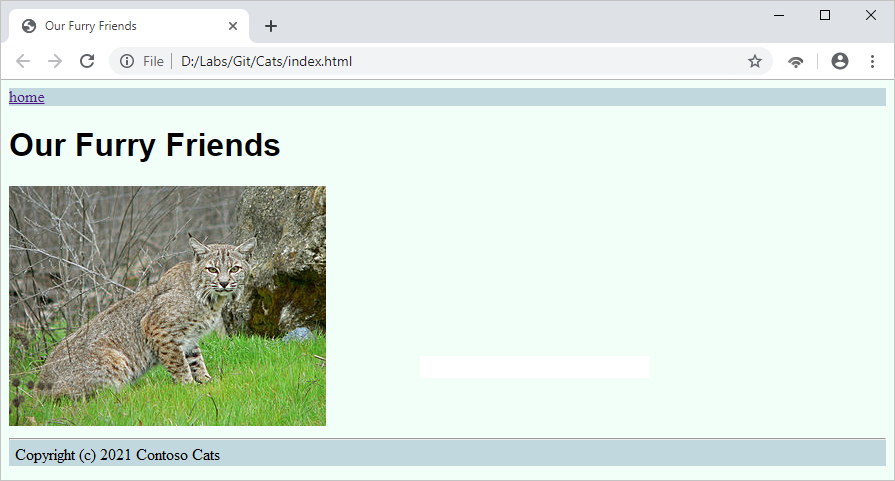

While Alice is working on the CSS, Bob is sitting at home, blissfully unaware of what Alice is doing. This arrangement is just fine because they're both using branches! Bob decides to make some changes of their own.

## Create a branch for Bob

1. Return to the "Bob" directory and use the following command to create a branch named "add-cat,", using the popular `checkout -b` option to create the branch and switch to it in a single command:

    ```bash
    cd ../Bob
    git checkout -b add-cat
    ```

1. Download the zip file containing the [some website resources](https://topcs.blob.core.windows.net/public/git-resources.zip), then unzip them with these commands:

    ```bash
    wget https://topcs.blob.core.windows.net/public/git-resources.zip
    unzip git-resources.zip
    ```

1. Now, copy **bobcat2-317x240.jpg** into Bob's **Assets** directory, deleting the other files (we'll redownload and use them later):

    ```bash
    mv bobcat2-317x240.jpg Assets/bobcat2-317x240.jpg
    rm git-resources.zip
    rm bombay-cat-180x240.jpg
    ```

1. Now open **index.html** and replace the line that says "Eventually we will put cat pictures here" with the following line:

    ```html
    
    ```

    Now save and close the file.

1. You've now made two changes to Bob's "add-cat" branch: added one file and modified another. Use `git status` to double check your changes:

    ```bash
    git status
    ```

1. Now, use the following commands to add the new file in the "Assets" directory to the index and commit all changes:

    ```bash
    git add .
    git commit -a -m "Add picture of Bob's cat"
    ```

1. Bob now does as Alice did: they switch back to "master" and does a pull to see if anything has changed:

    ```bash
    git checkout master
    git pull
    ```

1. This time, the output indicates that changes *have* been made to "master" in the shared repo (the result of Alice's push). It also indicates that the change pulled from "master" in the shared repo have been merged with "master" in Bob's repo:

    ```output
    remote: Counting objects: 4, done.
    remote: Compressing objects: 100% (3/3), done.
    remote: Total 4 (delta 1), reused 0 (delta 0)
    Unpacking objects: 100% (4/4), done.
    From D:/Labs/Git/Bob/../Shared
       e81ae09..1d2bfea  master     -> origin/master
    Updating e81ae09..1d2bfea
    Fast-forward
     assets/site.css | 3 ++-
     1 file changed, 2 insertions(+), 1 deletion(-)
    ```

1. Now Bob merges their branch into "master" so that "master" in their repo will have both theirs *and* Alice's changes. Then, Bob pushes "master" on their computer to "master" in the shared repo:

    ```bash
    git merge add-cat --no-edit
    git push
    ```

Bob didn't use the `--ff-only` option because he knew "master" had changed. A fast-forward-only merge would have failed.

## Sync the repos

At this point, Bob has an up-to-date repo, but Alice doesn't. Alice needs to do a `git pull` from the shared repo to make sure she has the latest and greatest version of the site.

1. Use the following commands to sync Alice's repo with the shared repo:

    ```bash
    cd ../Alice
    git pull
    ```

Take a moment to verify that Alice's repo and Bob's repo are synced. Each of them should have a JPG file in the **assets** directory and an `` element declared in **index.html**. The **site.css** file in each repo's **assets** folder should contain a line defining a CSS style named `cat` (the style that Alice added when they made their changes).

If you open **index.html** in a browser, you would see:



_There be cats!_

In the next lesson, you learn how to resolve merge conflicts, which occur when changes made by two or more developers overlap.
