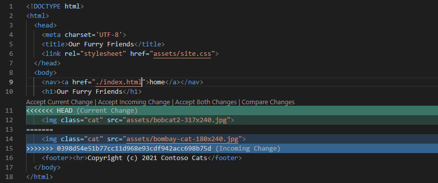

Sometimes, no matter how well you plan, things go wrong. Imagine two developers are working on the same project file at the same time. The first developer pushes their changes up to the main branch of the project repo without any issue. When the second developer tries to push their changes, Git says there's a *merge conflict*. The file that the second developer is trying to modify is no longer up to date in terms of the most recent changes, or file version. The file version needs to be brought up to date before the second developer's changes can be merged in. Developers who use version control dread few things more than merge conflicts!

Conflicts like this can happen, so you *must* to know how to deal with them. The good news is that Git provides solutions for dealing with merge conflicts.


## Create branches for Alice and Bob

Let's begin by creating a branch for Alice and a branch for Bob. They're both updating files in the project repo at the same time. They're not aware of each other's changes because they're making updates in their local branches.

1. Be sure you're in the "Alice" directory. Create a branch named `add-cat` for Alice to work in:

    ```bash
    git checkout -b add-cat
    ```

1. Change to the "Bob" directory and create a branch named `style-cat` for Bob to work in:

    ```bash
    cd ../Bob
    git checkout -b style-cat
    ```

Now let's make some changes in the branches.

## Make a change as Alice

Start by assuming the role of Alice and make a change to the website home page. Replace the picture of Bob's cat with a picture of Alice's.

1. Change back to the "Alice" directory:

    ```bash
    cd ../Alice
    ```

1. If you didn't download the resources previously, download the zip file containing the [resources that accompany this lesson](https://topcs.blob.core.windows.net/public/git-resources.zip), and then unzip them with these commands:

    ```bash
    wget https://topcs.blob.core.windows.net/public/git-resources.zip
    unzip git-resources.zip
    ```

1. Move the **bombay-cat-180x240.jpg** file into Alice's "Assets" directory, and delete the other files:

    ```bash
    mv bombay-cat-180x240.jpg Assets/bombay-cat-180x240.jpg
    rm git-resources.zip
    rm bobcat2-317x240.jpg
    ```

1. Then open the **index.html** file and replace this statement that uses one of Bob's cat pictures:

    ```html
    
    ```

    With this statement to use one of Alice's cat pictures:

    ```html
    
    ```

    Save and close the file.

1. Now use the following Git commands to push the changes to the project repo. First, we'll add the commits made in the "Assets" folder. Then we'll switch back to the `main` branch and do a `pull` to make sure nothing has changed. Finally, we'll `merge` the `add-cat` local branch into the `main` branch and then `push` the changes to the repo.

    ```bash
    git add Assets
    git commit -a -m "Add picture of Alice's cat"
    git checkout main
    git pull
    git merge --ff-only add-cat
    git push
    ```

Finish up by confirming that the push succeeded.


## Make a change as Bob

Without knowing what Alice is doing, Bob notices that Alice's last push added a CSS style named `cats` to the **site.css** file for the repo. So Bob decides to apply that class to his cat picture.

1. Return to the "Bob" directory:

    ```bash
    cd ../Bob
    ```

1. Open the **index.html** file. Replace the statement that uses Bob's cat picture with the following statement that adds a `class="cat"` attribute to the `` element:

    ```html
    
    ```

    Save and close the file.

1. Now use the following Git commands to sync our changes to the project repo like we did for the updates to Alice's repo. Commit the change, switch to the `main` branch, do a `pull`, and then `merge` the style change:

    ```bash
    git commit -a -m "Style Bob's cat"
    git checkout main
    git pull
    git merge style-cat
    ```

And there it is: **the dreaded merge conflict**. The same line in the same file was changed by two people. Git sees the conflict and reports "Automatic merge failed." Git has no way of knowing whether the `src` attribute in the `` element should reference the **bobcat2-317x240.jpg** file or the **bombay-cat-180x240.jpg** file:

```output
Auto-merging index.html
CONFLICT (content): Merge conflict in index.html
Automatic merge failed; fix conflicts and then commit the result.
```

The output from Git identifies the **index.html** file as the source of the conflict.
The question now is: What's Bob to do?


## Resolve the merge conflict

Bob has a few options at this point:
- Use the `git merge --abort` command to restore the `main` branch to what it was before the attempted merge. Use the `pull` command to get Alice's changes. Then create a new branch, make their changes, and merge their branch into the `main` branch. Last, push their changes.
- Use the `git reset --hard` command to get back to where they were before they started the merge.
- Resolve the conflict manually by using information that Git inserts into the affected files.

Developers seem to prefer the last option. When Git detects a conflict in content versions, it inserts *both* versions of the content into the file. It uses special formatting to help you identify and resolve the conflict: left angle brackets `<<<<<<<`, double dashes (equal signs) `=======`, and right angle brackets `>>>>>>>`. The content above the line of dashes `=======` shows your changes in your branch. The content below the separator line shows the version of the content in the branch that you're trying to merge into.

Here's what the **index.html** file in Bob's repo looks like now. Notice the special formatting around the content with conflicts:

:::code language="html" source="../resources/bob-index.html" range="1-18" highlight="11,13,15":::

Let's resolve the merge conflict by editing the **index.html** file. Because this is a quick fix, you'll make the change directly in the `main` branch even though you're still in the "Bob" directory.

1. Open the **index.html** file and delete the special formatting lines. Don't remove any other statements. 

    ```html
    <<<<<<< HEAD
    =======
    >>>>>>> style-cat
    ```

    Save and close the file.

    The **index.html** file now has two `` elements: one for Bob's cat picture and one for Alice's.

    Some text editors feature Git integration and offer to help when they see text that represents merge conflicts. If you open the **index.html** file in Visual Studio Code, you'll see this:

    

    _Resolve merge conflicts in Visual Studio Code_

    If you select **Accept Both Changes**, the editor removes the lines around the `` elements and leaves both elements intact.

1. Now use the following commands to commit the change:

    ```bash
    git add index.html
    git commit -a -m "Style Bob's cat"
    ```

    The `git add` command tells Git that the conflict in the **index.html** file has been resolved.

1. Push the changes to the `main` branch on the remote:

    ```bash
    git push
    ```

1. Finish by syncing the changes into Alice's repo:

    ```bash
    cd ../Alice
    git pull
    ```
    
    Now open Alice's **index.html** file and confirm their version also has two `` tags with cat pictures.
