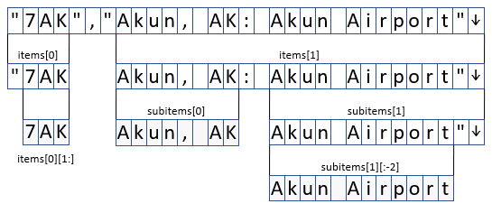
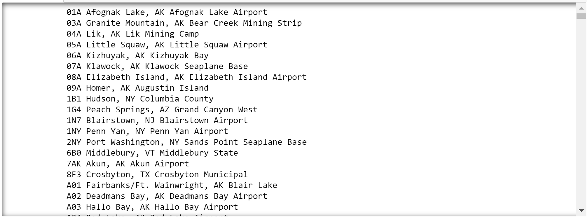
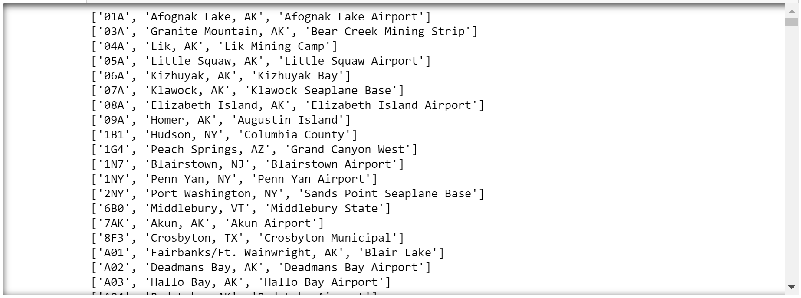

In this exercise, you will use string slicing and string splitting to parse the strings read from the data file in the previous lesson into a list of lists, with the inner lists containing data regarding individual airports. Lists of lists are very common in Python and are useful for storing tabular data — that is, data that is organized into rows and columns.

1. Return to the Azure notebook that you created earlier.

1. Add the following statements to the empty cell at the end of the notebook:

    ```python
    for airport in all_airports:
        items = airport.split('","')
        airport_code = items[0][1:]
        print(airport_code)
    ```

    Based on the discussion of string splitting and slicing in the previous section, can you predict what the output will be?

1. Run the cell and confirm that it produces a lst of airport codes parsed from the strings in the file:

    

    _Printing airport codes_

1. The previous code parsed an airport code from each line read from the data file. The next challenge is to get each airport's name and location. Modify the code above as follows:

    ```python
    for airport in all_airports:
        # Split the airport code from the airport location and name and
        # remove the quotation mark from the beginning of the airport code
        items = airport.split('","')
        airport_code = items[0][1:]

        # Split the airport location and airport name, and remove the quotation
        # mark and newline character from the end of the airport name
        subitems = items[1].split(': ')
        airport_location = subitems[0]
        airport_name = subitems[1][:-2]

        # Print the resulting strings
        print(airport_code, airport_location, airport_name)
    ```

    The purpose of the code in the `for-in` loop is to divide a string containing an airport code, an airport location, and an airport name into three strings, as diagrammed below. First the string is split at "," to produce `items[0]` and `items[1]` at the top of the diagram. Then the quotation mark is removed from the beginning of `items[0]`, producing an airport code. Next, `items[1]` is split to produce `subitems[0]` and `subitems[1]`. The former is the airport location, and the quotation mark and embedded newline character are removed from the end of `subitems[1]` to get the airport name.

    

    _Splitting and trimming strings_

    The final line in the `for-in` loop prints the resulting pieces of data on one line. Based on this, can you predict what the output will be?

1. Now run the modified cell. Confirm that the output resembles the output below.

    

    _Printing airport data_

1. The next step is to add the airport codes, locations, and names to a list rather than simply print them out. To that end, add the following code to the empty cell at the bottom of the notebook:

    ```python
    airports = []

    for airport in all_airports:
        items = airport.split('","')
        airport_code = items[0][1:]
        subitems = items[1].split(': ')
        airport_location = subitems[0]
        airport_name = subitems[1][:-2]
        airports.append([airport_code, airport_location, airport_name])

    for airport in airports:
        print(airport)
    ```

    This code defines a new list named `airports` and adds to it a list containing the airport code, location, and name for each line in the input. Then it prints each list in the list of lists.

1. Run the cell and confirm that the output resembles the output below.

    

    _Printing final transfomed airport data_

1. Use the **File** -> **Save and Checkpoint** command to save the notebook.

Now that you have separated airport codes, airport locations, and airport names into explicit entities, you are prepared to take the next step, which involves filtering the data so the list includes only U.S. airports.
