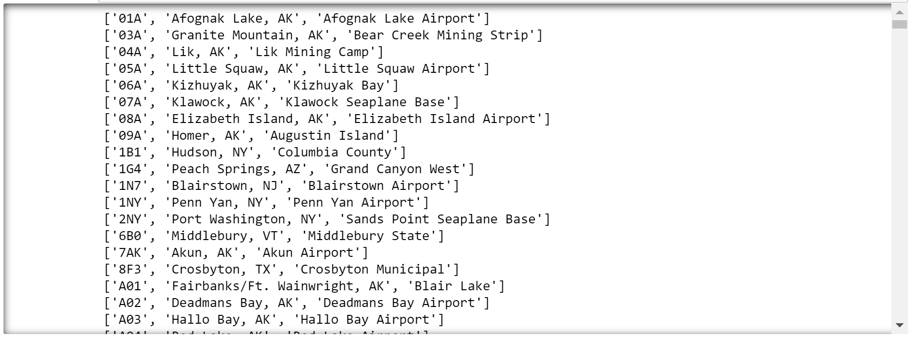

Now let's use what you learned about `if` statements, plus the `endswith` function that can be called on strings in Python, to generate a new list of lists that contains only U.S. airports.

1. Return to the Azure notebook that you created in the first lesson. 
1. Add the following code to the end of the notebook to create a list named `us_airports` that includes only airports located in the U.S.:

    ```python
    us_airports = []

    us_states = ["AL", "AK", "AZ", "AR", "CA", "CO", "CT", "DC", "DE", "FL", "GA",
                 "HI", "ID", "IL", "IN", "IA", "KS", "KY", "LA", "ME", "MD",
                 "MA", "MI", "MN", "MS", "MO", "MT", "NE", "NV", "NH", "NJ",
                 "NM", "NY", "NC", "ND", "OH", "OK", "OR", "PA", "RI", "SC",
                 "SD", "TN", "TX", "UT", "VT", "VA", "WA", "WV", "WI", "WY"]

    for airport in airports:
        if airport[1].endswith(tuple(us_states)):
            us_airports.append(airport)
    ```

    Notice the call to [Python's `tuple` function](https://www.w3schools.com/python/ref_func_tuple.asp) in the second-to-last line. A tuple is similar to a list, but unlike a list, it is immutable. `endswith` won't accept a list, but it will accept a tuple. The solution, therefore, is to use the `tuple` function to wrap a tuple around the `us_states` list.

    Now `endswith` will return `True` if the string it is called on (airport[1] - the second string of the airport list) ends with a string provided in the list (all the state abbreviations), or `False` if it does not.

1. Run the cell and verify that it executes without error. Then add the following code to the empty cell at the end of the notebook to list all U.S. airports:

    ```python
    for airport in us_airports:
        print(airport)
    ```

1. Run the cell and confirm that the output includes only airports in the United States:

    

    _Printing a list of U.S. airports_

1. Use the **File** -> **Save and Checkpoint** command to save the notebook.

You have now filtered the list so that it only includes U.S. airports. The last step is to add logic that allows a user to interactively filter the data to view all of the airports in a specified state.