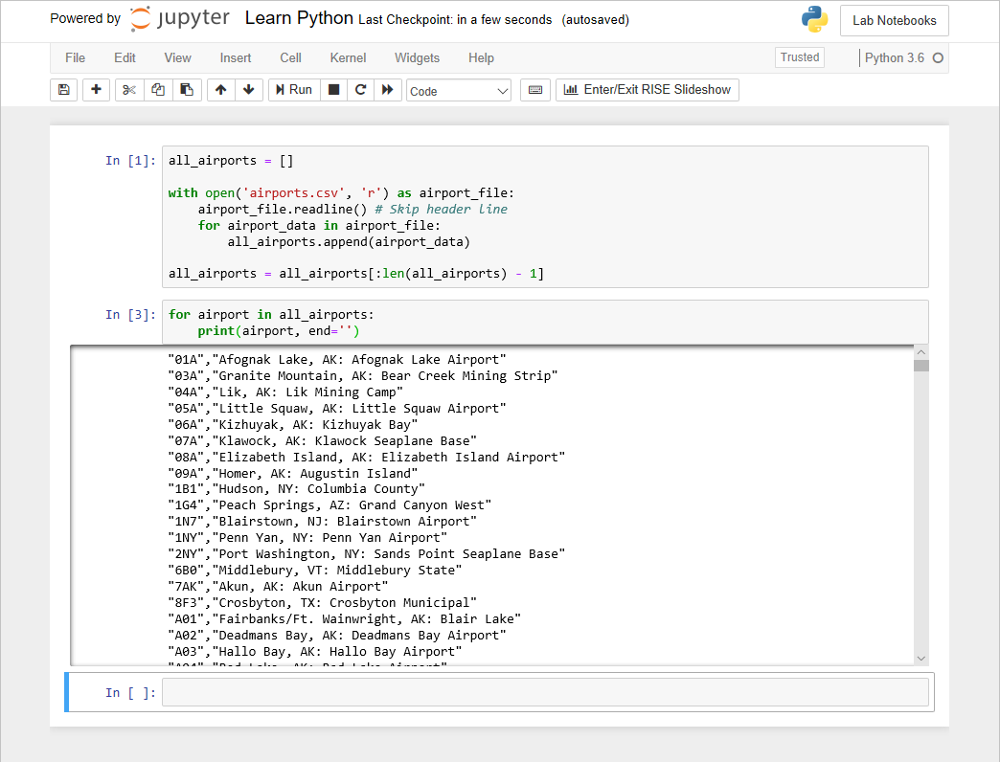

**Microsoft Azure Notebooks** is a cloud-based platform for building and running Jupyter notebooks. Azure Notebooks provide Jupyter-as-a-service for free. It's a convenient way to build notebooks and share them with others without having to install and manage a Jupyter server. And it's completely web-based, making it an ideal solution for collaborating online.

In the following screenshot, you can see Python code running in a Jupyter notebook hosted in Azure Notebooks.



Jupyter notebooks are JSON documents that are composed of *cells*. Each cell is assigned one of three types:

- **Markdown** for entering text into the document
- **Code** for entering code that runs interactively - this is the primary cell type you will use
- **Raw NBConvert** for entering data inline

> [!NOTE]
> There used to be a fourth cell type - _Header_ which was for text headers. This has been deprecated in favor of using the Markdown cell type which also supports headers.

## Markdown cells

The Markdown cell type allows you to add annotations, documentation, and visual elements in the form of text and images into the notebook. It uses [GitHub flavored markdown](https://help.github.com/articles/github-flavored-markdown) syntax. You can also use most HTML markup elements to format the content in this cell type.

As an example the following cell would display a header and image in the document.

```markdown
## Show the Python logo

```

## Code cells

Code entered into code cells is executed by a *kernel*. The popular IPython kernel supports code written in Python, but [dozens of other kernels](https://github.com/jupyter/jupyter/wiki/Jupyter-kernels) are available supporting other languages. Azure notebooks (Jupyter notebooks created in Azure) support Python, R, and F#. They also support numerous packages and libraries that are commonly used in Python.

Code cells always have an output cell which provides the results from the code cell above it. For example, the following code:

```python
print('Hello, world!')
6 * 7
```

Would produce an output cell below it with the following:

```output
Hello, world!
42
```

There is a sequence number displayed as a prefix to each cell which correlates the cell and the output together.


## NBConvert cells

A raw cell is defined as content that should be included unmodified in **nbconvert** output. These cells are only processed when using the command-line tool `nbconvert` to convert the notebook to another format such as HTML or LaTeX.