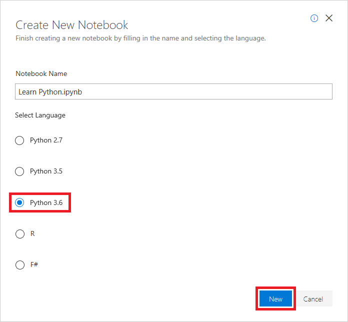

Azure notebooks are created through the portal at [https://notebooks.azure.com](https://notebooks.azure.com?azure-portal=true) and require nothing more than a browser and a Microsoft account. Notebooks are contained in projects, whose primary purpose is to group related notebooks. 

In this exercise, you will create a new project and then create a notebook inside it.

[!include[](../../../includes/azure-free-trial-note.md)]

## Create an Azure Notebook

1. Navigate to [https://notebooks.azure.com](https://notebooks.azure.com?azure-portal=true) in your browser and sign in using your Microsoft account.

1. Select **My Projects** in the menu at the top of the page.

1. Select the **+ New Project** button at the top of the "My Projects" page.

1. Create a new project named "Learn Notebooks" or something similar.

    

    _Creating a project_

    > [!TIP]
    > Leaving the "Public" box checked makes it easy to share notebooks later on. You can also go into project settings once a project is created and change its visibility to public or private.  

1. Select **+ New** > **Notebook** from the menu to add a notebook to the project.

    

    _Adding a notebook to the project_

1. Give the notebook a name such as "Learn Python.ipynb," and select **Python 3.6** as the language. This will create a notebook with a Python 3.6 kernel for executing Python code. One of the strengths of Azure notebooks is that you can use different languages by choosing different kernels.

    

    _Creating a notebook_

    > [!NOTE]
    > If you're curious, the **.ipynb** filename extension stands for "IPython notebook." Jupyter notebooks were originally known as IPython (Interactive Python) notebooks, and they only supported Python as a programming language. The name Jupyter is a combination of Julia, Python, and R — the core programming languages that Jupyter supports.

1. Select the notebook to open it for editing.

You can create additional projects and notebooks as you work with Azure Notebooks. You can create notebooks from scratch, or you can upload existing notebooks. And once a notebook is created or uploaded, you can take advantage of Azure compute resources to run the notebook and leverage popular Python libraries such as [Keras](https://keras.io/), [NumPy](http://www.numpy.org/), [Pandas](https://pandas.pydata.org/), [Matplotlib](https://matplotlib.org/), and [Scikit-learn](https://scikit-learn.org/stable/index.html).

## Writing output to the screen

A great way to get started with Python is learning how to perform input and output. In Python, the `print` function, which is one of more than 60 functions built into the language, outputs text to the screen. The following statement displays "Hello World!" on the screen:

```python
print('Hello World!')
```

The argument passed to `print` is a *string*, which is one of the fundamental data types in Python. By default, `print` outputs a newline character at the end of the line so that subsequent output — for example, additional calls to `print` — will start on the next line.

### Implement Hello, World in a notebook

The beauty of Azure Notebooks is that you can type in statements like the one above, execute them inside the notebook, and see the output in the notebook as well.

1. Return to the notebook that you created a few moments ago. Type (or paste) the following Python code into the empty cell at the top of the notebook:

    ```python
    print('Hello, World!')
    ```

1. Now click the **Run** button to run the cell and add a new cell after it. Confirm that "Hello, World!" appears in the output of the first cell:

    

    _Running the first cell_

The **Run** button runs the current cell and selects the next one, adding an empty cell if necessary. If preferred, you can use the keyboard equivalent <kbd>Shift</kbd>+<kbd>Enter</kbd> instead. Other keyboard shortcuts include <kbd>Ctrl</kbd>+<kbd>Enter</kbd> (<kbd>Command</kbd>+<kbd>Enter</kbd> on a Mac), which runs the current cell without changing the selection, and <kbd>Alt</kbd>+<kbd>Enter</kbd> (<kbd>Option</kbd>+<kbd>Enter</kbd> on a Mac), which runs the current cell and inserts a new cell below it even if there are already cells below it.

1. Finish up by using using the **File** > **Save and Checkpoint** command to save the notebook.

Once the notebook is saved, you can return to it later and pick up where you left off, even if you close the notebook or close the browser. Go ahead and leave the Azure Notebook tab or window open - we'll be adding to it in a moment, but first let's learn a bit more about Python syntax so we can start building a real program.