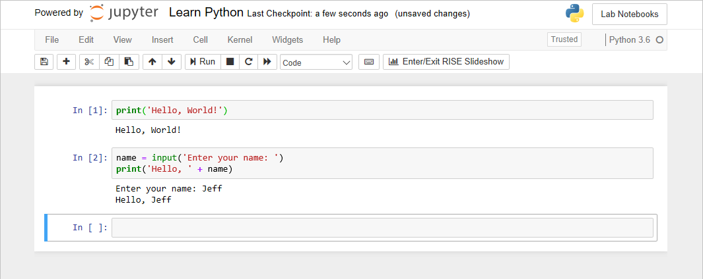
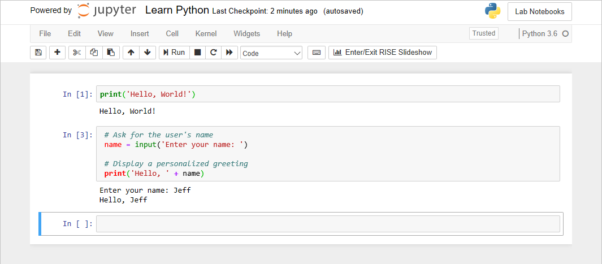

Now let's use what you learned about `print`, `input`, and string concatenation to display a personalized greeting in the Azure Notebook.

1. Switch back to your Azure Notebook tab or window.

1. Type the following statements into the empty cell at the end of the notebook:

    ```python
    name = input('Enter your name: ')
    print('Hello, ' + name)
    ```

1. Select the **Run** button or press <kbd>Shift</kbd>+<kbd>Enter</kbd> to run the cell. 
1. When prompted, type your name and press <kbd>Enter</kbd>. 
1. Confirm that a personalized greeting appears in the output:

    

    _Displaying a personalized greeting_

If you wanted to add an exclamation mark after the name so the greeting reads "Hello, Jeff!" rather than "Hello, Jeff", how would you do it?

> [!TIP]
> A single Python statement can use multiple `+` operators to concatenate several strings. If you want to try out your answer, simply modify the `print` statement and run the cell again. Code entered into a cell isn't cast in stone. You always have the option of modifying that code and running it again.

## Add comments to your notebook

Next, let's add a few comments into the Python code to document what this simple program does.

1. Modify the code that you added a few moments ago to include comments:

    ```python
    # Ask for the user's name
    name = input('Enter your name: ')

    # Display a personalized greeting
    print('Hello, ' + name)
    ```

1. Run the cell and confirm that it behaves the same as it did before.

    

    _Running the modified cell_

1. As before, select the **File** > **Save and Checkpoint** command to save the notebook.