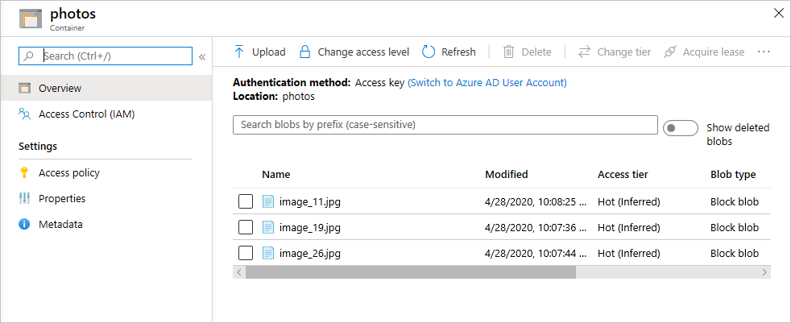
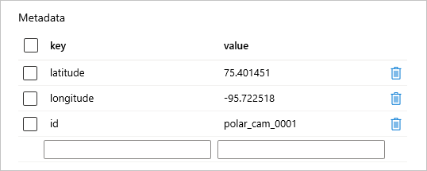

In this unit, you will create an Azure Storage account and implement a simulated camera array in Node.js that uploads wildlife photos to the account. The storage account will store photographs taken by the cameras that you deploy. These represent the first steps toward building an end-to-end solution that demonstrates how Azure services are combined to create sophisticated systems that incorporate cloud services and AI.

## Create a storage account ##

Let's begin by using the [Azure Cloud Shell](https://azure.microsoft.com/features/cloud-shell/) to create an Azure Storage account. The Cloud Shell provides a browser-based command line for executing Azure commands and is an alternative to the [Azure CLI](https://docs.microsoft.com/cli/azure/?view=azure-cli-latest), which lets you execute the same commands on your local workstation. Whether to use the CLI or the Cloud Shell is often a matter of personal preference. One of the advantages of the Cloud Shell is that it doesn't require you to install any software on your PC. Another is that you don't have to update it periodically as you do the CLI.

1. Open the [Azure portal](https://portal.azure.com) in your browser. If asked to log in, do so using your Microsoft account.

1. Click the **Cloud Shell** button in the toolbar at the top of the portal to open the Cloud Shell.

	> If you would prefer, you can open a Cloud Shell in a separate browser window by pointing your browser to https://shell.azure.com. Clicking the Cloud Shell button in the portal opens a Cloud Shell inside the portal.

    

    _Opening the Azure Cloud Shell_

	If you are prompted to choose a language, select Bash. If you are prompted to allow the Cloud Shell to create a storage account, allow it to do so.

1. The next task is to create a resource group to hold the storage account and other Azure resources that comprise the solution. Make sure the language selected in the Cloud Shell is Bash, and execute the following command in the Cloud Shell to create a resource group named "polar-bear-rg" in Azure's South Central US region:

	```
	az group create --name polar-bear-rg --location southcentralus
	```

	You can use **Shift+Insert** to paste commands into the Cloud Shell, and **Ctrl+Insert** to copy text from the Cloud Shell to the clipboard.

1. Now use the following command to create a storage account in the "polar-bear-rg" resource group. Replace ACCOUNT_NAME with the name you wish to assign the storage account.

	```
	az storage account create --name ACCOUNT_NAME --resource-group polar-bear-rg --location southcentralus --sku Standard_LRS
	```

	Storage-account names must be from 3 to 24 characters in length and can contain only numbers and lowercase letters. In addition, the account name must be unique within Azure, so if the command fails because the storage-account name is already in use, change the name and try again.

1. Azure Storage accounts support four types of storage: blobs, tables, files, and 	queues. Blob storage provides a massively scalable object store for text and binary data. Photos uploaded to your storage account will be stored as blobs. Before you can upload blobs to a storage account, you must create a container to store them in.

	Use the following command to create a container named "photos" in the storage account, replacing ACCOUNT_NAME with the name you assigned to the storage account in the previous step:

	```
	az storage container create --name photos --account-name ACCOUNT_NAME
	```

1. Execute the following command in the Cloud Shell to list the access keys for the storage account, once more replacing ACCOUNT_NAME with the storage account's name:

	```
	az storage account keys list --account-name ACCOUNT_NAME
	```

1. Copy the primary access key — the `value` property containing a long series of letters and numbers — from the output and paste it into a text file so you can retrieve it later. Remember that you can use **Ctrl+Insert** to copy text from the Cloud Shell to the clipboard.

You now have a storage account for storing photos and a container to store them in. Now let's deploy some cameras to snap wildlife photos and upload them to blob storage.

## Deploy a simulated camera array ##

The next task is to create a Node.js app that simulates an array of motion-activated cameras that upload photographs taken in the wild to the storage account's "photos" container.

1. If Node.js isn't installed on your computer, go to https://nodejs.org/ and install it it now. You can determine whether Node is installed — and what version is installed — by opening a Command Prompt or terminal window and typing the following command:

	```bash
	node -v
	```

	If Node is installed, the version number will be displayed. If the version number is less than 8.0, **download and install the latest version**.

1. Create a directory on your hard disk to serve as the project directory. Then ```cd``` to that directory in a Command Prompt or terminal window.

1. Execute the following commands to initialize the project directory to host a Node project and install a package:

	```bash
	npm init -y
	npm install azure-storage --save
	```

	The [azure-storage](https://www.npmjs.com/package/azure-storage) package provides a programmatic interface to Azure Storage, including blob storage, for Node.js apps.

1. Wait for the install to finish. Then create a subdirectory named "photos" in the project directory. Copy all 30 **.jpg** files from the "Camera Images" folder in the resources that accompany this module to the "photos" subdirectory. These are the images that the simulated cameras will upload to blob storage, samples of which are shown below. Wildlife depicted in the images include Arctic foxes, polar bears, and walruses.

	


1. Create a file named **cameras.json** in the project directory and paste in the following JSON:

	```json
	[
	    {
	        "deviceId" : "polar_cam_0001",
	        "latitude" : 75.401451,
	        "longitude" : -95.722518
	    },
	    {
	        "deviceId" : "polar_cam_0002",
	        "latitude" : 75.027715,
	        "longitude" : -96.041859
	    },
	    {
	        "deviceId" : "polar_cam_0003",
	        "latitude" : 74.996653,
	        "longitude" : -96.601780
	    },
	    {
	        "deviceId" : "polar_cam_0004",
	        "latitude" : 75.247701,
	        "longitude" : -96.074436
	    },
	    {
	        "deviceId" : "polar_cam_0005",
	        "latitude" : 75.044926,
	        "longitude" : -93.651951
	    },
	    {
	        "deviceId" : "polar_cam_0006",
	        "latitude" : 75.601571,
	        "longitude" : -95.294407
	    },
	    {
	        "deviceId" : "polar_cam_0007",
	        "latitude" : 74.763102,
	        "longitude" : -95.091160
	    },
	    {
	        "deviceId" : "polar_cam_0008",
	        "latitude" : 75.473988,
	        "longitude" : -94.069432
	    },
	    {
	        "deviceId" : "polar_cam_0009",
	        "latitude" : 75.232307,
	        "longitude" : -96.277683
	    },
	    {
	        "deviceId" : "polar_cam_0010",
	        "latitude" : 74.658811,
	        "longitude" : -93.783787
	    }
	]
	```

	This file defines ten virtual cameras that will upload photos to blob storage. Each "camera" contains a device ID as well as a latitude and a longitude specifying the camera's location.

	> The latitudes and longitudes correspond to points on the coast of Northern Canada's [Cornwallis Island](https://en.wikipedia.org/wiki/Cornwallis_Island_(Nunavut)), which is one of the best sites in all of Canada to spot polar bears. It is also adjacent to [Bathurst Island](https://en.wikipedia.org/wiki/Bathurst_Island_(Nunavut)), which is home to the [Polar Bear Pass National Wildlife Area](https://www.canada.ca/en/environment-climate-change/services/national-wildlife-areas/locations/polar-bear-pass.html).

1. Create a file named **run.js** in the project directory. Paste the following code into the file:

	```javascript
	'use strict';
	
	// Connect to the storage account
	var storage = require('azure-storage');
	
	var blobService = storage.createBlobService(
	    process.env.ACCOUNT_NAME,
	    process.env.ACCOUNT_KEY
	);
	
	// Load image file names and create an array of cameras
	var fs = require('fs');
	
	fs.readdir('photos', (err, files) => {
	    var cameras = JSON.parse(fs.readFileSync('cameras.json', 'utf8')).map(
	        camera => new Camera(
	            camera.deviceId,
	            camera.latitude,
	            camera.longitude,
	            blobService,
	            files
	        )
	    );
	
	    // Start the cameras
	    cameras.forEach(camera => {
	        camera.start();
	    });
	});
	
	class Camera {
	    constructor(id, latitude, longitude, blobService, files) {
	        this._id = id;
	        this._latitude = latitude;
	        this._longitude = longitude;
	        this._blobService = blobService;
	        this._files = files.slice(0);
	        this._interval = 300000;
	    }
	
	    start() {
	        // Register first callback
	        setTimeout(this.timer, Math.random() * this._interval, this);
	        console.log('Started ' + this._id);
	    }
	
	    timer(self) {
	        // Randomly select a photo
	        var index = Math.floor(Math.random() * self._files.length);
	        var filename = self._files[index]
	
	        // Define the metadata to be written to the blob
	        var metadata = {
	            'latitude': self._latitude,
	            'longitude': self._longitude,
	            'id': self._id
	        };
	
	        // Upload the blob
	        self._blobService.createBlockBlobFromLocalFile('photos', filename, 'photos/' + filename, { 'metadata': metadata }, (err, result) => {
	            if (!err) {
	                console.log(self._id + ': Uploaded ' + filename);
	            }
	            else {
	                console.log(self._id + ': Error uploading ' + filename);
	            }
	        });
	
	        // Register the next callback
	        setTimeout(self.timer, Math.random() * self._interval, self);
	    }
	}
	```

	This code uses the [class support](http://es6-features.org/#ClassDefinition) in ECMAScript 6 (ES6) to define a class named ```Camera```. Then it creates 10 ```Camera``` instances and starts them running. Each camera uses a random timer that fires once every few minutes to upload wildlife images to the "photos" container in blob storage. Images are randomly selected from the files in the project directory's "photos" subdirectory. Each blob that is created contains metadata identifying the camera that uploaded the photo and the camera's location.

1. If you are running Windows, execute the following commands to create a pair of environment variables, replacing STORAGE_ACCOUNT_NAME with the name of the storage account that you created earlier, and STORAGE_ACCOUNT_KEY with the storage account's access key:

	```
	set ACCOUNT_NAME=STORAGE_ACCOUNT_NAME
	set ACCOUNT_KEY=STORAGE_ACCOUNT_KEY
	```

	If you are running Linux or macOS, use these commands instead:

	```
	export ACCOUNT_NAME=STORAGE_ACCOUNT_NAME
	export ACCOUNT_KEY=STORAGE_ACCOUNT_KEY
	```

	At run-time, **run.js** reads these environment variables and uses them to connect to the storage account. Storing "secrets" such as these in environment variables is more secure than embedding them in source code. Of course, if you close the Command Prompt or terminal window in which you executed these commands, you will need to run them again before running **run.js**.

1. Execute the following command in the Command Prompt or terminal window to run **run.js**:

	```bash
	node run.js
	```

1. Confirm that you see output similar to the following, indicating that all 10 "cameras" are running:

	```
	Started polar_cam_0001
	Started polar_cam_0002
	Started polar_cam_0003
	Started polar_cam_0004
	Started polar_cam_0005
	Started polar_cam_0006
	Started polar_cam_0007
	Started polar_cam_0008
	Started polar_cam_0009
	Started polar_cam_0010
	```

1. Over the course of the next minute or two, confirm that you see output similar to the following. Each line corresponds to a photo uploaded to blob storage by one of the virtual cameras:

	```
	polar_cam_0001: Uploaded image_19.jpg
	polar_cam_0005: Uploaded image_26.jpg
	polar_cam_0003: Uploaded image_11.jpg
	```

	Because **run.js** uses a random-number generator to decide which photos to upload and when to upload them, your results will differ from the ones shown above.

1. Let **run.js** run until three or more blobs have been uploaded. Then return to the Command Prompt or terminal window in which **run.js** is running and press **Ctrl+C** to stop it.

1. Return to the [Azure portal](https://portal.azure.com) in your browser. Open the storage account that you created in the previous exercise, and then open the "photos" container. Confirm that it contains several **.jpg** images as shown below.

    

    _Images uploaded to the "photos" container_

1. Click one of the blobs to show a blob detail and examine the blob's metadata. Confirm that the blob metadata contains properties named `latitude`, `longitude`, and `id` as pictured below:

    

    _Viewing blob metadata_

Open some of the blobs and view the images inside them. Which images contain polar bears, and which do not?