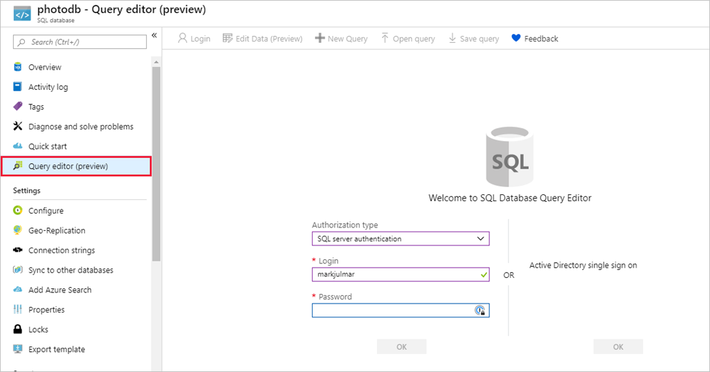

In this unit, you'll use the Azure Cloud Shell to create an Azure SQL database. This database will collect output from the Azure Function you connected to Stream Analytics.

If the Azure Cloud Shell timed out while you were working in the portal, go ahead and reconnect it. All the files and folders are still present but the environment variables you set earlier will be missing because this is a new terminal session. Make sure to execute the following statements with the proper values before you continue.

```bash
export HUB_NAME={iot-hub-name}
export ACCOUNT_NAME={storage-account-name}
```

1. In the Cloud Shell on the right, make sure you are in the project folder `photoproc`. Recall you can use the `cd` command in the shell to switch to the proper folder.

1. Create an environment variable to hold the Azure SQL DB name. The server name must be unique within Azure.

    ```bash
    export SERVER_NAME={server-name}
    ```

1. Execute the following command in the Cloud Shell to create a database server in your resource group.
    - Replace `{username}` and `{pw}` with the user name and password for an admin user. **Remember the user name and password** you enter, because you'll need them later.

    ```azurecli
    az sql server create --name $SERVER_NAME \
        --resource-group <rgn>[sandbox resource group name]</rgn> \
        --location southcentralus \
        --admin-user {username} --admin-password {pw}
    ```

    > [!IMPORTANT]
    > The admin password must be at least 8 characters long. The user name cannot be one that is reserved in SQL Server such as "admin" or "sa." The user name "adminuser" is valid if you want to use that.

1. Use the following command to create a **photodb** database in your Azure SQL server.

    ```azurecli
    az sql db create \
        --resource-group <rgn>[sandbox resource group name]</rgn> \
        --server $SERVER_NAME \
        --name photodb \
        --service-objective S0
    ```

### Set up network access to the database

We need to access the database from our other Azure services and Power BI for reporting. We'll add those rules to the firewall using the Azure portal.

1. Switch to the [Azure portal](https://portal.azure.com?azure-portal=true) and locate the database server - you can type the name you used into the global search box at the top of the screen to easily find the resource.

1. Select **Firewalls and virtual networks** in the menu on the left.

1. Turn on **Allow access to Azure services** to allow other Azure services to connect to the server.

1. Select **+ Add client IP** so you can connect to the database from Power BI Desktop.

1. Click **Save** at the top of the view to save these changes.

    

### Create the database table

We need a table to hold our polar bear sightings. Let's create it with the Azure portal.

1. Select the database you created on the server. You can switch to the **Overview** pane and then select your database from there, or select **SQL databases** from the left sidebar and then select your database. 

1. Select **Query editor** in the menu on the left and enter the user name and password you specified when you created the server.

1. Select **OK** to sign in to the database.

    

1. Paste the following statements into the query window and click **Run** to create a database table:

    ```sql
    CREATE TABLE [dbo].[PolarBears]
    (
        [Id] [uniqueidentifier] NOT NULL,
        [CameraId] [nvarchar](16) NULL,
        [Latitude] [real] NULL,
        [Longitude] [real] NULL,
        [Url] [varchar](max) NULL,
        [Timestamp] [datetime] NULL,
        [IsPolarBear] [bit] NULL,
        PRIMARY KEY CLUSTERED ([Id] ASC)
        WITH (STATISTICS_NORECOMPUTE = OFF, IGNORE_DUP_KEY = OFF) ON [PRIMARY]
    )
    ON [PRIMARY] TEXTIMAGE_ON [PRIMARY]
    GO

    ALTER TABLE [dbo].[PolarBears] ADD DEFAULT (newid()) FOR [Id]
    GO

    ALTER TABLE [dbo].[PolarBears] ADD DEFAULT (getdate()) FOR [Timestamp]
    GO

    ALTER TABLE [dbo].[PolarBears] ADD DEFAULT ((0)) FOR [IsPolarBear]
    GO
    ```

1. Expand the list of tables in the tree view on the left and confirm that the `PolarBears` table was created, and that it has the following schema:

    

The main column we need is named `IsPolarBear` which will be set to `1` or `0` to indicate that the corresponding images contain a polar bear.