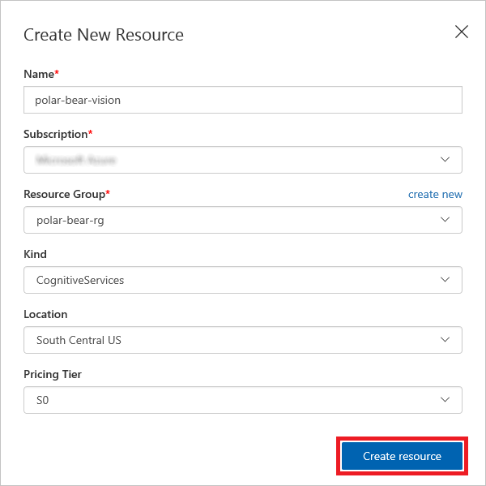
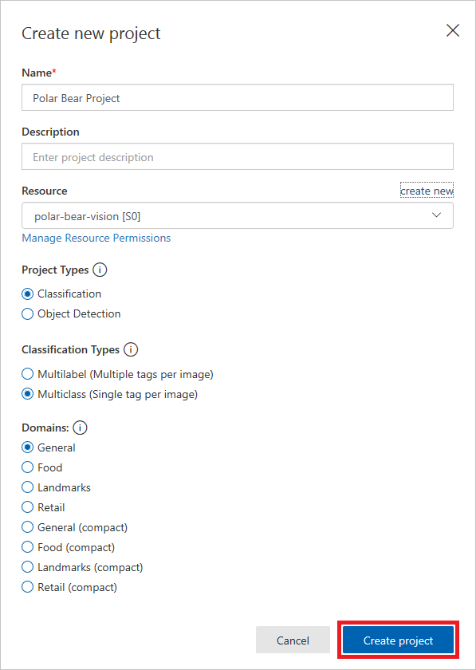
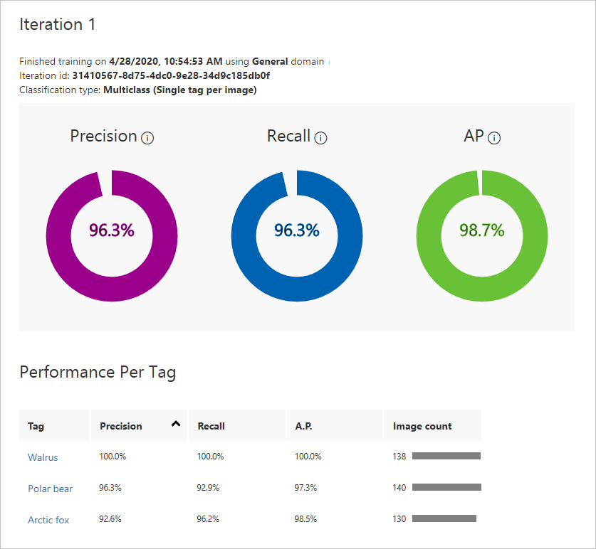
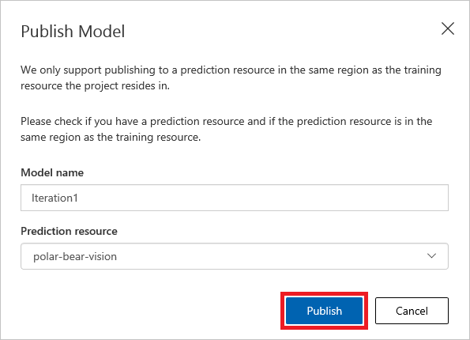
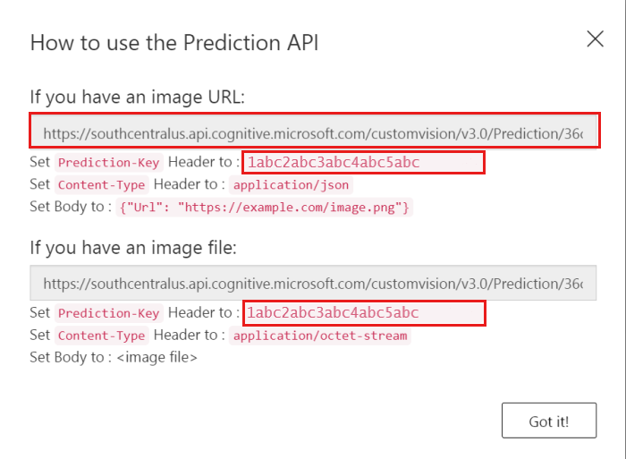

# Train a machine-learning model to recognize polar bears #

[Azure Cognitive Services](https://azure.microsoft.com/services/cognitive-services/) is a suite of more than 20 services and APIs backed by machine learning that enables developers to incorporate intelligent features such as facial recognition and sentiment analysis into their applications. The [Custom Vision Service](https://azure.microsoft.com/services/cognitive-services/custom-vision-service/) is one member of the Cognitive Services family. Its purpose is to create image-classification models that "learn" from labeled images you provide. Want to know if a photo contains a picture of a flower? Train the Custom Vision Service with a collection of flower images, and it can tell you whether the next image includes a flower — or even what type of flower it is.

The Custom Vision Service exposes two APIs: the [Custom Vision Training API](https://southcentralus.dev.cognitive.microsoft.com/docs/services/d9a10a4a5f8549599f1ecafc435119fa/operations/58d5835bc8cb231380095be3) and the [Custom Vision Prediction API](https://southcentralus.dev.cognitive.microsoft.com/docs/services/eb68250e4e954d9bae0c2650db79c653/operations/58acd3c1ef062f0344a42814). You can build, train, and test image-classification models using the [Custom Vision Service portal](https://www.customvision.ai/), or you can build, train, and test them using the Custom Vision Training API. Once a model is trained, you can use the Custom Vision Prediction API to build apps that utilize it. Both are REST APIs that can be called from a variety of programming languages.

In this unit, you will create a Custom Vision Service model and train it to differentiate between various types of Arctic wildlife.

## Build a Custom Vision Service model ##

You will begin by creating a new Custom Vision Service project. Then you will upload images of polar bears, Arctic foxes, and walruses and tag the images so the Custom Vision Service can learn to differentiate between them.

1. Open the [Custom Vision Service portal](https://www.customvision.ai/) in your browser. Then click **Sign In** and sign in with your Microsoft account. 
 
    

    _Signing in to the Custom Vision Service portal_

1. Click **+ NEW PROJECT** to display the "Create new project" dialog. Enter a project name and click **create new** to create a new Cognitive Services resource. Name the resource "polar-bear-vision" and place it in the "polar-bear-rg" resource group. Make sure the location is set to **South Central US**, and then click **Create resource**.

    

    _Creating a Cognitive Services resource_

1. Select **polar-bear-vision** in the "Resource" drop-down if it isn't already selected. Ensure that **Classification** is selected as the project type, **Multiclass** is selected as the classification type, and **General** is selected as the domain. Then click **Create project**.

	> A domain optimizes a model for specific types of images. For example, if your goal is to classify food images by the types of food they contain or the ethnicity of the dishes, then it is helpful to select the Food domain. For scenarios that don't match any of the offered domains, or if you are unsure of which domain to choose, select the General domain.

	

    _Creating a Custom Vision Service project_

1. Click **Add images** to add images to the project.

	

    _Adding images to the project_ 
 
1. Browse to the folder containing the resources that accompany this module and select all of the files in the "Training Images/Arctic Fox" directory. Then OK the selection, enter "Arctic fox" as the tag for the images, and click the **Upload 130 files** button. Wait for the upload to complete, and then click **Done**.

	

    _Uploading Arctic-fox images_ 
 
1. Click **Add images** at the top of the page and repeat the previous step to upload all of the images in the "Training Images/Polar Bear" directory to the Custom Vision Service and tag them with the term "Polar bear." Wait for the upload to complete, and then click **Done**.

	

    _Uploading polar-bear images_ 

1. Repeat the previous step to upload all of the images in the "Training Images/Walrus" directory to the Custom Vision Service and tag them with the term "Walrus." Wait for the upload to complete, and then click **Done**.

With the images tagged and uploaded, the next step is to train the model so it can distinguish between Arctic foxes, polar bears, and walruses, as well as determine whether an image contains one of these animals.

## Train and test the model ##

Now it's time to train the model using the images that you tagged and uploaded. After training the model, you will test it to determine how adept it is at identifying Arctic wildlife in photos. Once trained, a model can be refined by uploading additional tagged images and retraining it.

1. Click the **Train** button at the top of the page to train the model. When prompted to choose a training type, select **Quick Training**.

	

	_Training the model_

1. Wait for the training process to complete. (It should only take a few seconds.) Then review the training statistics presented to you for iteration 1.

	>  Each time you train the model, a new version ("iteration") is created. The Custom Vision Service maintains all of your iterations so you can choose which version of the model to use.

	

    _Results of training the model_ 

	**Precision** and **recall** are separate but related  measures of the model's accuracy. Suppose the model was presented with three polar-bear images and three walrus images, and that it correctly identified two of the polar-bear images as polar-bear images, but incorrectly identified two of the walrus images as polar-bear images. In this case, the precision would be 50% (two of the four images it classified as polar-bear images actually are polar-bear images), while its recall would be 67% (it correctly identified two of the three polar-bear images as polar-bear images). You can learn more about precision and recall from https://en.wikipedia.org/wiki/Precision_and_recall.

	**AP**, short for *Average Precision*, is a third measurement of the model's accuracy. Whereas precision measures the false-positive rate and recall measures the false-negative rate, AP is a mean of false-positive rates computed across a range of thresholds. For more information, see [Understanding the mAP Evaluation Metric for Object Detection](https://medium.com/@timothycarlen/understanding-the-map-evaluation-metric-for-object-detection-a07fe6962cf3).

1. Now let's test the model using the portal's Quick Test feature, which allows you to submit images to the model and see how it classifies them using the knowledge gained during training.

	Click the **Quick Test** button at the top of the page. Then click **Browse local files**, browse to the "Testing Images/Polar Bear" directory in the resources accompanying this module, and select any one of the test images in that directory.

1. Examine the results of the test in the "Quick Test" dialog. What is the probability that the image contains a polar bear? What is the probability that it contains an Arctic fox or a walrus?

1. Repeat this test with one of the images in the "Testing Images/Arctic Fox" directory. How well is the model able to differentiate between Arctic foxes and polar bears?

1. The "Testing Images" directory contains subdirectories with a total of 30 different images for testing. Perform additional quick tests using these images until you are satisfied that the model is reasonably adept at predicting whether an image contains a polar bear.

1. Return to the project and click **Publish** at the top of the page. Make sure **polar-bear-vision** is selected as the prediction resource. Then click the **Publish** button.

	

    _Publishing the model_ 

1. Click **Prediction URL** at the top of the page. The ensuing dialog lists two URLs: one for uploading images via URL, and another for uploading images as byte streams. Copy the former to the clipboard, and then paste it into your favorite text editor so you can retrieve it later. Do the same for the `Prediction-Key` value underneath the URL. This value must be passed in each call to the prediction URL. Finish up by clicking **Got it!** to dismiss the dialog.

	

    _Copying the Prediction API URL_ 

You now have a machine-learning model that can discern whether an image contains a polar bear, as well as a URL and API key for invoking the model. The next step is to invoke the model each time an image is uploaded to blob storage. An [Azure Function](https://azure.microsoft.com/services/functions/) is the perfect tool for the job.