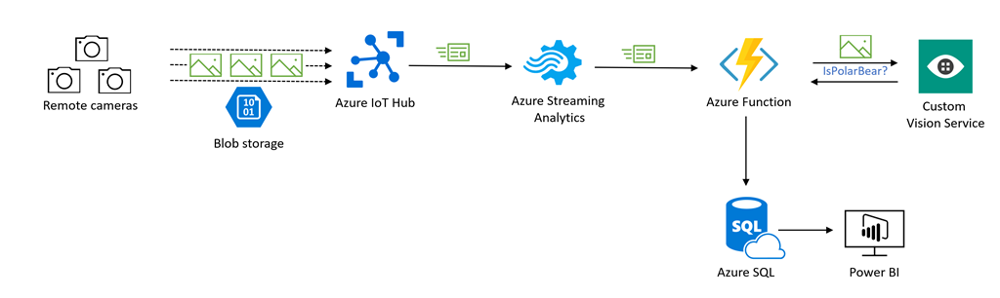

Our goal is to build a scalable system that has the following requirements.

- Receive pictures from a set of Internet-connected, motion-activated cameras.
- Use machine learning to determine if a Polar Bear is present in the photograph.
- To optimize the process and cut down our processing requirements, we'll only analyze photos when two or more photos.
- Track matches found in a relational database for historical reporting.
- Create a set of visualizations from the data that makes it easy to determine when and where activity has occurred.

After some thought and discussion, the solution architect has come up with the following design.

1. Use Azure IoT Hub to connect and monitor each of the remote cameras over the Internet.
1. Images taken by the cameras will be stored in a single Azure Blob Storage account.
1. The IoT Hub will send an event to Azure Stream Analytics with details about the photo and camera.
1. Stream analytics will send the event to an Azure Function for processing.
1. The Azure Function will pass the capture image to a Custom Vision Service that can identify arctic animals. The vision service will return whether the image contains a polar bear.
1. The Azure Function will write the result from the Custom Vision Service into an Azure SQL Database.
1. A set of Power BI visualizations will be created that interpret the SQL data and display where our data shows positive hits.

With this design in mind, let's start by creating the Azure Storage account where captured photos will be stored.
