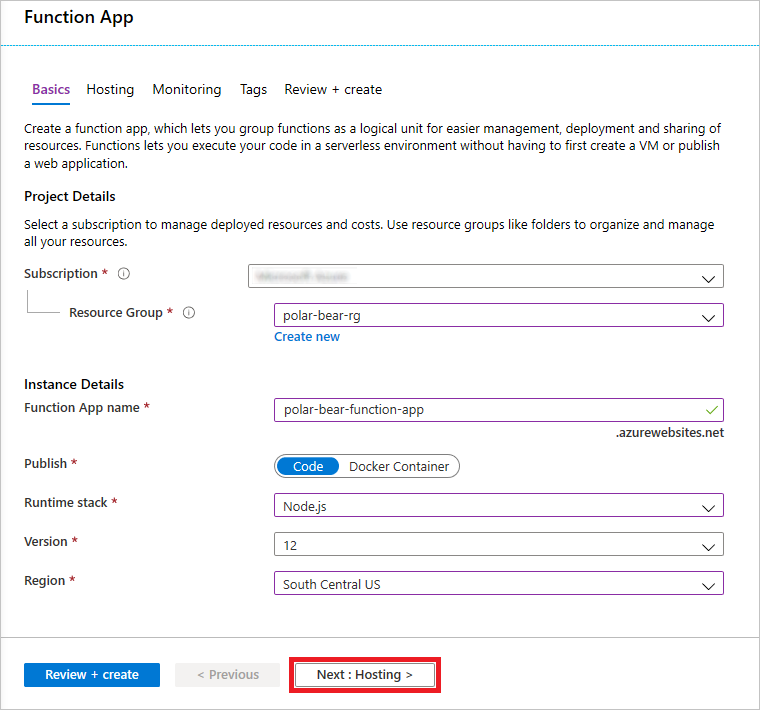
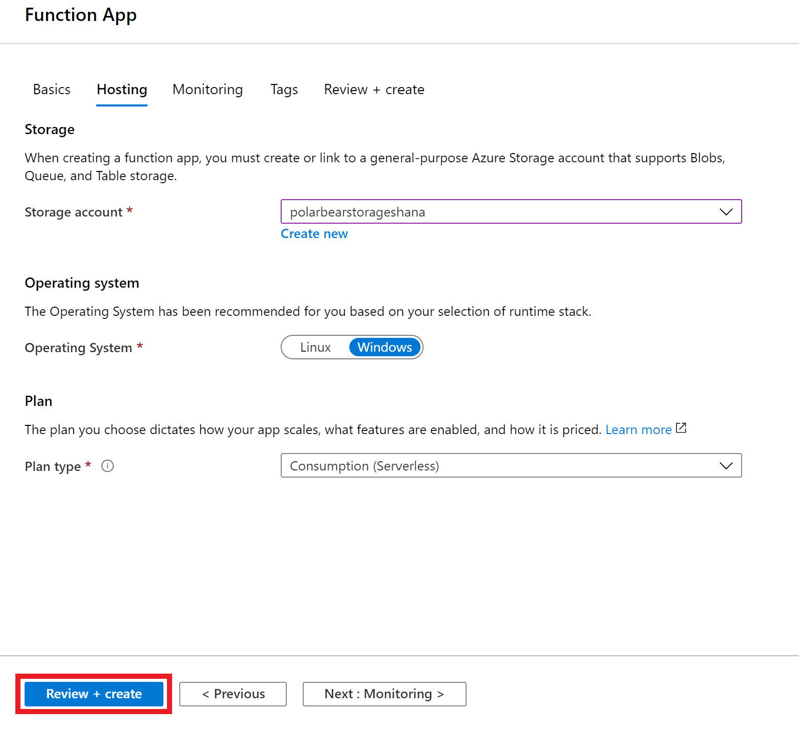
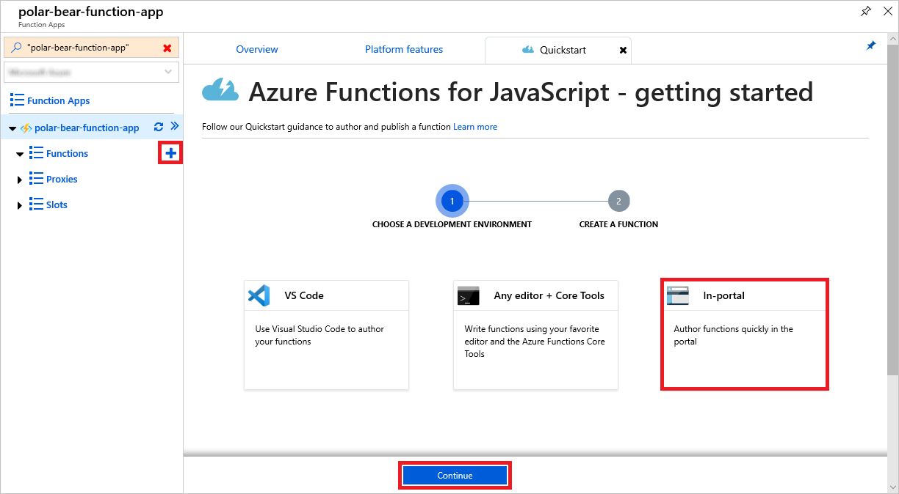
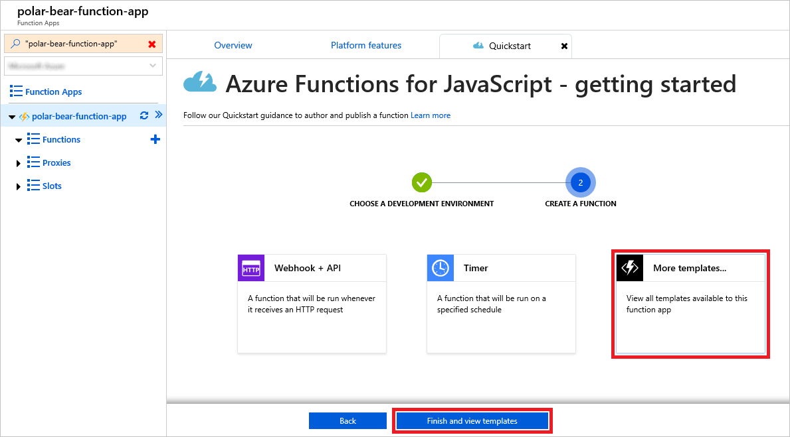
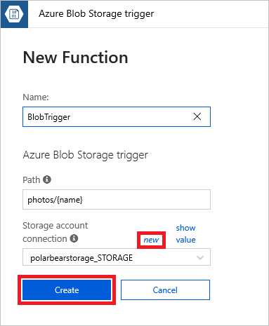
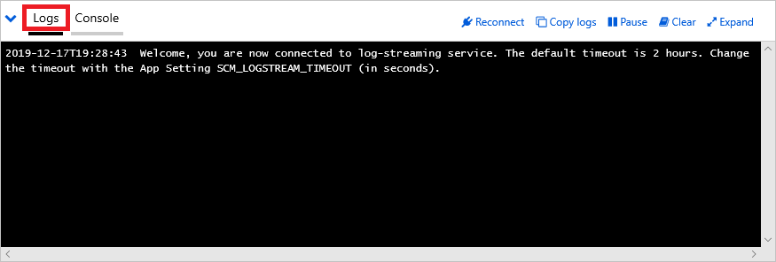
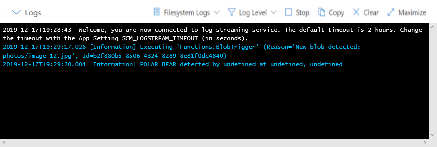
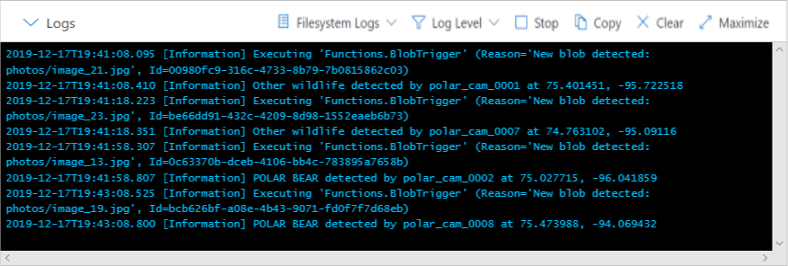

In this unit, you will write an Azure Function that is triggered each time an image is uploaded to the "photos" container in the storage account you created. The function will use the Custom Vision Service model you created in the previous unit to determine whether the photo contains a polar bear.

## Create an Azure Function ##

Azure Functions can be written in the Azure portal or written externally using tools such as Visual Studio. You will write an Azure Function in the portal. The function will be written in JavaScript and executed using Azure Functions' Node.js run-time. It will be triggered each time an image is uploaded to the "photos" container that you created in blob storage, and it will pass each blob that is uploaded to the Custom Vision Service to be analyzed for polar bears.

1. Return to the [Azure portal](https://portal.azure.com?azure-portal=true) in your browser. In the Azure portal, click **+ Create a resource**, followed by **Compute** and **Function App**.

1. Enter an app name that is unique to Azure. Place the Function App in the "polar-bear-rg" resource group and select the **South Central US** region. Choose **Node.js** as the runtime stack, and then click the **Next: Hosting** button.

    

    _Creating an Azure Function App_

1. Select the storage account that you created to receive wildlife photos. Accept the defaults everywhere else, and click **Review + create**. Wait for validation to complete, and then click **Create**.

    

    _Specifying hosting options_

1. Wait for the Function App to be deployed. Then open it in the Azure portal and click the **+** sign to the right of **Functions**. Click **In-portal**, and then click **Continue**.

    

    _Adding a function_

1. Click **More templates**. Then click **Finish and view templates**.

    

    _Viewing additional function templates_

1. Click **Azure Blob Storage trigger**. If you are prompted to install the `Microsoft.Azure.WebJobs.Extensions.Storage` extension, click the **Install** button. Wait for the extension to be installed, and then click **Continue**. (If you are not prompted to install the extension, you may have to wait a minute or two before proceeding to the next step.)

1. Change the function name to `BlobTrigger` and the path to "photos/{name}" so the function will be triggered when blobs are uploaded to the "photos" container.

1. Click **new** next to "Storage account connection" and select the storage account that you created earlier. Note down the string that is shown in this field, as you will use it in a later step. Then click **Create** to add the function to the Function App.

    

    _Creating a blob-triggered function_

1. Replace the function code with the following code:

    ```javascript
    module.exports = function (context, myBlob) {
        var predictionUrl = process.env.PREDICTION_URL;
        var predictionKey = process.env.PREDICTION_KEY;
        var storageConnectionString = process.env.<CONNECTION_STRING_NAME>;

        var storage = require('azure-storage');
        var blobService = storage.createBlobService(storageConnectionString);
        var blobName = context.bindingData.name;
        var blobUri = context.bindingData.uri;

        // Read the blob's metadata
        blobService.getBlobMetadata('photos', blobName, (err, result, response) => {
            if (!err) {
                var latitude = result.metadata.latitude;
                var longitude = result.metadata.longitude;
                var id = result.metadata.id;

                // Generate a SAS for the Custom Vision Service
                var now = new Date();
                var expiry = new Date(now).setMinutes(now.getMinutes() + 3);

                var policy = {
                    AccessPolicy: {
                        Permissions: storage.BlobUtilities.SharedAccessPermissions.READ,
                        Start: now,
                        Expiry: expiry
                    },
                };

                var sas = blobService.generateSharedAccessSignature('photos', blobName, policy);

                // Pass the blob URL to the Custom Vision Service
                var request = require('request');

                var options = {
                    url: predictionUrl,
                    method: 'POST',
                    headers: {
                        'Prediction-Key': predictionKey
                    },
                    body: {
                        'Url': blobUri + '?' + sas
                    },
                    json: true
                };

                request(options, (err, result, body) => {
                    if (!err) {
                        var probability =  body.predictions.find(p => p.tagName.toLowerCase() === 'polar bear').probability;          
                        var isPolarBear = probability > 0.8; // 80% threshold

                        if (isPolarBear) {
                            context.log('POLAR BEAR detected by ' + id + ' at ' + latitude + ', ' + longitude);
                        }
                        else {
                            context.log('Other wildlife detected by ' + id + ' at ' + latitude + ', ' + longitude);
                        }

                        context.done();
                    }
                    else {
                        context.log(err);
                        context.done();
                    }
                });
            }
            else {
                context.log(err);
                context.done();
            }
        });
    };
    ```

    The modified function uses NPM's [request](https://www.npmjs.com/package/request) module to call the Custom Vision Service, passing the URL of the image to be analyzed. It parses the JSON results and retrieves the value indicating the probability that the image contains a polar bear. Then it writes the results to the output log. The threshold for determining whether an image contains a polar bear is 80%:

    ```javascript
    var isPolarBear = probability > 0.8; // 80% threshold
    ```

    Another notable aspect of this code is its use of a [shared-access signature](https://docs.microsoft.com/azure/storage/common/storage-dotnet-shared-access-signature-part-1), or SAS. The "photos" container that you created is private. To access the blobs stored there, you must have access to the storage account or have the storage account's access key. Shared-access signatures (SAS) allow other users and services to access individual blobs, but only for a specified length of time and optionally with read-only access.

    The code that you just added uses the Azure Storage SDK for Node.js ([azure-storage](https://www.npmjs.com/package/azure-storage)) to generate a read-only SAS for the blob whose URL is passed to the Custom Vision Service, and appends it to the blob URL as a query string. The SAS is valid for 3 minutes and allows read access only. This allows your code to submit private blobs to the Custom Vision Service for analysis without putting the blobs in a public container where anyone could download them.

1. Replace <CONNECTION_STRING_NAME> on line 4 with the **Storage account connection** string you noted earlier (for example, "polarbearstorage_STORAGE"). This connection string was added to application settings when you added the `BlobTrigger` function to the Function App, and its name derives from the storage-account name. If needed, you can look it up in the Application settings of the Function App. Then click the **Save** button to save the changes.

1. Click the Function App in the menu on the left. Click **Platform features**, and then click **Console** to open a function console.

    

    _Opening a function console_

1. Execute the following commands in the function console to install the NPM [request](https://www.npmjs.com/package/request) package and the [Azure Storage SDK for Node.js](https://www.npmjs.com/package/azure-storage) so your function can use them, and ignore any warning messages that are displayed.

    ```bash
    npm install request
    npm install azure-storage
    ```

    > [!NOTE]
    > Ignore any warning messages that are displayed. We are using an older version of a javascript library for simplicity.

1. Wait for the installs to finish. Then return to the "Platform features" tab and click **Function app settings**. Click **Manage application settings** and add two application settings to the Function App:

    - One named PREDICTION_URL whose value is the Custom Vision Service prediction URL you saved in the previous unit
    - One named PREDICTION_KEY whose value is the Custom Vision Service prediction key you saved in the previous unit

    Finish up by clicking **Save** at the top of the blade to save the new application settings.

    > Rather than hard-code the Custom Vision Service URL and authentication key in the function's code, you are storing them in the Function App's application settings, where they are more secure.

1. Return to the `BlobTrigger` function in the portal and click **Logs** at the bottom of the page to open the function's output log. 

    

    _Opening the function's output log_

1. Start a separate browser instance and navigate to the [Azure portal](https://portal.azure.com?azure-portal=true). Open the storage account and upload **image_12.jpg** from the "photos" folder you created in an earlier unit this module to the "photos" container. Here's what **image_12.jpg** looks like:

    

    _Image uploaded to blob storage_

1. Return to the function log in the other browser instance and confirm that the function executed, and that **image_12.jpg** was determined by the Custom Vision Service to contain a polar bear.

    

    _Viewing the output log_

The reason for the text "undefined at undefined, undefined" in the log output is that the function attempted to read the latitude, longitude, and camera ID from blob metadata and include them in the output, but those metadata values don't exist since you uploaded the blob manually. That will change when your virtual cameras upload photos to blob storage.

## Run the camera array ##

Next, you will run the simulated camera array that you created earlier. Then you will check the log output from the Azure Function to verify that images are being uploaded to blob storage and analyzed for polar bears.

1. Return to the project directory in a Command Prompt or terminal window. Then use the following command to run **run.js**:

    ```
    node run.js
    ```

1. Return to the `BlobTrigger` function in the Azure portal and watch the output log for a minute or two. Confirm that the function is being triggered and that it's calling the Custom Vision Service to determine whether each photo uploaded to the "photos" container contains a polar bear.

    

    _There be polar bears!_

1. Finish up by returning to the Command Prompt or terminal window in which **run.js** is running and pressing **Ctrl+C** to stop it.

Congratulations! You have built a system that transmits wildlife photos to blob storage and uses a custom AI model built with Azure's Custom Vision Service to determine which of the photos contains a polar bear. The next step is to make the output more visual, and that starts with an [Azure SQL Database](https://azure.microsoft.com/services/sql-database/).