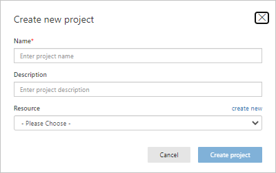
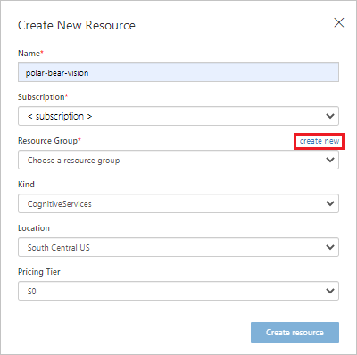
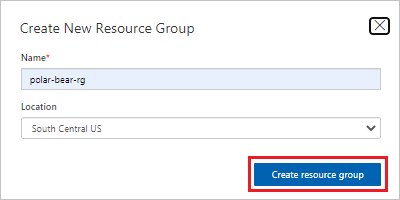
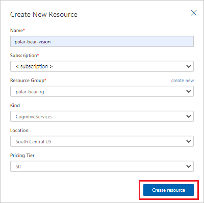
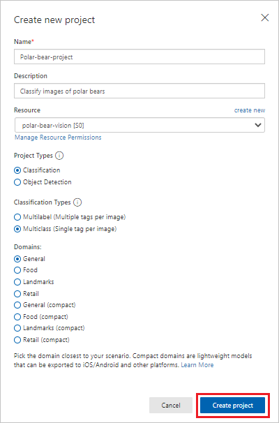
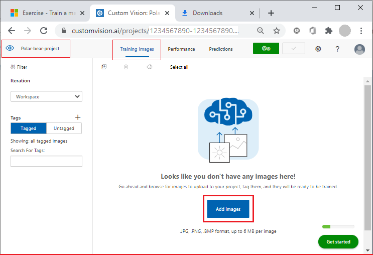
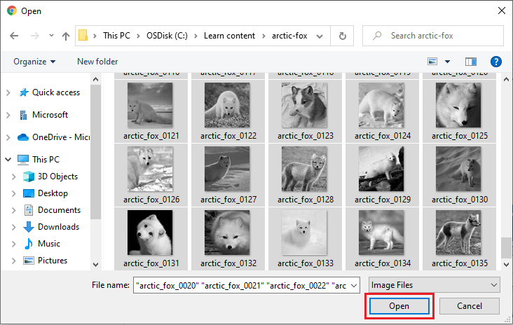
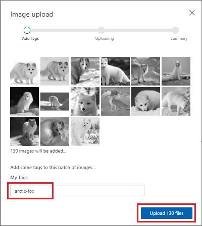

Azure Cognitive Services is a suite of more than 20 services and APIs that are backed by machine learning. Developers can use the APIs to incorporate intelligent features like facial recognition and sentiment analysis into their applications. Custom Vision is just one member of the Azure Cognitive Services family. Its purpose is to create image classification models that "learn" from labeled images you provide. Want to know if a photo contains a picture of a flower? Train Custom Vision by using a collection of flower images. Then, it can tell you whether the next image includes a flower, or even what type of flower appears in an image.

The Custom Vision service exposes two APIs: the [Custom Vision Training API](https://southcentralus.dev.cognitive.microsoft.com/docs/services/d9a10a4a5f8549599f1ecafc435119fa/operations/58d5835bc8cb231380095be3) and the [Custom Vision Prediction API](https://southcentralus.dev.cognitive.microsoft.com/docs/services/eb68250e4e954d9bae0c2650db79c653/operations/58acd3c1ef062f0344a42814). You can build, train, and test image classification models by using the [Custom Vision portal](https://www.customvision.ai/), or you can build, train, and test the models by using the Custom Vision Training API. After a model is trained, you can use the Custom Vision Prediction API to build apps that use the model. Both are REST APIs that can be called from a variety of programming languages.

In this unit, you'll create a Custom Vision model and train it to differentiate between various types of Arctic wildlife.

## Build a Custom Vision model

You'll begin by creating a new Custom Vision project. Then, you'll upload images of polar bears, Arctic foxes, and walruses and tag the images so Custom Vision can learn to differentiate between them.

### Create a new project, resource, and resource group

1. In your browser, go to the [Custom Vision portal](https://www.customvision.ai/?azure-portal=true). Select **Sign In** and sign in with your Microsoft account. Accept any terms of service if needed.

1. Select the **New Project** button.
1. In the **Create new project** dialog box:
   1. Enter a project **Name** and **Description**.
   1. Beside **Resource**, select **create new** to create a new Cognitive Services resource.

   

   _Create a new Cognitive Services project_
   
1. In the **Create New Resource** dialog box:
   1. For the resource **Name**, enter *polar-bear-vision*.
   1. Select your **Subscription**.
   1. Beside **Resource Group**, select **create new** to create a new Cognitive Services resource group.

   

   _Create a new Cognitive Services resource_

1. In the **Create New Resource Group** dialog box:

   1. For the resource group **Name**, enter *polar-bear-rg*.

   1. Make sure **Location** is set to *South Central US**, and then select **Create resource group**.

   

   _Create a new Cognitive Services resource group_

    The new resource group information is added to the **Create New Resource** dialog box.

1.  In the **Create New Resource Group** dialog box, select **Create resource**.

    

    _Create the Cognitive Services resource_

1. In the **Create new project** dialog box, check the following settings:

    - **Resource**: *polar-bear-vision*
    - **Project Types**: *Classification*
    - **Classification Types**: *Multiclass (Single tab per image)*
    - **Domains**: *General*

    > [!NOTE]
    > A domain optimizes a model for specific types of images. If your goal is to classify food images by the types of food they contain or by the ethnicity of the dishes, it's helpful to select the **Food** domain. For scenarios that don't match any of the offered domains, or if you're unsure which domain to choose, select the **General** domain.

    

    _Verify your settings_

    When all settings are correct, select **Create project**. Your project opens.

### Get the images to use in the project

Now you're ready to get the images to use in your project.

1. Download [this zip file](https://github.com/MicrosoftDocs/mslearn-build-ml-model-with-azure-stream-analytics/raw/master/training-images/arctic-fox.zip) of Arctic fox training images. Unzip the folder.

1. Select **Add images** to add the Arctic fox images to your project.

    

    _Add images to the Custom Vision project_

1. In the **Open** files dialog, select all the images of Arctic foxes found in the unzipped folder. Select **Open** to choose the images.

    

    _Open the images to use in the project_

1. For the **My Tags** setting for the images, enter *arctic-fox*. Then, select **Upload 130 files**. Wait for the upload to finish.

    

    _Add the image tag and upload the images to the project_

    After the images are uploaded successfully, a dialog box displays a summary. Select **Done**.

Repeat these steps for the polar bear images.

1. Download [this zip file](https://github.com/MicrosoftDocs/mslearn-build-ml-model-with-azure-stream-analytics/raw/master/training-images/polar-bear.zip) of polar bear training images. Unzip the folder.

1. Select **Add images** to upload the polar bear images in the unzipped folder to your project. For these images, set **My Tags** to "polar-bear." Wait for the upload to complete--there are 140 files in this folder. After the upload completes, select **Done**.

Finally, repeat these steps for the walrus images.

1. Download [this zip file](https://github.com/MicrosoftDocs/mslearn-build-ml-model-with-azure-stream-analytics/raw/master/training-images/walrus.zip) of walrus training images. Unzip the folder.

1. Select **Add images** to upload the walrus images in the unzipped folder to your project. Set **My Tags** to "walrus." Wait for the upload to complete--there are 138 files in this folder. After the upload completes, select **Done**.

With the images tagged and uploaded, the next step is to train the model so it can distinguish between Arctic foxes, polar bears, and walruses, as well as determine whether an image contains one of these animals.

## Train and test the model

Now it's time to train the model by using the images that you tagged and uploaded. After you train the model, you'll test it to determine how adept it is at identifying Arctic wildlife in photos. After the model is trained, it can be refined by uploading additional tagged images and retraining it.

1. Select the **Train** button at the top of the page to train the model. When prompted to choose a training type, select **Quick Training**.

    

    _Train the model_

1. Wait for the training process to complete. (The process can take a few minutes.) Then review the training statistics presented to you for iteration 1.

    > Each time you train the model, a new version ("iteration") is created. The Custom Vision Service maintains all of your iterations so you can choose which version of the model to use.

    

    _Results of training the model_

    **Precision** and **recall** are separate but related  measures of the model's accuracy. Suppose the model was presented with three polar-bear images and three walrus images, and that it correctly identified two of the polar-bear images as polar-bear images, but incorrectly identified two of the walrus images as polar-bear images. In this case, the precision would be 50% (two of the four images it classified as polar-bear images actually are polar-bear images), while its recall would be 67% (it correctly identified two of the three polar-bear images as polar-bear images). You can learn more about precision and recall from <https://en.wikipedia.org/wiki/Precision_and_recall>.

    **AP**, short for *Average Precision*, is a third measurement of the model's accuracy. Whereas precision measures the false-positive rate and recall measures the false-negative rate, AP is a mean of false-positive rates computed across a range of thresholds. For more information, see [Understanding the mAP Evaluation Metric for Object Detection](https://medium.com/@timothycarlen/understanding-the-map-evaluation-metric-for-object-detection-a07fe6962cf3).

1. Now let's test the model using the portal's Quick Test feature, which allows you to submit images to the model and see how it classifies them using the knowledge gained during training.

1. Download [this zip file of test images](https://github.com/MicrosoftDocs/mslearn-build-ml-model-with-azure-stream-analytics/raw/master/testing-images/testing-images.zip) and unzip it locally on your machine.

    Select **Quick Test** at the top of the page. Then select **Browse local files**, browse to the "testing-images/polar-bear" directory, and select any one of the test images in that directory.

1. Examine the results of the test in the **Quick Test** dialog. What's the probability that the image contains a polar bear? What's the probability that it contains an Arctic fox or a walrus?

1. Repeat this test with one of the images in the "testing-images/arctic-fox" directory. How well is the model able to differentiate between Arctic foxes and polar bears?

1. The "testing-images" directory contains subdirectories with a total of 30 different images for testing. Perform additional quick tests by using these images until you're satisfied that the model is reasonably adept at predicting whether an image contains a polar bear.

1. Return to your project. On the **Performance** tab, select **Publish**.

1. In the **Publish Model** pane, set **Prediction resource** to the name of your resource, "polar-bear-vision." Make sure you choose your resource name, and not the resource *group* name. Select **Publish** to publish the model.

    

    _Publish the model_

1. At the top of the page, select **Prediction URL**. The **How to use the Prediction API** pane shows two URLs to use for uploading images and API values to define when you use the URLs.
    
    

    _Copy the Prediction API URL_

    - **If you have an image URL**: You can use the first URL to upload images by using a URL address.
    - **If you have an image file**: You can use the second URL to upload images as byte streams.
    
    You'll need to copy some of the values from this dialog and save them for use later on.

1. Under the heading **If you have an image URL**, copy and then save the URL in your favorite text editor, so you can get it later.

   Also copy and then save the key value after **Set** `Prediction-Key` **Header to**. This value must be passed in each call to the prediction URL.

1. To finish, select **Got it!**.

Now, you have a machine learning model that can discern whether an image contains a polar bear, and you have a URL and API key to invoke the model. The next step is to invoke the model each time an image is uploaded to Blob Storage. Azure Functions is the perfect tool for this job.
