In this unit, you'll write an app by using Azure Functions that's triggered each time an image is uploaded to the `photos` container in the storage account you created. The function app will use the Custom Vision model you created in the preceding unit to determine whether the photo contains a polar bear.

## Create a function app in Azure

You can write an Azure Functions function app in the Azure portal or externally by using tools like Visual Studio. In this exercise, you'll write a function app in the portal. You'll use JavaScript to write the function app, and you'll run the function app by using the Azure Functions Node.js runtime. The function app will be triggered each time an image is uploaded to the `photos` container that you created in Blob Storage. Then, the function app will pass each blob that's uploaded to Custom Vision to be analyzed for polar bears.

1. In your browser, return to the [Azure portal](https://portal.azure.com?azure-portal=true). In the portal, select **Create a resource**. The portal view changes to show choices to create a new resource. In the left menu, select **Compute**. After the list refreshes, select **Function App**.

   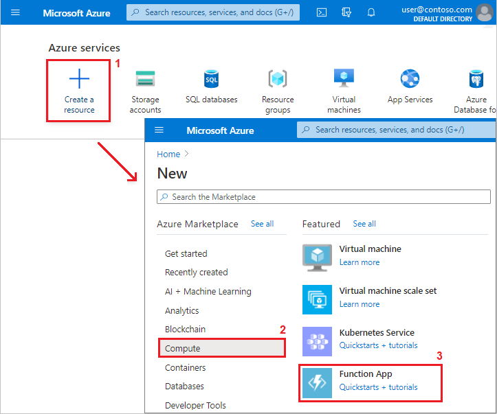

   _Create a new function app in Azure_

1. In **Create Function App**, on the **Basics** tab, enter or select the following values:

   1. **Subscription**: Select the subscription you want to use.
   1. **Resource Group**: Select `polar-bear-rg`.
   1. **Function App name**: Enter a name that's unique in Azure for your new app.
   1. **Publish**: Leave **Code** selected.
   1. **Runtime stack**: Select `Node.js`.
   1. **Region**: Select `South Central US`.
   1. Select **Next: Hosting**.

   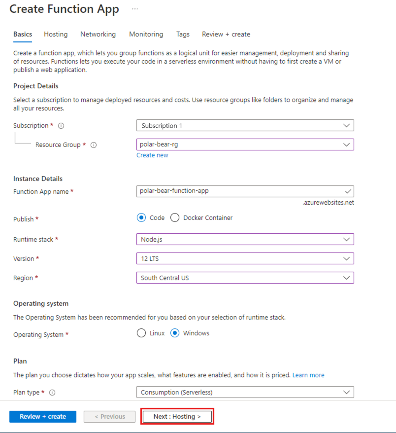

   _Configure the basic settings for a new function app_

1. On the **Hosting** tab, select the storage account you created to upload wildlife photos to. For the other settings, accept the defaults, and then select **Review + create**. Wait for validation to finish, and then select **Create**.

   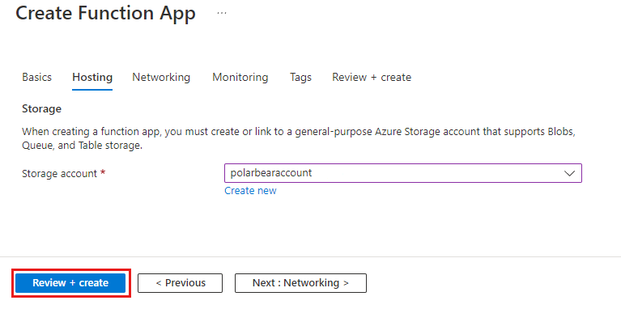

   _Configure the hosting settings for a new function app_

1. Wait for the function app to deploy, and then open the app in the Azure portal. In the left menu, under **Functions**, select **Functions**. In the results pane, select **Add**.

   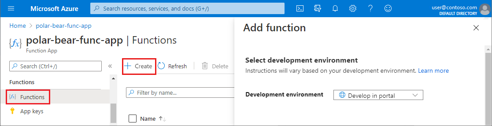

   _Add a function_

1. In **Add function**, select these settings:

   1. For **Development environment**, select **Develop in portal**.
   1. In the template list, select **Azure Blob Storage trigger**. When you select a list item, the **Template details** pane opens.

   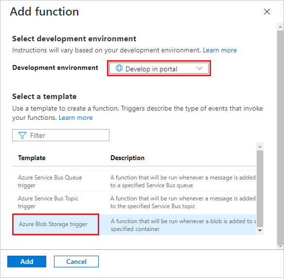

   _Configure the settings and choose a template for a function_
    
   > [!Note]
   > If you're prompted to install the `Microsoft.Azure.WebJobs.Extensions.Storage` extension, select **Install**.
   > Wait for the installation to complete, and then select **Continue**.
   > (If you're **not** prompted to install the extension, you might have to wait a few minutes before you can proceed to the next step.)

1. In the **Template details** section, provide details about the trigger for the function app.

   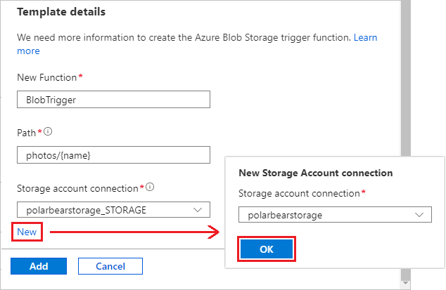

   _Configure the template to create a blob-triggered function_

   1. For the new function app name, enter **BlobTrigger**.
   1. Set the path to *photos/{name}* so that the function app triggers when blobs are uploaded to the `photos` container.
   1. Under **Storage account connection**, select **New**. In the dialog box, select the storage account that you created earlier, and then select **OK**.

      > [!Note]
      > Copy and then save the value that's shown in the **Storage account connection** box. You'll need the value in a later step.

1. At the bottom of the **Add function** page, select **Add**. After the function app is created, the portal view changes to show the new app.

1. On the trigger function page in the portal, on the left under **Developer**, select **Code + Test**. The index.js file for the trigger opens.

   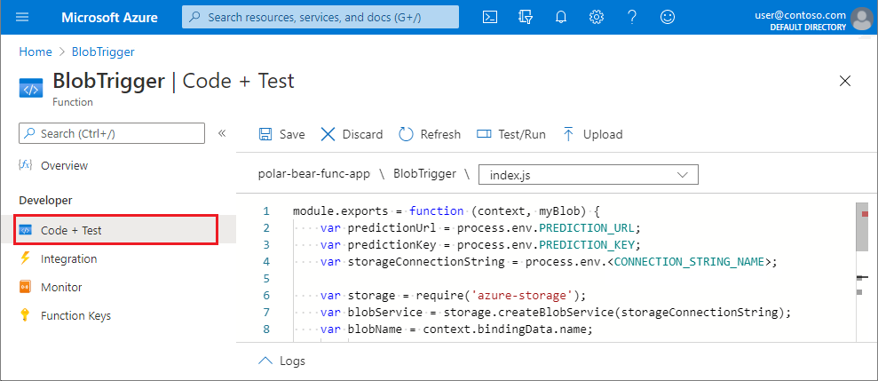

   _Open the index.js file for the trigger function_

1. Replace the function code with the following code:

   ```javascript
   module.exports = function (context, myBlob) {
       var predictionUrl = process.env.PREDICTION_URL;
       var predictionKey = process.env.PREDICTION_KEY;
       var storageConnectionString = process.env.<CONNECTION_STRING_NAME>;

       var storage = require('azure-storage');
       var blobService = storage.createBlobService(storageConnectionString);
       var blobName = context.bindingData.name;
       var blobUri = context.bindingData.uri;

       // Read the blob's metadata
       blobService.getBlobMetadata('photos', blobName, (err, result, response) => {
           if (!err) {
               var latitude = result.metadata.latitude;
               var longitude = result.metadata.longitude;
               var id = result.metadata.id;

               // Generate a SAS for the Custom Vision Service
               var now = new Date();
               var expiry = new Date(now).setMinutes(now.getMinutes() + 3);

               var policy = {
                   AccessPolicy: {
                       Permissions: storage.BlobUtilities.SharedAccessPermissions.READ,
                       Start: now,
                       Expiry: expiry
                   },
               };

               var sas = blobService.generateSharedAccessSignature('photos', blobName, policy);

               // Pass the blob URL to the Custom Vision Service
               var request = require('request');

               var options = {
                   url: predictionUrl,
                   method: 'POST',
                   headers: {
                       'Prediction-Key': predictionKey
                   },
                   body: {
                       'Url': blobUri + '?' + sas
                   },
                   json: true
               };

               request(options, (err, result, body) => {
                   if (!err) {
                       var probability =  body.predictions.find(p => p.tagName.toLowerCase() === 'polar-bear').probability;
                       var isPolarBear = probability > 0.8; // 80% threshold
                        if (isPolarBear) {
                           context.log('POLAR BEAR detected by ' + id + ' at ' + latitude + ', ' + longitude);
                       }
                       else {
                           context.log('Other wildlife detected by ' + id + ' at ' + latitude + ', ' + longitude);
                       }

                       context.done();
                   }
                   else {
                       context.log(err);
                       context.done();
                   }
               });
           }
           else {
               context.log(err);
               context.done();
           }
       });
   };
   ```

   The modified function app uses the NPM[request](https://www.npmjs.com/package/request) module to call the Custom Vision Service, passing the URL of the image to be analyzed. It parses the JSON results and retrieves the value indicating the probability that the image contains a polar bear. Then it writes the results to the output log. The threshold for determining whether an image contains a polar bear is 80%:

   ```javascript
   var isPolarBear = probability > 0.8; // 80% threshold
   ```

   Another notable aspect of this code is its use of a [shared-access signature](https://docs.microsoft.com/azure/storage/common/storage-dotnet-shared-access-signature-part-1), or SAS. The `photos` container that you created is private. To access the blobs stored there, you must have access to the storage account or have the storage account's access key. Shared-access signatures (SAS) allow other users and services to access individual blobs, but only for a specified length of time and optionally with read-only access.

   The code that you just added uses the Azure Storage SDK for Node.js ([azure-storage](https://www.npmjs.com/package/azure-storage)) to generate a read-only SAS for the blob whose URL is passed to the Custom Vision Service, and appends it to the blob URL as a query string. The SAS is valid for 3 minutes and allows read access only. This allows your code to submit private blobs to the Custom Vision Service for analysis without putting the blobs in a public container where anyone could download them.

1. Replace `<CONNECTION_STRING_NAME>` on line 4 with the Storage account connection string that you saved earlier (for example, "polarbearstorage_STORAGE"). This connection string was added to application settings when you added the `BlobTrigger` function to the function app, and its name derives from the Storage account name. If needed, you can look it up in the **Application settings** of the function app.

   After you add your Storage account connection string, select **Save** to complete the changes to the index.js file. After the file is saved, the function's output log opens at the bottom of the page.

1. Open a Console in the Azure portal. At the top, select your function app name. The portal view changes to the overview page for the function app. On the left, scroll to locate the **Development Tools** group. Under **Development Tools**, select **Console**. A Console pane opens at the right.

   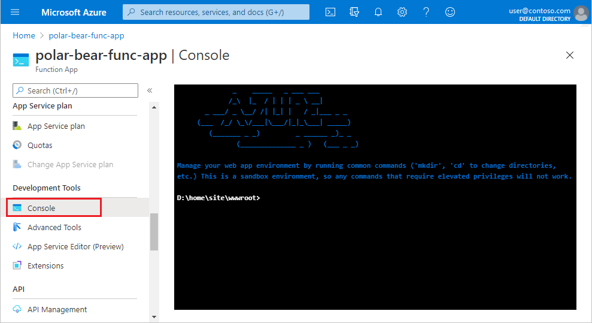

   _Open a function app console_

1. Run the following commands in the function Console to install the NPM [request](https://www.npmjs.com/package/request) package and the [Azure Storage SDK for Node.js](https://www.npmjs.com/package/azure-storage) so your function can use them.

   ```console
   npm install request
   npm install azure-storage
   ```

   > [!NOTE]
   > Ignore any warning messages that are displayed. We're using an older version of a JavaScript library for simplicity.

1. Wait for the install commands to finish. Now you'll add two application settings to the function app:

   1. In the Azure portal, on the left, scroll to locate the **Settings** group. Under **Settings**, select **Configuration**.
   1. Under **Configuration**, make sure the **Application settings** page is open. Select **New application** setting.
   1. In the **Add/Edit application setting** page, add a setting named `PREDICTION_URL`. Set the value to the Custom Vision Service prediction URL that you saved in the previous unit. Leave the **Deployment slot setting** unchecked. Select **OK**.
   1. Repeat the previous step to add a setting named `PREDICTION_KEY`. Set the value to the Custom Vision Service prediction key that you saved in the previous unit. Leave the **Deployment slot setting** unchecked. Select **OK**.

   

   _Configure the application settings for the function app_

   Finish by selecting **Save** at the top of the blade. If you're prompted, select **Continue** to complete the save action.

   > Rather than hard-code the Custom Vision Service URL and authentication key in the function app code, you're storing the values in the function app's application settings. The values are more secure when they're saved in the application settings.

1. Return to your `BlobTrigger` function in the Azure portal and open the function's output log.

   On the left, scroll to locate the **Functions** group. Under **Functions**, select **{fx} Functions**. On the **Functions** blade, select **BlobTrigger**.
    
   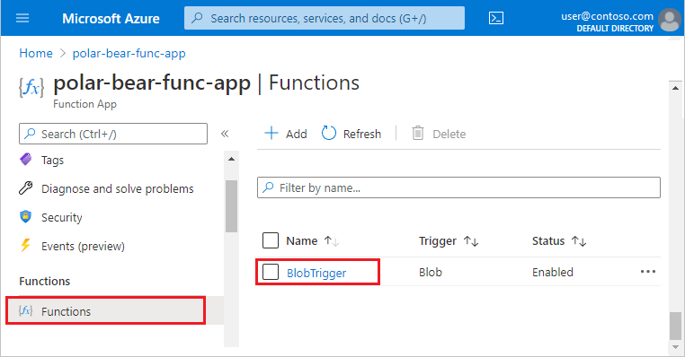

   _Open the blob trigger function_

   After the portal view changes to show the overview page for the `BlobTrigger` function, open the **Logs** output pane. At the left, under the **Developer** group, select **Code + Test**. At the bottom, select the up arrow next to **Logs**. The Log output pane opens.

   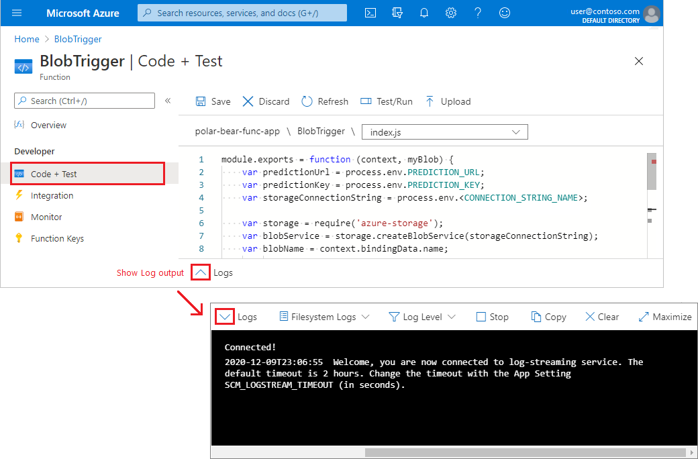

   _Open the function's output log_

   Keep the Log pane open. We'll use it in a later step.

1. Open the `photos` Blob Storage container. In a browser window, go to the [Azure portal](https://portal.azure.com?azure-portal=true). Open the storage account that you created earlier. On the left, scroll to the **Blob service** group, and then select **Containers**. On the right, select the `photos` container that you created earlier.

   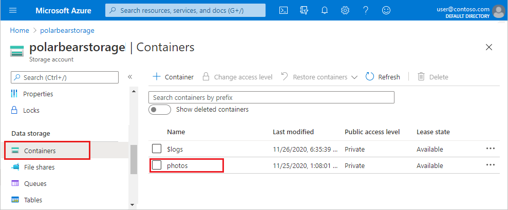

   _Open the photos container for your Blob Storage account_
    
1. Upload an image to the photos container so that you can try out your function app. On the `photos` container page in the portal, select **Upload**. The **Upload blob** page opens at the right.

   1. In **Upload blob**, select the folder icon to the right of the **Files** box. A Windows Explorer **Open** dialog opens.
   1. In the Explorer dialog, browse to the photos folder that you created in your project directory.
   1. Select the **image_12.jpg** file, then select **Open**. The Explorer dialog closes.
   1. In the **Upload blob** page, select **Upload**. After the upload completes, select the **X** to close the page.

   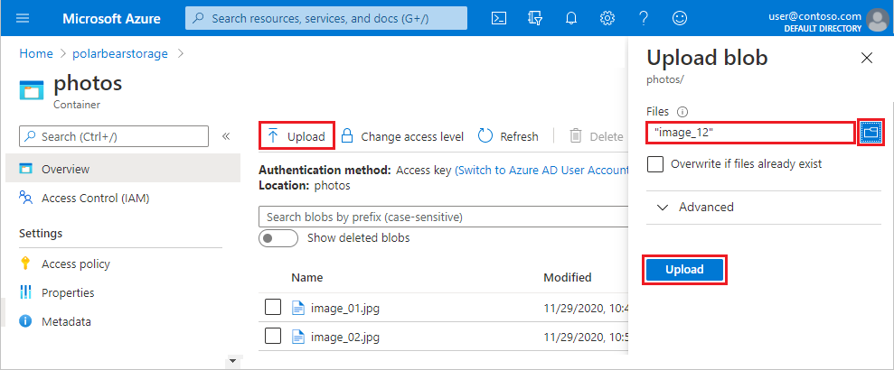

   _Upload a photo to the container_
        
   Here's what **image_12.jpg** looks like:
        
   
        
   _Image 12 in Blob Storage_

1. Return to the function log in the other browser instance. Confirm that the function executed, and that **image_12.jpg** was determined by the Custom Vision Service to contain a polar bear.

   

   _View the output log details for uploading and analyzing image 12_

The reason for the text "undefined at undefined, undefined" in the log output is that the function attempted to read the latitude, longitude, and camera ID from blob metadata and include them in the output. Those metadata values don't exist since you uploaded the blob manually. That condition will change when your virtual cameras upload photos to blob storage.

## Run the camera array

Next, you'll run the simulated camera array that you created earlier. Then, you'll check the log output from the function app to verify that images are being uploaded to Blob Storage and analyzed for polar bears.

1. In a Command Prompt or terminal window, return to the project directory. Then, use the following command to run *run.js*:

   ```bash
   node run.js
   ```

1. In the Azure portal, return to the `BlobTrigger` function and watch the output log for a minute or two. Confirm that the function is being triggered and that it's calling Custom Vision to determine whether each photo uploaded to the `photos` container contains a polar bear.

   

   _There be polar bears!_

1. To finish, return to the Command Prompt or terminal window in which *run.js* is running and select Ctrl+C to stop the process.

Congratulations! You've built a system that transmits wildlife photos to Blob Storage and uses a custom AI model built by using the Azure Cognitive Services Custom Vision to determine which photos contain polar bears. The next step is to make the output more visual, and that starts with an Azure SQL Database.