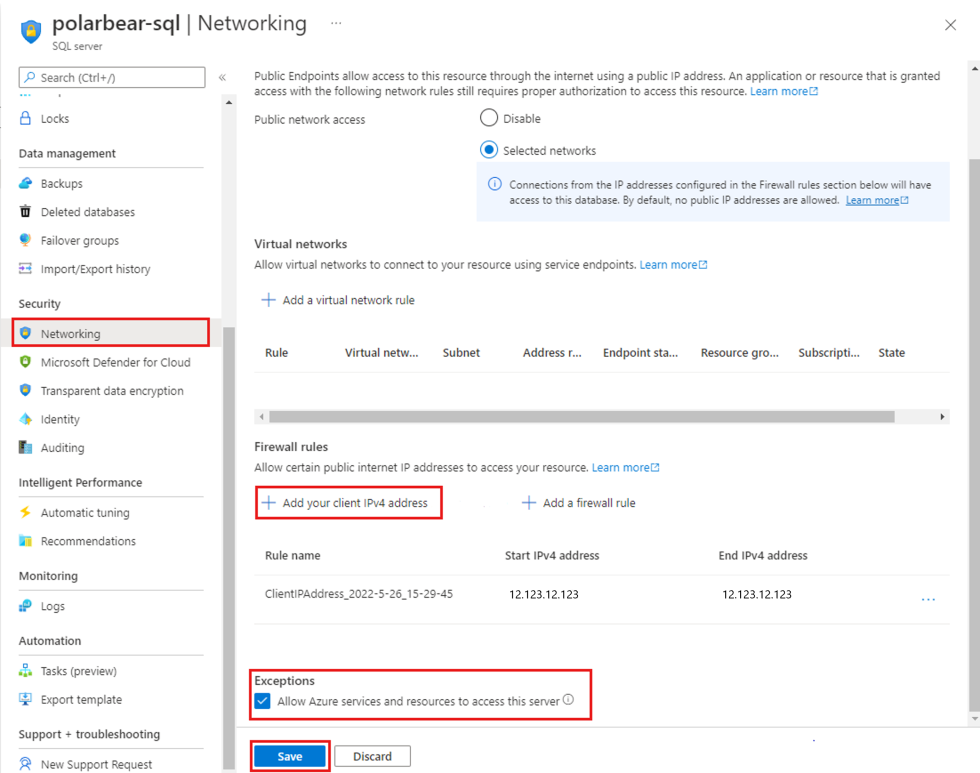
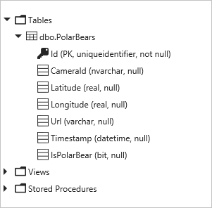
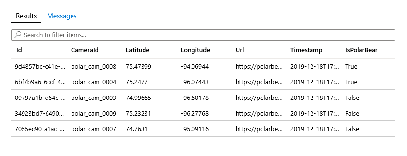

In the previous unit, you wrote an Azure Function that passes each photo uploaded to a blob container to the Custom Vision Service to determine whether the photo contains a polar bear. The only output from the function was log output showing the verdict rendered by the Custom Vision Service, as well as the ID and location of the camera that snapped the photo. Now you will create an Azure SQL Database and modify the function to write to the database. This will set the stage for visualizing polar-bear sightings in Power BI, which will draw information about what's being spotted and where from the database.

## Create an Azure SQL Database

Let's begin by using the Azure Cloud Shell to create an Azure SQL Database. This database will collect output from the Azure Function you deployed previously. Later, you will connect the database to Power BI to show where polar bears are being spotted.

1. Return to the [Azure portal](https://portal.azure.com?azure-portal=true). Click the **Cloud Shell** button in the toolbar at the top of the page to open the Azure Cloud Shell. If you would prefer to run the Cloud Shell in its own browser window, open a separate browser instance and navigate to <https://shell.azure.com>.

    

    _Opening the Azure Cloud Shell_

1. Use these commands to save the names you wish to use for your database server, admin username, admin password, and database name, replacing `<server name>`, `<admin username>`, `<admin password>`, and `<database name>` with the information you wish to use.

    ```bash
    SERVER_NAME="<server name>"
    ADMIN_USERNAME="<admin username>"
    ADMIN_PASSWORD="<admin password>"
    DATABASE_NAME="<database name>"
    ```

    > [!NOTE]
    >  The server name must be unique within Azure, and the admin password must be at least 8 characters long. The user name cannot be one that is reserved in SQL Server such as "admin" or "sa." The user name "adminuser" is valid if you want to use that.

    > [!NOTE]
    > Remember the user name and password you enter, because you will need them later.

1. Execute the following command in the Cloud Shell to create a database server in the "polar-bear-rg" resource group. Remember that you can use **Shift+Insert** to paste commands into the Cloud Shell.

    ```bash
    az sql server create --name $SERVER_NAME --resource-group polar-bear-rg --location southcentralus --admin-user $ADMIN_USERNAME --admin-password $ADMIN_PASSWORD
    ```

1. Use the following command to create a database assigned the [S0 service tier](https://docs.microsoft.com/azure/sql-database/sql-database-service-tiers).

    ```bash
    az sql db create --resource-group polar-bear-rg --server $SERVER_NAME --name $DATABASE_NAME --service-objective S0
    ```

1. Go to the database server in the [Azure portal](https://portal.azure.com?azure-portal=true) and click **Firewalls and virtual networks** in the menu on the left. Turn on **Allow Azure services and resources to access this server** to allow Azure Functions and other Azure services to connect to the server, and click **+ Add client IP** so you can connect to the database from Power BI Desktop later. Then click **Save** at the top of the blade to save these changes.

    

    _Configuring the database server_

1. Open the database in the Azure portal. Click **Query editor** in the menu on the left and enter the user name and password you specified in Step 2. Then click **OK** to log in to the database.

1. Paste the following statements into the query window and click **Run** to run them and create a database table:

    ```sql
    CREATE TABLE [dbo].[PolarBears]
    (
        [Id] [uniqueidentifier] NOT NULL,
        [CameraId] [nvarchar](16) NULL,
        [Latitude] [real] NULL,
        [Longitude] [real] NULL,
        [Url] [varchar](max) NULL,
        [Timestamp] [datetime] NULL,
        [IsPolarBear] [bit] NULL,
        PRIMARY KEY CLUSTERED ([Id] ASC)
        WITH (STATISTICS_NORECOMPUTE = OFF, IGNORE_DUP_KEY = OFF) ON [PRIMARY]
    )
    ON [PRIMARY] TEXTIMAGE_ON [PRIMARY]
    GO

    ALTER TABLE [dbo].[PolarBears] ADD DEFAULT (newid()) FOR [Id]
    GO

    ALTER TABLE [dbo].[PolarBears] ADD DEFAULT (getdate()) FOR [Timestamp]
    GO

    ALTER TABLE [dbo].[PolarBears] ADD DEFAULT ((0)) FOR [IsPolarBear]
    GO
    ```

1. Expand the list of tables in the treeview on the left and confirm that the "dbo.PolarBears" table was created, and that it has the following schema:

    

    _The dbo.PolarBears table_

Note the column named "IsPolarBear," which will be set to 1 or 0 to indicate that the corresponding image does or does not contain a polar bear.  

## Modify the Azure Function

The next step is to modify the Azure Function that you created to write output to the Azure SQL Database.

1. Open the Azure Function App that you created in the previous unit in the Azure portal. Click **Platform features** to open the "Platform features" tab, and then click **Console** to open a function console. Execute the following command in the function console to install the NPM [tedious](https://www.npmjs.com/package/tedious) package, and ignore any warning messages that are displayed. `tedious` provides an API allowing Node.js apps to talk to SQL Server and Azure SQL Database.

    ```bash
    npm install tedious
    ```

1. Open the Function App's `BlobTrigger` function. Add the following statements to the top of the function beginning at line 5, replacing DATABASE_SERVER_NAME with the name you assigned to the database server and DATABASE_NAME with the database name:

    ```javascript
    var databaseUserName = process.env.DATABASE_USER_NAME;
    var databasePassword = process.env.DATABASE_PASSWORD;
    var databaseServer = 'DATABASE_SERVER_NAME.database.windows.net';
    var databaseName = 'DATABASE_NAME';
    ```

1. Find the following statements near the end of the function:

    ```javascript
    if (isPolarBear) {
        context.log('POLAR BEAR detected by ' + id + ' at ' + latitude + ', ' + longitude);
    }
    else {
        context.log('Other wildlife detected by ' + id + ' at ' + latitude + ', ' + longitude);
    }

    context.done();
    ```

    Replace these statements with the following:

    ```javascript
    // Update the database
    var Connection = require('tedious').Connection;
    var Request = require('tedious').Request;

    var config =
    {
        authentication:
        {
            type: 'default',
            options:
            {
                userName: databaseUserName,
                password: databasePassword
            }
        },
        server: databaseServer,
        options:
        {
            database: databaseName,
            encrypt: true
        }
    };

    var dbConnection = new Connection(config);

    dbConnection.on('connect', err => {
        if (!err) {
            var query = "INSERT INTO dbo.PolarBears (CameraId, Latitude, Longitude, URL, Timestamp, IsPolarBear) " +
                "VALUES ('" + id + "', " + latitude + ", " + longitude + ", '" + blobUri + "', GETDATE(), " + (isPolarBear ? "1" : "0") + ")";

            var dbRequest = new Request(query, err => {
                // Called when request completes, with or without error
                if (err) {
                    context.log(err);
                }

                dbConnection.close();
                context.done();
            });

            dbConnection.execSql(dbRequest);
        }
        else {
            context.log(err);
            context.done();
        }
    });
    ```

    These statements connect to the database and execute an INSERT command to record the latest sighting. The row added to the database includes the ID, latitude, and longitude of the camera that took the photograph, the URL of the blob containing the photograph, the current date and time, and an `IsPolarBear` value that indicates whether the photograph contains a polar bear.

1. Click **Save** to save your changes to the function. Return to the "Platform features" tab and click **Function app settings**. Click **Manage application settings** and add two application settings to the Function App:

    - One named DATABASE_USER_NAME whose value is the user name you specified when you created the database server
    - One named DATABASE_PASSWORD whose value is the password you specified when you created the database server

    Finish up by clicking **Save** at the top of the blade to save the new application settings.

1. Return to the project directory in a Command Prompt or terminal window. Then use the following command to run **run.js**:

    ```bash
    node run.js
    ```

1. Let **run.js** run for a couple of minutes. Then return to the database in the Azure portal and use the query editor to execute the following query:

    ```sql
    SELECT * FROM dbo.PolarBears
    ```

1. Confirm that the table contains a few rows representing images that were submitted to the Custom Vision Service for analysis. Look at the "IsPolarBear" column in each row. How many of the images that were analyzed contain a polar bear?

    

    _Rows written to the database by the Azure Function_

1. Return to the Command Prompt or terminal window and press **Ctrl+C** to stop **run.js**.

In the next unit, you will use Power BI to produce a more compelling — and graphical — visualization of the data.
