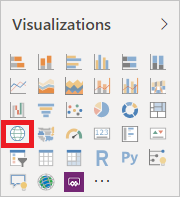
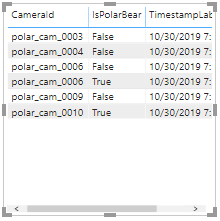
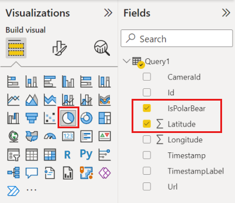
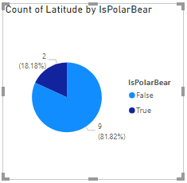
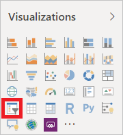
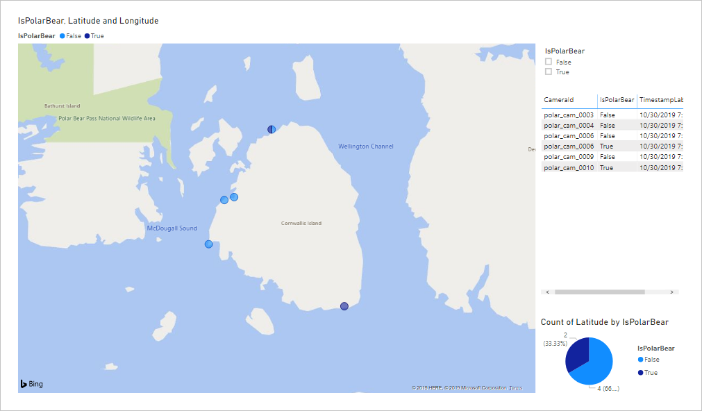
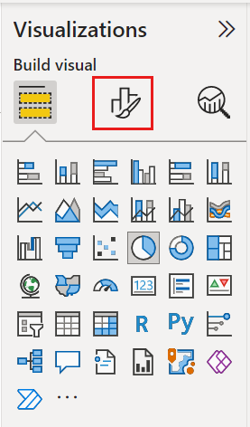
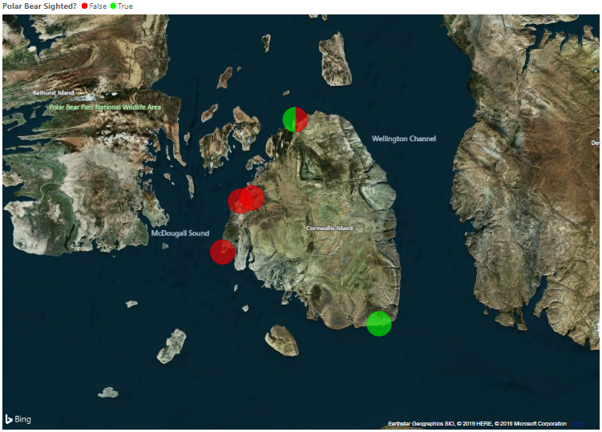
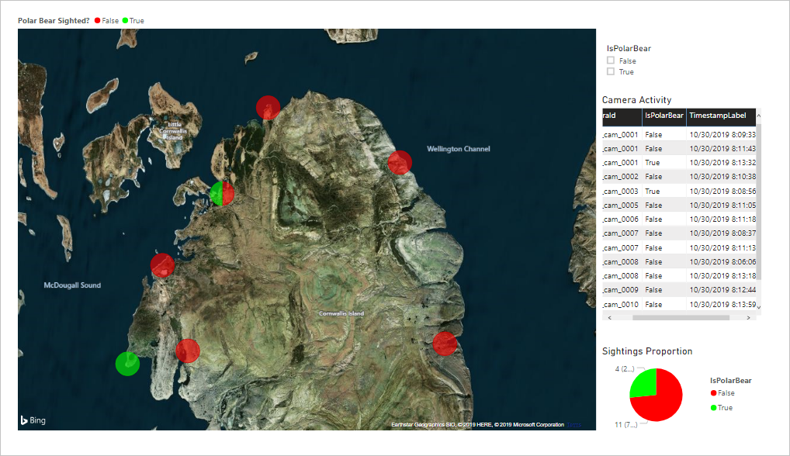

To complete the end-to-end solution for spotting polar bears in the wild, you will connect Microsoft Power BI to the database you created in the previous unit and build a report that shows in near real-time where polar bears are being photographed. You will use Power BI Desktop to create the report, and Power BI Desktop only runs on Windows. If you aren't running Windows, one solution is to create a Windows VM in Azure and run Power BI Desktop from there.

## Connect Power BI to the database ##

You used the Custom Vision Service to train an image-classification model to differentiate between different types of Arctic wildlife, and modified the Azure Function you wrote to output the results to an Azure SQL Database. The first step in using Microsoft Power BI to explore and visualize this data is connecting it to the database. In this exercise, you will connect Power BI Desktop to the Azure SQL Database.

1. If Power BI Desktop isn't already installed on your computer, go to [https://powerbi.microsoft.com/desktop/](https://powerbi.microsoft.comgit/desktop/?azure-portal=true) and install it now.

1. Start Power BI Desktop. If you are asked to sign in, do so using your work/school or organizational account.

    > [!NOTE]
    > There are two types of Microsoft accounts: personal Microsoft accounts and work/school accounts, also known as organizational accounts. Power BI accepts the latter but not the former. If you have an Office 365 subscription, it uses your work/school account. You can have a work/school account without having an Office 365 subscription, however. For an explanation of the differences between personal Microsoft accounts and work/school accounts, see [Understanding Microsoft Work And Personal Accounts](http://www.brucebnews.com/2016/06/finding-your-way-through-microsofts-maze-of-work-and-personal-accounts/).

1. Click **Get Data** in the ribbon at the top of the window. Then select **Azure SQL database** from the list of data sources and click the **Connect** button.

    

    _Adding a data source_

1. Enter the server's host name (the server name you specified in the previous unit plus ".database.windows.net") and the database name. Select **DirectQuery**, and click **Advanced options**. Then type the query below into the "SQL statement" box to select the 20 most recently added rows in the "dbo.PolarBears" table. This is the query that Power BI will use to pull information from the database. When you're done, click **OK**.

    ```sql
    SELECT TOP 20 Id, CameraId, Latitude, Longitude, Url, Timestamp, FORMAT(Timestamp,'MM/dd/yyyy h:mm:ss tt') AS TimestampLabel, IsPolarBear FROM dbo.PolarBears ORDER BY Timestamp DESC
    ```

    

    _Connecting to the database_

1. In the ensuing dialog, click **Database** in the menu on the left. Enter the user name and password you specified when you created the database server, and select the database server from the drop-down list. Click **Connect**, and then click the **Load** button in the next dialog.

    

    _Entering admin credentials_

After a short delay, Power BI will connect to the database and retrieve a dataset using the query you provided. The next step is to add visuals to bring that dataset to life.

## Build a report in Power BI Desktop ##

Visualizations (or simply "visuals") are the primary element that make up Power BI reports. In this exercise, you will use the Power BI report designer to create visuals from the database you connected to in the previous exercise, adjust filters and aggregates to refine the way the data is displayed, and format the visuals to produce compelling output.

1. Click the **Map** icon in the "Visualizations" panel to add a map visual to the report.

    

    _Adding a map visual_

1. Check the **IsPolarBear**, **Latitude**, and **Longitude** boxes in the "Fields" panel to include these fields in the map visual.

    

    _Adding fields to the map visual_

1. In the "Visualizations" panel, click the down arrow next to **Average of Latitude** and select **Don't summarize** from the menu. Then do the same for **Average of Longitude**.

    

    _Removing summary calculations_

1. Click in the empty area outside the map to deselect it. Then check the **CameraId**, **IsPolarBear**, and **TimestampLabel** boxes in the "Fields" panel to add a table visual containing those columns to the report.

    

    _Adding a table visual_

1. Click in an empty area to deselect the table visual. Then check **IsPolarBear** and **Latitude** in the "Fields" panel to add another table visual, and click the **Pie Chart** icon in the "Visualizations" panel to convert the table into a pie chart. 

    

    _Adding a pie-chart visual_

1. Click the down arrow next to **Average of Latitude** and select **Count** from the menu to configure the pie chart to show a count of sightings and the proportion of sightings in which polar bears were detected. 

    

    _Refining the pie-chart visual_

1. Deselect the pie-chart visual and click the **Slicer** icon to add a slicer to the report. Slicers provide a convenient means for filtering information in a Power BI report by narrowing the data shown in other visuals. Then select the **IsPolarBear** field in the "Fields" panel so the slicer shows checkboxes labeled "True" and "False."

    

    _Adding a slicer_

1. Now resize and reposition the visuals to achieve a layout similar to this:

    

    _Adjusting the layout_

1. With the report structure in place, the next task is to use some of Power BI's rich formatting options to embellish the visuals. Start by selecting the map visual in the report designer. Then click the **Format** icon in the "Visualizations" panel.

    

    _Formatting the map visual_

1. Use the formatting controls in the "Visualizations" panel to make the following changes to the map visual:

    - Under "Legend," set "Legend Name" to "Polar Bear Sighted?"
    - Under "Data colors," set the color for True to 00FF00 (pure green) and the color for False to FF0000 (pure red)
    - Under "Bubbles," set  the bubble size to 30%
    - Under "Map styles," set the theme to "Aerial"
    - Turn "Title" from on to off

    Confirm that the resulting map looks something like this:

    

    _Formatted map visual_

1. Select the pie-chart visual and use the formatting controls in the "Visualizations" panel to make the following changes:

    - Under "Data colors," set True to 00FF00 and False to FF0000
    - Under "Detail  labels," set the label style to "Data value, percent of total"
    - Under "Title," change the title text to "Sightings Proportion"

1. Select the table visual and use the formatting controls in the "Visualizations" panel to make the following changes:

    - Under "Style," change the table style to "Alternating rows"
    - Turn "Title" on, and change the title text to "Camera Activity" 

1. Select the slicer visual and under "Selection controls" in the "Visualizations" panel, turn "Multi-select with CTRL" off. This prevents you from having to use the **Ctrl** key to select more than one check box.

1. Double-click **Page 1** in the bottom-left corner of the designer and change the report title to "Polar Bear Activity."

1. Use the **File -> Save** command to save the report.

Feel free to embellish the report further. Once you're satisfied with the layout and content, it's time to put it to work using a live data source.

## Run the end-to-end solution ##

Now that the report is prepared in Power BI, your final task is to run the end-to-end solution and check for polar bears!

1. Open the database that you created in the previous unit in the [Azure Portal](https://portal.azure.com) and use the query editor to execute the following query and delete all rows from the "dbo.PolarBears" table:

    ```sql
    DELETE FROM dbo.PolarBears
    ```

1. Return to the project directory in a Command Prompt or terminal window. Then use the following command to run **run.js**:

    ```bash
    node run.js
    ```

1. Return to Power BI Desktop and click **Refresh** in the ribbon at the top of the window. Click it again every 15 seconds or so. The report will refresh automatically every few minutes, but you can refresh it manually as often as you would like to update the visuals. 

1. Confirm that red and green bubbles appear at various locations around the island. Green bubbles indicate the presence of polar bears, while red bubbles represent locations where photos were taken but no polar bears were detected. Locations that have a mixture of sightings will show red *and* green, as pictured below.

    

    _There be polar bears!_

1. Suppose you *only* wanted to show locations where polar bears were detected. Check the **True** box in the slicer visual. What happens in the map?

1. Continue running for a few minutes and refreshing the report once or twice a minute. Confirm that there are polar bears active on the island!

1. When you're satisfied that the solution is working as intended, return to the Command Prompt or terminal window and press **Ctrl+C** stop the cameras.

You now have a report that shows, in near real-time, polar-bear activity on the island. If you have a Power BI Pro or Power BI Premium account, you can share the report with other Power BI users so they, too, can monitor polar-bear activity. For more information about sharing your work, see [Share Power BI Dashboards and Reports](https://docs.microsoft.com/power-bi/service-how-to-collaborate-distribute-dashboards-reports "Share Power BI Dashboards and Reports"). Reports can also be viewed in the Power BI mobile apps](https://docs.microsoft.com/power-bi/mobile-apps-for-mobile-devices) so you can keep track of polar bears on your Windows, Android, or iOS device — even on an Apple watch!
