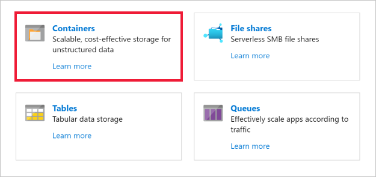

The next step is to test the IoT hub connectivity by uploading a photo to the blob container.

We'll use a sample image for this test. The images that the simulated cameras will upload to blob storage show wildlife including Arctic foxes, polar bears, and walruses. Here are a few of the example images:


1. Start by cloning the GitHub repo with the images and starter code to the **assets** folder. Execute the following statement in the Cloud Shell in your project folder.

    ```bash
    git clone https://github.com/MicrosoftDocs/mslearn-build-ml-model-with-azure-stream-analytics.git assets
    ```

1. Next, copy the **upload-photo-test.js** source file from the cloned repo into your project folder.

    ```bash
    cp assets/src/upload-photo-test.js .
    ```

    This Node.js program uploads a file named **image_19.jpg** from the "assets/photos" folder to the storage account's "photos" container.

    Then it opens a connection from `polar_cam_0003` to the IoT hub using `polar_cam_0003`'s access key (which comes from **cameras.json**) and transmits a message containing a JSON payload over MQTT.

    That message includes a camera ID, a latitude and longitude, the URL of the blob that was uploaded, and the event time.

1. Execute the following command to install the [Microsoft Azure Storage SDK for Node.js](https://www.npmjs.com/package/azure-storage) package:

    ```bash
    npm install azure-storage --save
    ```

    This package provides a programmatic interface to Azure storage, including blob storage.

1. In the Azure Cloud Shell, use the following command to list the access keys for the created storage account:

    ```azurecli
    az storage account keys list \
        --account-name $ACCOUNT_NAME \
        --resource-group <rgn>[sandbox resource group name]</rgn>
    ```

    > [!IMPORTANT]
    > By default, blobs stored in an Azure storage account are private and are only accessible to persons who have access to the subscription under which the account was created. Access keys allow other parties, including apps, to access the contents of a storage account. Treat access keys with great care and **never** give them to someone you don't trust.

1. Copy the `value` property of either of the two keys that is displayed in the command output to the clipboard. Save the value off in a text editor - you'll need this value in a few places later.

1. Open the **upload-photo-test.js** file in the Cloud Shell editor.

    ```bash
    code upload-photo-test.js
    ```

1. Replace `ACCOUNT_KEY` assigned to the `storageAccountKey` variable on line 3 of **upload-photo-test.js** with the access key. You can also replace the `storageAccountName` and `iotHubName` values - but if you've stored them in the environment variables they will be pulled from there. The line should look something like:

    ```javascript
    var storageAccountKey = 'doPZd+uLueiDMY0JWtg...qWtWfmJLVkTe/huqlTliq8ruy8L1lzmDV9l6HkRw==';
    ```

1. Save **upload-photo-test.js** and close the editor.

1. Run the test with the following command:

    ```bash
    node upload-photo-test.js
    ```

1. Confirm that you see the following output indicating that the command completed successfully:

    ```output
    Blob uploaded
    Event transmitted
    ```

## Verify the upload

We'll use the Azure portal to verify that the container has the uploaded image.

1. Sign into the [Azure portal](https://portal.azure.com?azure-portal=true) using the same account you used to activate the Sandbox.

1. Select **Resource groups** from the left-hand sidebar and locate <rgn>[Sandbox resource group]</rgn> in the list.

1. In the resource group, select the storage account you created to hold the photos.

    

1. In the view for the storage account, click **Blobs** to view a list of blob containers.

    

1. Click **photos** to open the "photos" container.

    

1. Click the blob named **image_19.jpg**. Then click **Download** to download the blob.

    

1. Confirm that the blob contains a small (64x64) grayscale polar-bear image as shown below.

    

Go ahead and keep the Azure portal window open - we'll be using it throughout the remainder of this module. Let's go ahead and create the Streaming Analytics job.